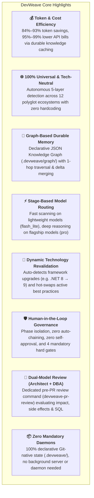

# DevWeave — AI-DLC Framework

> **Less Tokens. More Work. Lower Bill.**

[](LICENSE)
[](conformance/)
[](#-multi-host-plugins--adapters)

**DevWeave** is a **generic, declarative, host-neutral AI-Driven Development Lifecycle (AI-DLC)** specification, durable knowledge architecture, and workflow orchestration framework for AI coding assistants and autonomous engineering agents.

📖 **New to DevWeave?** Read the **[Complete Product Overview (Simple English Guide)](docs/product-overview.md)** for a friendly, step-by-step introduction.  
🌐 **Interactive Showcase & Client Portal**: Open [`site/index.html`](site/index.html) or deploy via **Cloudflare Pages / Vercel** (100% Free for Private Repos).

---

## 🚀 Key Highlights & Architectural Strengths



| Highlight | Description | Realized Benefit |
|---|---|---|
| **Graph-Based Durable Memory** | Maintains a Git-native JSON Knowledge Graph (`knowledge-graph.json`) with 1-hop neighborhood recall and automated task delta merging (`graph-delta.json`). | **Eliminates AI amnesia**; loads only the exact 2–3 connected files instead of whole directories. |
| **Token & Cost Efficiency** | Caches discovered codebase patterns into `.devweave/domains/` and `.devweave/products/` and scopes execution to precise blast radiuses. | **84.1%–93.4% Token Savings** ($0.0018–$0.0039 vs $0.50–$1.16 on repeat tasks). |
| **Stage-Based Model Routing** | Routes abstract capabilities (`fast-analysis`, `deep-reasoning`, `coding`, `independent-review`) to calibrated model tiers (`flash_lite`, `flash`, `pro`). | Eliminates paying flagship model prices for routine file scanning and git checks. |
| **5-Layer Autonomous Tech Detection** | Progressively parses lockfiles and manifests across Language, Framework, Persistence, Testing, and Build layers. | Works out-of-the-box on **C#, Python, TypeScript, Java, Go, Rust, PHP, Ruby, C++**, monorepos, and legacy codebases. |
| **Dual-Model Code & SQL Review** | Separate `devweave-pr-review` command executing concurrently as **Principal Software Architect** (code/impact) and **Senior DBA** (SQL/locks/indexes). | Uncovers architectural design flaws, table locks, and cascading failure risks before PR creation. |
| **Dynamic Revalidation Engine** | Flags affected domain practices as `NEEDS_REVALIDATION` when dependency or runtime version bumps occur. | Permanent skills remain stable while version-specific idioms and conventions update dynamically. |
| **HITL Phase Isolation** | Enforces that each command executes **only its single phase**, writes its artifact, and halts with a human decision prompt. | Eliminates runaway autonomous loops, hallucinations, and unreviewed code modifications. |
| **Mandatory Hard Gates** | 1. **PII/Privacy Gate** (sanitizes secrets), 2. **Branch Gate** (blocks edits on main), 3. **Review Gate** (human sign-off on review), 4. **PR Gate**. | Strict enterprise safety and zero secret storage in Git history. |
| **Declarative & Git-Native** | Stores all lifecycle state, audit logs, and metrics as Markdown, YAML frontmatter, and JSON in `.devweave/`. | 100% transparent, auditable, and reproducible with zero background server dependencies. |

---

## 📐 Canonical 7-Phase User Workflow

```mermaid
flowchart LR
    P0["<b>Phase 0: Init</b><br><code>devweave-init</code>"] --> P1["<b>Phase 1: Context</b><br><code>devweave-context &lt;ID&gt;</code>"]
    P1 --> P2["<b>Phase 2: Analyze</b><br><code>devweave-analyze &lt;ID&gt;</code>"]
    P2 --> P3["<b>Phase 3: Plan</b><br><code>devweave-plan &lt;ID&gt;</code>"]
    P3 --> P4["<b>Phase 4: Branch</b><br><code>devweave-branch &lt;ID&gt;</code><br><b>[HARD GATE]</b>"]
    P4 --> P5["<b>Phase 5: Implement</b><br><code>devweave-implement &lt;ID&gt;</code>"]
    P5 --> P6["<b>Phase 6: Review</b><br><code>devweave-pr-review &lt;ID&gt;</code><br><b>[HARD GATE]</b>"]
    P6 --> P7["<b>Phase 7: PR</b><br><code>devweave-pr &lt;ID&gt;</code><br><b>[HARD GATE]</b>"]
```



---

## ⚡ Specialized Fast Lanes

### 1. Fix Lane (Bug Triage & Accelerated Remediation)
```text
devweave-fix-triage <ID>  ──►  devweave-fix-diagnose <ID>  ──►  devweave-fix-land <ID> [HARD GATE]
 (Defect Classification)       (Root-Cause Investigation)        (Patch, Test, Verify & PR)
```

### 2. Modernization Lane (Legacy Migration & Upgrades)
```text
devweave-context <ID>  ──►  devweave-analyze <ID>  ──►  devweave-modernize <ID>  ──►  devweave-branch  ──►  devweave-implement  ──►  devweave-pr-review  ──►  devweave-pr
                                                    (migration_manifest.md)
```

### 3. Express Mode (Low-Risk Fast Track)
```text
devweave-express <ID> ──► Unified Context + Plan + Patch + Test + PR (Bypasses ceremony for typos & docs)
```

---

## 📦 Repository Structure (Monorepo)

```text
DevWeave/
├── plugins/antigravity/               # Google Antigravity Native Plugin Package
│   ├── plugin.json                    # Plugin manifest ($schema, version 1.0.0)
│   ├── rules/AGENTS.md                # AI-DLC core rules & phase boundary constraints
│   └── skills/                        # 20 validated workflow skills (with [Phase X] tags)
│       ├── devweave-init/             # [Phase 0: Init] Autonomous 5-layer repo setup
│       ├── devweave-context/          # [Phase 1: Context] Intake, PII gate, blast radius
│       ├── devweave-analyze/          # [Phase 2: Analyze] Deep archaeology & root-cause
│       ├── devweave-plan/             # [Phase 3: Plan] Atomic task breakdown & test anchors
│       ├── devweave-branch/           # [Phase 4: Branch] Isolated Git branch hard gate
│       ├── devweave-implement/        # [Phase 5: Implement] Surgical, plan-bound coding
│       ├── devweave-pr-review/        # [Phase 6: Review] Dual-model review (Architect + DBA)
│       ├── devweave-pr/               # [Phase 7: PR] Final PR package & human approval gate
│       ├── devweave-fix-triage/       # [Fix Lane - Phase 1] Error logs & severity triage
│       ├── devweave-fix-diagnose/     # [Fix Lane - Phase 2] Hypotheses & minimal fix plan
│       ├── devweave-fix-land/         # [Fix Lane - Phase 3] Patch, regression test, PR
│       ├── devweave-modernize/        # [Modernization Lane] migration_manifest.md
│       ├── devweave-express/          # [Express Lane] Single-pass fast track for low risk
│       ├── devweave-update/           # [Lifecycle] In-place updater & 24h daily auto-sync
│       ├── devweave-status/           # [Utility] Lifecycle state inspector
│       ├── devweave-handoff/          # [Utility] Team handoff package generator
│       ├── devweave-archive/          # [Utility] Post-merge workspace archiver
│       ├── devweave-report/           # [Utility] Executive process & metrics report
│       ├── devweave-improve/          # [Utility] Friction logs & skill improver
│       ├── devweave-document-product/ # [Knowledge] Product architecture catalog
│       └── devweave-document-domain/  # [Knowledge] Domain knowledge & scorecards
│
├── spec/                              # Formal Specification, Schemas & Policies
│   ├── specification/                 # Normative lifecycle, HITL, detection, reval specs
│   └── schemas/                       # Canonical JSON Schemas for all artifacts
│
├── conformance/                       # Master Verification & Test Runner Suites
│   ├── tests/                         # Automated test runners (run_all_tests.ps1)
│   ├── scenarios/                     # 20 end-to-end integration test scenarios
│   └── fixtures/                      # 12 polyglot repo fixtures (.NET, Python, Go, etc.)
│
└── docs/                              # Multi-Tier Documentation
    ├── developer-guide.md             # 🌟 Universal Developer Handbook & Command Reference
    ├── installation-guide.md          # 1-Click Git-based installation across all 6 hosts
    ├── getting-started.md             # End-to-end workflow walkthrough with Mermaid diagrams
    ├── v1-benchmarks.md               # Empirical benchmarks across 12 repos & token/cost stats
    ├── lifecycle.md                   # Normative AI-DLC lifecycle and execution contracts
    ├── workflow-profiles.md           # 8 risk-calibrated profiles and execution lanes
    ├── architecture.md                # 5-layer detection, dynamic reval, and host adapters
    ├── antigravity.md                 # Antigravity CLI and plugin guide
    └── conformance.md                 # 20-scenario conformance verification guide
```

---

## ⚡ Quick Start & Git-Based Installation Across All Hosts

> 📖 For full command descriptions, parameter options, and beginner tutorials, see the **[Universal Developer Handbook](docs/developer-guide.md)**.

Install DevWeave directly from the Git repository into any project:

### 1. 🔵 Google Antigravity
```powershell
# Windows (PowerShell):
git clone --depth 1 https://github.com/paarthivnaik/DevWeave.git $env:TEMP\devweave; agy plugin install $env:TEMP\devweave\plugins\antigravity; Remove-Item -Recurse -Force $env:TEMP\devweave
```
```bash
# macOS / Linux (Bash):
git clone --depth 1 https://github.com/paarthivnaik/DevWeave.git /tmp/devweave && agy plugin install /tmp/devweave/plugins/antigravity && rm -rf /tmp/devweave
```
**Verify**: `agy plugin list` &rarr; `devweave (plugins/antigravity) - Status: active, Skills: 21 available`

---

### 2. 🟠 Anthropic Claude Code
```bash
# macOS / Linux / Git Bash:
git clone --depth 1 https://github.com/paarthivnaik/DevWeave.git /tmp/devweave && mkdir -p .claude/commands && cp /tmp/devweave/plugins/claude/CLAUDE.md ./CLAUDE.md && cp /tmp/devweave/plugins/claude/commands/* .claude/commands/ && rm -rf /tmp/devweave
```
```powershell
# Windows (PowerShell):
git clone --depth 1 https://github.com/paarthivnaik/DevWeave.git $env:TEMP\devweave; New-Item -ItemType Directory -Force -Path .claude\commands | Out-Null; Copy-Item $env:TEMP\devweave\plugins\claude\CLAUDE.md .\CLAUDE.md; Copy-Item $env:TEMP\devweave\plugins\claude\commands\* .claude\commands\; Remove-Item -Recurse -Force $env:TEMP\devweave
```
**Verify**: Run `claude /devweave-init`

---

### 3. 🟣 GitHub Copilot (VS Code, Visual Studio, CLI)
```bash
# macOS / Linux / Git Bash:
git clone --depth 1 https://github.com/paarthivnaik/DevWeave.git /tmp/devweave && mkdir -p .github/prompts && cp /tmp/devweave/plugins/copilot/copilot-instructions.md .github/copilot-instructions.md && cp /tmp/devweave/plugins/copilot/prompts/* .github/prompts/ && rm -rf /tmp/devweave
```
```powershell
# Windows (PowerShell):
git clone --depth 1 https://github.com/paarthivnaik/DevWeave.git $env:TEMP\devweave; New-Item -ItemType Directory -Force -Path .github\prompts | Out-Null; Copy-Item $env:TEMP\devweave\plugins\copilot\copilot-instructions.md .github\copilot-instructions.md; Copy-Item $env:TEMP\devweave\plugins\copilot\prompts\* .github\prompts\; Remove-Item -Recurse -Force $env:TEMP\devweave
```
**Verify**: Type `@devweave /init` in Copilot Chat.

---

### 4. 🔴 Google Gemini CLI
```bash
# macOS / Linux / Git Bash:
git clone --depth 1 https://github.com/paarthivnaik/DevWeave.git /tmp/devweave && mkdir -p .gemini/commands && cp /tmp/devweave/plugins/gemini/GEMINI.md .gemini/GEMINI.md && cp /tmp/devweave/plugins/gemini/commands/* .gemini/commands/ && rm -rf /tmp/devweave
```
```powershell
# Windows (PowerShell):
git clone --depth 1 https://github.com/paarthivnaik/DevWeave.git $env:TEMP\devweave; New-Item -ItemType Directory -Force -Path .gemini\commands | Out-Null; Copy-Item $env:TEMP\devweave\plugins\gemini\GEMINI.md .gemini\GEMINI.md; Copy-Item $env:TEMP\devweave\plugins\gemini\commands\* .gemini\commands\; Remove-Item -Recurse -Force $env:TEMP\devweave
```
**Verify**: Run `gemini devweave-init`

---

### 5. 🟢 OpenAI Codex & ChatGPT CLI
```bash
# macOS / Linux / Git Bash:
git clone --depth 1 https://github.com/paarthivnaik/DevWeave.git /tmp/devweave && mkdir -p .codex/commands && cp /tmp/devweave/plugins/codex/CODEX.md .codex/CODEX.md && cp /tmp/devweave/plugins/codex/commands/* .codex/commands/ && rm -rf /tmp/devweave
```
```powershell
# Windows (PowerShell):
git clone --depth 1 https://github.com/paarthivnaik/DevWeave.git $env:TEMP\devweave; New-Item -ItemType Directory -Force -Path .codex\commands | Out-Null; Copy-Item $env:TEMP\devweave\plugins\codex\CODEX.md .codex\CODEX.md; Copy-Item $env:TEMP\devweave\plugins\codex\commands\* .codex\commands\; Remove-Item -Recurse -Force $env:TEMP\devweave
```
**Verify**: Run `codex run devweave-init`

---

### 6. ⚪ Cognition Devin
```bash
# In your Devin workspace:
git clone --depth 1 https://github.com/paarthivnaik/DevWeave.git /tmp/devweave && mkdir -p .devin && cp -r /tmp/devweave/plugins/devin/* .devin/ && rm -rf /tmp/devweave
```
**Verify**: Run `/devweave-init` in the Devin console.

---

## 📚 Complete Documentation Library

DevWeave provides deep documentation across architecture, developer guides, platform integrations, and formal specifications:

### 🌟 Core Guides & Architecture
| Document | Purpose |
| :--- | :--- |
| **[Product Overview (Simple English Guide)](docs/product-overview.md)** | Clear, friendly guide explaining the entire DevWeave system, 7 phases, and benefits in plain English. |
| **[How It Works (Deep Architecture)](docs/how-it-works.md)** | Pin-to-pin architectural explanation of state machines, blast radius, dual-model reviews, and token caching. |
| **[Developer Handbook & Command Reference](docs/developer-guide.md)** | Step-by-step tutorial, command parameters, and full reference for all 21 skills across 6 hosts. |
| **[Universal Installation Guide](docs/installation-guide.md)** | 1-Click copy-pasteable Git installation and automated updates for all 6 AI coding assistants. |
| **[Getting Started Guide](docs/getting-started.md)** | End-to-end walkthrough of the 7-phase canonical development lifecycle with Mermaid diagrams. |
| **[Token & Cost Benchmark Report](docs/v1-benchmarks.md)** | Empirical data proving 84%–93% token savings and 95%–99% cost reduction across 12 polyglot repositories. |
| **[Normative AI-DLC Lifecycle Contract](docs/lifecycle.md)** | Specification of state transitions, phase boundaries, gate conditions, and failure loops. |
| **[Workflow Profiles & Fast Lanes](docs/workflow-profiles.md)** | Execution guide for `EXPRESS`, `FEATURE`, `FIX`, and `MODERNIZE` workflow lanes. |
| **[Autonomous Stack & Layer Architecture](docs/architecture.md)** | 5-layer manifest discovery, physical-to-logical layer mapping, and host adapter bridges. |
| **[Master Conformance Guide](docs/conformance.md)** | Complete breakdown of the 20-scenario automated integration test runner. |

### 🤖 Host Platform Guides
| Platform | Guide | Installation Target | Validated Skills |
| :--- | :--- | :--- | :--- |
| **Google Antigravity** | **[Antigravity Guide](docs/antigravity.md)** | `plugins/antigravity/` | 21 Validated Skills |
| **Anthropic Claude Code** | **[Claude Code Guide](docs/claude-code.md)** | `plugins/claude/` | 21 Slash Commands |
| **GitHub Copilot** | **[GitHub Copilot Guide](docs/github-copilot.md)** | `plugins/copilot/` | 21 Prompt Files |
| **Google Gemini CLI** | **[Gemini CLI Guide](docs/gemini-cli.md)** | `plugins/gemini/` | 21 Command Definitions |
| **OpenAI Codex** | **[OpenAI Codex Guide](docs/codex.md)** | `plugins/codex/` | 21 System Commands |
| **Cognition Devin** | **[Cognition Devin Guide](docs/devin.md)** | `plugins/devin/` | 21 Playbook Actions |

### 📜 Formal Specifications & Schemas
- **[Lifecycle State Machine Spec](spec/specification/lifecycle.md)**
- **[Human-in-the-Loop Governance Spec](spec/specification/human-in-the-loop.md)**
- **[Autonomous Technology Detection Spec](spec/specification/autonomous-detection.md)**
- **[Dual-Model Consensus Review Spec](spec/specification/dual-model-review.md)**
- **[Dynamic Technology Revalidation Spec](spec/specification/technology-revalidation.md)**
- **[Plugin Lifecycle & Auto-Update Spec](spec/specification/plugin-lifecycle.md)**
- **[Security & Secret Protection Spec](spec/specification/security.md)**
- **[JSON Schema Definitions (`spec/schemas/`)](spec/schemas/)**

---

## 🧪 Master Conformance Verification

```powershell
.\conformance\tests\run_all_tests.ps1
```

```text
=================================================================
  [PASSED] JSON Schema Validation Suite                  (2.44s)
  [PASSED] AI-DLC State Machine Transition Suite         (0.90s)
  [PASSED] 18 Conformance Scenarios Suite (20 Scenarios) (1.53s)
  [PASSED] 12-Ecosystem Technology Neutrality Suite      (1.07s)
  [PASSED] Multi-Repository .devweave Initialization Suite (2.64s)
  [PASSED] Token & Cost Efficiency Benchmark Suite       (0.96s)
-----------------------------------------------------------------
RELEASE CANDIDATE STATUS: 100% CONFORMANCE VERIFIED (ALL SUITES PASSED)
=================================================================
```

---

## 📄 License

Licensed under the Apache License, Version 2.0. See [LICENSE](LICENSE) for details.
