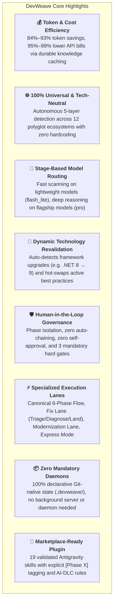

# DevWeave — AI-DLC Framework

> **Less Tokens. More Work. Lower Bill.**

DevWeave is a **generic, declarative, host-neutral AI-Driven Development Lifecycle (AI-DLC)** specification, durable knowledge architecture, and workflow orchestration framework for AI coding assistants and autonomous engineering agents.

---

## 🚀 Key Highlights & Architectural Strengths



| Highlight | Description | Realized Benefit |
|---|---|---|
| **Token & Cost Efficiency** | Caches discovered codebase patterns into `.devweave/domains/` and `.devweave/products/` and scopes execution to precise blast radiuses. | **84.1%–93.4% Token Savings** ($0.0018–$0.0039 vs $0.50–$1.16 on repeat tasks). |
| **Stage-Based Model Routing** | Routes abstract capabilities (`fast-analysis`, `deep-reasoning`, `coding`, `independent-review`) to calibrated model tiers (`flash_lite`, `flash`, `pro`). | Eliminates paying flagship model prices for routine file scanning and git checks. |
| **5-Layer Autonomous Tech Detection** | Progressively parses lockfiles and manifests across Language, Framework, Persistence, Testing, and Build layers. | Works out-of-the-box on **C#, Python, TypeScript, Java, Go, Rust, PHP, Ruby, C++**, monorepos, and legacy codebases. |
| **Dynamic Revalidation Engine** | Flags affected domain practices as `NEEDS_REVALIDATION` when dependency or runtime version bumps occur. | Permanent skills remain stable while version-specific idioms and conventions update dynamically. |
| **HITL Phase Isolation** | Enforces that each command executes **only its single phase**, writes its artifact, and halts with a human decision prompt. | Eliminates runaway autonomous loops, hallucinations, and unreviewed code modifications. |
| **Three Mandatory Hard Gates** | 1. **PII/Privacy Gate** (sanitizes secrets), 2. **Branch Gate** (blocks edits on main), 3. **PR Gate** (verifies passing tests & review). | Strict enterprise safety and zero secret storage in Git history. |
| **Dual Pathways & Fast Lanes** | 1. **Canonical 6-Phase Flow** (Features/Refactors), 2. **Fix Lane** (Triage $\to$ Diagnose $\to$ Land), 3. **Modernization Lane** (`migration_manifest.md`), 4. **Express Mode**. | Right-sized workflow tailored to task risk and scope. |
| **Declarative & Git-Native** | Stores all lifecycle state, audit logs, and metrics as Markdown, YAML frontmatter, and JSON in `.devweave/`. | 100% transparent, auditable, and reproducible with zero background server dependencies. |

---

## 📐 Canonical 6-Phase User Workflow

```mermaid
flowchart LR
    P0["<b>Phase 0: Init</b><br><code>devweave-init</code>"] --> P1["<b>Phase 1: Context</b><br><code>devweave-context &lt;ID&gt;</code>"]
    P1 --> P2["<b>Phase 2: Analyze</b><br><code>devweave-analyze &lt;ID&gt;</code>"]
    P2 --> P3["<b>Phase 3: Plan</b><br><code>devweave-plan &lt;ID&gt;</code>"]
    P3 --> P4["<b>Phase 4: Branch</b><br><code>devweave-branch &lt;ID&gt;</code><br><b>[HARD GATE]</b>"]
    P4 --> P5["<b>Phase 5: Implement</b><br><code>devweave-implement &lt;ID&gt;</code>"]
    P5 --> P6["<b>Phase 6: PR</b><br><code>devweave-pr &lt;ID&gt;</code><br><b>[HARD GATE]</b>"]
```



---

## ⚡ Specialized Fast Lanes

### 1. Fix Lane (Bug Triage & Accelerated Remediation)
```text
devweave-fix-triage <ID>  ──►  devweave-fix-diagnose <ID>  ──►  devweave-fix-land <ID> [HARD GATE]
 (Defect Classification)       (Root-Cause Investigation)        (Patch, Test, Verify & PR)
```

### 2. Modernization Lane (Legacy Migration & Upgrades)
```text
devweave-context <ID>  ──►  devweave-analyze <ID>  ──►  devweave-modernize <ID>  ──►  devweave-branch  ──►  devweave-implement  ──►  devweave-pr
                                                    (migration_manifest.md)
```

### 3. Express Mode (Low-Risk Fast Track)
```text
devweave-express <ID> ──► Unified Context + Plan + Patch + Test + PR (Bypasses ceremony for typos & docs)
```

---

## 📦 Repository Structure (Monorepo)

```text
DevWeave/
├── plugins/devweave/                  # Google Antigravity Native Plugin Package
│   ├── plugin.json                    # Plugin manifest ($schema, version 1.0.0)
│   ├── rules/AGENTS.md                # AI-DLC core rules & phase boundary constraints
│   └── skills/                        # 19 validated workflow skills (with [Phase X] tags)
│       ├── devweave-init/             # [Phase 0: Init] Autonomous 5-layer repo setup
│       ├── devweave-context/          # [Phase 1: Context] Intake, PII gate, blast radius
│       ├── devweave-analyze/          # [Phase 2: Analyze] Deep archaeology & root-cause
│       ├── devweave-plan/             # [Phase 3: Plan] Atomic task breakdown & test anchors
│       ├── devweave-branch/           # [Phase 4: Branch] Isolated Git branch hard gate
│       ├── devweave-implement/        # [Phase 5: Implement] Surgical, plan-bound coding
│       ├── devweave-pr/               # [Phase 6: PR] Deterministic verify, review, PR assembly
│       ├── devweave-fix-triage/       # [Fix Lane - Phase 1] Error logs & severity triage
│       ├── devweave-fix-diagnose/     # [Fix Lane - Phase 2] Hypotheses & minimal fix plan
│       ├── devweave-fix-land/         # [Fix Lane - Phase 3] Patch, regression test, PR
│       ├── devweave-modernize/        # [Modernization Lane] migration_manifest.md
│       ├── devweave-express/          # [Express Lane] Single-pass fast track for low risk
│       ├── devweave-status/           # [Utility] Lifecycle state inspector
│       ├── devweave-handoff/          # [Utility] Team handoff package generator
│       ├── devweave-archive/          # [Utility] Post-merge workspace archiver
│       ├── devweave-report/           # [Utility] Executive process & metrics report
│       ├── devweave-improve/          # [Utility] Friction logs & skill improver
│       ├── devweave-document-product/ # [Knowledge] Product architecture catalog
│       └── devweave-document-domain/  # [Knowledge] Domain knowledge & scorecards
│
├── spec/                              # Formal Specification, Schemas & Policies
│   ├── specification/                 # Normative lifecycle, HITL, detection, reval specs
│   └── schemas/                       # Canonical JSON Schemas for all artifacts
│
├── conformance/                       # Master Verification & Test Runner Suites
│   ├── tests/                         # Automated test runners (run_all_tests.ps1)
│   ├── scenarios/                     # 20 end-to-end integration test scenarios
│   └── fixtures/                      # 12 polyglot repo fixtures (.NET, Python, Go, etc.)
│
└── docs/                              # Multi-Tier Documentation
    ├── getting-started.md             # End-to-end workflow walkthrough with Mermaid diagrams
    ├── installation-guide.md          # 5 installation methods (Junior to Senior/DevOps)
    ├── lifecycle.md                   # Normative AI-DLC lifecycle and execution contracts
    ├── workflow-profiles.md           # 8 risk-calibrated profiles and execution lanes
    ├── architecture.md                # 5-layer detection, dynamic reval, and host adapters
    ├── antigravity.md                 # Antigravity CLI and plugin guide
    └── conformance.md                 # 20-scenario conformance verification guide
```

---

## ⚡ Quick Start & Installation

### Option 1: One-Liner Install (Antigravity CLI)
```powershell
agy plugin install D:\DevWeave\plugins\devweave
```

### Option 2: Clone & Register from GitHub
```powershell
git clone --depth 1 https://github.com/paarthivnaik/DevWeave.git temp-devweave
agy plugin install .\temp-devweave\plugins\devweave
Remove-Item -Recurse -Force temp-devweave
```

### Verify Installation:
```powershell
agy plugin list
# Output: devweave (plugins/devweave) - Status: active, Skills: 19 available
```

---

## 🧪 Master Conformance Verification

DevWeave includes an automated test runner validating the specification across all polyglot targets:

```powershell
.\conformance\tests\run_all_tests.ps1
```

```text
=================================================================
  [PASSED] JSON Schema Validation Suite                  (3.11s)
  [PASSED] AI-DLC State Machine Transition Suite         (1.00s)
  [PASSED] 18 Conformance Scenarios Suite (20 Scenarios) (1.41s)
  [PASSED] 12-Ecosystem Technology Neutrality Suite      (1.72s)
  [PASSED] Multi-Repository .devweave Initialization Suite (1.93s)
  [PASSED] Token & Cost Efficiency Benchmark Suite       (1.10s)
-----------------------------------------------------------------
RELEASE CANDIDATE STATUS: 100% CONFORMANCE VERIFIED (ALL SUITES PASSED)
=================================================================
```

---

## 📖 Complete Documentation Links

- [**Getting Started & Workflow Guide**](docs/getting-started.md) — Comprehensive user walkthrough.
- [**Installation Guide**](docs/installation-guide.md) — 5 step-by-step setup methods for all developer tiers.
- [**Lifecycle Guide**](docs/lifecycle.md) — The formal 6-phase lifecycle and execution contracts.
- [**Workflow Profiles**](docs/workflow-profiles.md) — Profile matrix and specialized fast lanes.
- [**System Architecture**](docs/architecture.md) — 5-layer detection and dynamic revalidation mechanics.
- [**Antigravity Host Adapter**](docs/antigravity.md) — Plugin architecture and skill CLI invocations.
- [**Conformance Testing**](docs/conformance.md) — 20-scenario compliance verification matrix.

---

## 📄 License

Licensed under the Apache License, Version 2.0. See [LICENSE](LICENSE) for details.
