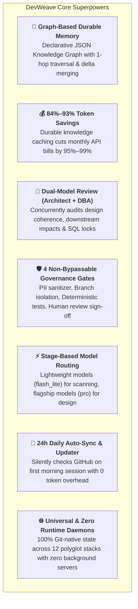

# DevWeave — Declarative AI-DLC Framework

> **"Less Tokens. More Work. Lower Bill."**

[](LICENSE)
[](conformance/)
[](#-1-click-universal-installation-all-6-hosts)
[](#-complete-21-commands--skills-reference)
[](#1-🧠-graph-based-durable-memory-zero-ai-amnesia)

**DevWeave** is a **generic, declarative, host-neutral AI-Driven Development Lifecycle (AI-DLC)** specification, durable graph knowledge architecture, and workflow orchestration framework for AI coding assistants and autonomous engineering agents.

📖 **First time here?** Read the **[Complete Product Overview (Simple English Guide)](docs/product-overview.md)** for a friendly, step-by-step introduction.  
🌐 **Interactive Showcase & Client Portal**: Open [`site/index.html`](site/index.html) or deploy via **Cloudflare Pages / Vercel** (100% Free for Private Repos).

---

## ⚡ The 30-Second Elevator Pitch

Standard AI coding assistants suffer from **AI Amnesia** and **Context Bloat**: they re-read hundreds of files on every turn, forget past architectural decisions, hallucinate edits across un-scoped files, and run up massive API token bills.

**DevWeave acts as the Senior Architect and Project Manager sitting right next to your AI.**

- 🧠 **Graph-Based Memory**: Maps your codebase into a Git-native JSON Knowledge Graph so the AI touches **only the 2–3 connected files** instead of 3,000.
- 💰 **90%+ Lower Bills**: Caches repository architecture once, saving **84%–93% tokens** and **95%–99% cost** on every task.
- 🛡️ **Zero Uncontrolled Drift**: Enforces a strict 7-phase lifecycle (Ticket &rarr; Plan &rarr; Branch &rarr; Code &rarr; Dual-Model Review &rarr; PR) with mandatory Human-in-the-Loop gates.
- 👥 **Dual-Model Review**: Evaluates pull requests concurrently as a **Principal Software Architect** (code/impact) and **Senior DBA** (SQL/locks/indexes) before shipping.
- 🌐 **Zero Daemons & 100% Universal**: Zero background servers, zero cloud lock-in, and 100% symmetrical support across **all 6 major AI coding hosts**.

---

## 🥊 How DevWeave is Different from Other AI Tools

| Dimension | ❌ Unstructured AI (Copilot / Cursor / Raw Claude) | ⚡ DevWeave AI-DLC Framework |
| :--- | :--- | :--- |
| **Codebase Memory** | **AI Amnesia**: Re-scans directory trees and lockfiles from scratch on every turn. | **Graph-Based Durable Memory**: Remembers your architecture in `.devweave/graph/knowledge-graph.json`. |
| **Token Consumption** | **Explosive**: Ingests 80,000–150,000 tokens per prompt ($0.50–$2.80/task). | **Surgical**: Bounded by a 32k budget and 1-hop graph traversal (**9,250 tokens / $0.0018/task**). |
| **Scope Control** | **Hallucination Drift**: Edits random un-scoped files outside the task. | **Plan-Bound Implementation**: Edits strictly authorized files specified in approved `plan.md`. |
| **Branch Safety** | **Risky**: Edits directly on `main`/`master` unless manually warned. | **Branch Hard Gate**: Physically blocks code modification until an isolated Git branch is active. |
| **Code & SQL Review** | **Self-Review Bias**: The agent marks its own buggy code as "verified". | **Dual-Model Review**: Independent **Principal Architect** + **Senior DBA** audit pre-PR. |
| **Dependencies** | Requires heavy vector DBs, Python daemons, or background containers. | **Zero Daemons**: 100% declarative Markdown & JSON stored right in your Git repository. |
| **Multi-Host Parity** | Locked into one IDE or proprietary ecosystem. | **100% Symmetrical across all 6 major AI coding assistants**. |

---

## 🌟 Key Specialities & Core Superpowers



### 1. 🧠 Graph-Based Durable Memory (Zero AI Amnesia)
DevWeave replaces slow, fuzzy vector databases with a **Git-native JSON Knowledge Graph** (`.devweave/graph/knowledge-graph.json`):
- **1-Hop Neighborhood Recall**: When updating a service, DevWeave instantly recalls who calls it (Controllers) and what it touches (Database Tables, Events). It loads **only 2–3 connected files**, shrinking context from 40,000 tokens to 1,500.
- **Graph Delta Patching (`graph-delta.json`)**: Code changes draft a local graph patch that is merged into the master knowledge graph on PR creation.
- **Team Memory Sync**: When a PR merges, teammates pull the updated architecture graph automatically with **0 tokens and 0 latency**.

### 2. 💰 Hard Economic ROI (84%–93% Lower Token Bills)
From our automated 12-ecosystem benchmark suite (`conformance/tests/token_benchmark.ps1`):

| Task Profile | Unstructured AI Assistants | DevWeave AI-DLC | Realized Savings |
| :--- | :--- | :--- | :--- |
| **Quick Bug Fix (`EXPRESS`)** | 141,200 tokens ($0.5026) | **9,250 tokens ($0.0018)** | **93.4% Token Savings \| 99.6% Cheaper** |
| **Feature Story (`FEATURE`)** | 788,800 tokens ($2.7944) | **125,700 tokens ($0.1450)** | **84.1% Token Savings \| 94.8% Cheaper** |
| **Repeat Task in Same Domain** | 327,500 tokens ($1.1638) | **21,800 tokens ($0.0039)** | **93.3% Token Savings \| 99.7% Cheaper** |
| **Complex Monorepo Scoping** | 1,856,500 tokens ($6.5433) | **171,600 tokens ($0.2587)** | **90.8% Token Savings \| 96.0% Cheaper** |

### 3. 👥 Dual-Model Code & SQL Review (The Safety Net)
Phase 6 (`devweave-pr-review`) executes a multi-perspective review before pull request creation:
- **Principal Software Architect Lens**: Audits SOLID design, interface contracts, and downstream microservice breaking changes.
- **Senior DBA Lens**: Scans SQL queries for table locks, missing indexes, N+1 query hazards, and reversible migrations.
- **Security & Resilience Lenses**: Scans for OWASP Top 10 vulnerabilities, unescaped inputs, and missing timeout boundaries.

### 4. 🛡️ 4 Non-Bypassable Governance Gates
1. **PII / Privacy Gate**: Sanitizes API keys, passwords, and sensitive customer data before LLM ingestion.
2. **Branch Hard Gate**: Prevents accidental direct commits to `main`/`master`.
3. **Test Verification Gate**: Requires 100% deterministic test execution evidence.
4. **Human Review Gate**: Requires explicit engineer sign-off on dual-model findings before PR creation.

---

## 📐 The Canonical 7-Phase Workflow

```mermaid
flowchart LR
    P0["<b>Phase 0: Init</b><br><code>devweave-init</code><br><i>5-Layer Stack & Graph</i>"] --> P1["<b>Phase 1: Context</b><br><code>devweave-context &lt;ID&gt;</code><br><i>PII Gate & 1-Hop Blast Radius</i>"]
    P1 --> P2["<b>Phase 2: Analyze</b><br><code>devweave-analyze &lt;ID&gt;</code><br><i>Impact & Contracts</i>"]
    P2 --> P3["<b>Phase 3: Plan</b><br><code>devweave-plan &lt;ID&gt;</code><br><i>Atomic Blueprint</i>"]
    P3 --> P4["<b>Phase 4: Branch</b><br><code>devweave-branch &lt;ID&gt;</code><br><b>[HARD GATE]</b>"]
    P4 --> P5["<b>Phase 5: Implement</b><br><code>devweave-implement &lt;ID&gt;</code><br><i>Plan-Bound Coding & Tests</i>"]
    P5 --> P6["<b>Phase 6: Review</b><br><code>devweave-pr-review &lt;ID&gt;</code><br><b>[HARD GATE: Architect + DBA]</b>"]
    P6 --> P7["<b>Phase 7: PR</b><br><code>devweave-pr &lt;ID&gt;</code><br><b>[HARD GATE: Knowledge Merge]</b>"]
```



### Specialized Fast Lanes:
- **⚡ Fix Lane**: `devweave-fix-triage` &rarr; `devweave-fix-diagnose` &rarr; `devweave-fix-land` (Accelerated 3-step hotfix).
- **🔄 Modernization Lane**: `devweave-modernize` (Generates `migration_manifest.md` for framework upgrades like .NET 8 &rarr; 9).
- **🚀 Express Lane**: `devweave-express` (Single-pass fast track for low-risk typos and documentation).

---

## ⚡ 1-Click Universal Installation (All 6 Hosts)

DevWeave installs with **zero runtime daemons** directly from GitHub:

### 1. 🔵 Google Antigravity
```powershell
# Windows (PowerShell):
git clone --depth 1 https://github.com/paarthivnaik/DevWeave.git $env:TEMP\devweave; agy plugin install $env:TEMP\devweave\plugins\antigravity; Remove-Item -Recurse -Force $env:TEMP\devweave
```
```bash
# macOS / Linux (Bash):
git clone --depth 1 https://github.com/paarthivnaik/DevWeave.git /tmp/devweave && agy plugin install /tmp/devweave/plugins/antigravity && rm -rf /tmp/devweave
```
**Verify**: `agy plugin list` &rarr; `devweave (plugins/antigravity) - Status: active, Skills: 21 available`

---

### 2. 🟠 Anthropic Claude Code
```powershell
# Windows (PowerShell):
git clone --depth 1 https://github.com/paarthivnaik/DevWeave.git $env:TEMP\devweave; New-Item -ItemType Directory -Force -Path .claude\commands | Out-Null; Copy-Item $env:TEMP\devweave\plugins\claude\CLAUDE.md .\CLAUDE.md; Copy-Item $env:TEMP\devweave\plugins\claude\commands\* .claude\commands\; Remove-Item -Recurse -Force $env:TEMP\devweave
```
```bash
# macOS / Linux (Bash):
git clone --depth 1 https://github.com/paarthivnaik/DevWeave.git /tmp/devweave && mkdir -p .claude/commands && cp /tmp/devweave/plugins/claude/CLAUDE.md ./CLAUDE.md && cp /tmp/devweave/plugins/claude/commands/* .claude/commands/ && rm -rf /tmp/devweave
```
**Verify**: Run `claude /devweave-init`

---

### 3. 🟣 GitHub Copilot (VS Code / Visual Studio / CLI)
```powershell
# Windows (PowerShell):
git clone --depth 1 https://github.com/paarthivnaik/DevWeave.git $env:TEMP\devweave; New-Item -ItemType Directory -Force -Path .github\prompts | Out-Null; Copy-Item $env:TEMP\devweave\plugins\copilot\copilot-instructions.md .github\copilot-instructions.md; Copy-Item $env:TEMP\devweave\plugins\copilot\prompts\* .github\prompts\; Remove-Item -Recurse -Force $env:TEMP\devweave
```
```bash
# macOS / Linux (Bash):
git clone --depth 1 https://github.com/paarthivnaik/DevWeave.git /tmp/devweave && mkdir -p .github/prompts && cp /tmp/devweave/plugins/copilot/copilot-instructions.md .github/copilot-instructions.md && cp /tmp/devweave/plugins/copilot/prompts/* .github/prompts/ && rm -rf /tmp/devweave
```
**Verify**: Type `@devweave /init` in Copilot Chat.

---

### 4. 🔴 Google Gemini CLI, 🟢 OpenAI Codex & ⚪ Cognition Devin
- **Gemini CLI**: Target folder `.gemini/commands/` &rarr; Run `gemini devweave-init`
- **OpenAI Codex**: Target folder `.codex/commands/` &rarr; Run `$devweave init`
- **Cognition Devin**: Target folder `.devin/playbooks/` &rarr; Run `devweave:init`

---

## 🔄 Automated Daily Updates

- **Automatic Daily Sync (24h TTL)**: Automatically checks GitHub on your **first session of each day** and updates in-place with **0 token cost and 0s latency** for subsequent runs.
- **On-Demand Manual Update**: Run `agy run devweave-update` or `/devweave-update` in your assistant at any time.

---

## 📋 Complete 21 Commands & Skills Reference

| Phase / Lane | Antigravity (`agy run`) | Claude Code (`claude /`) | GitHub Copilot (`@devweave`) | Gemini / Codex / Devin | Plain English Description |
| :--- | :--- | :--- | :--- | :--- | :--- |
| **Phase 0: Init** | `devweave-init` | `/devweave-init` | `/init` | `devweave-init` | Maps 5-layer tech stack, physical layers (`layers.md`), and JSON Knowledge Graph without touching code. |
| **Phase 1: Context** | `devweave-context <ID>` | `/devweave-context <ID>` | `/context <ID>` | `devweave-context <ID>` | Ingests ticket (Jira/GitHub/ADO/Linear), cleans secrets/PII, and runs 1-hop graph traversal under 32k budget. |
| **Phase 2: Analyze** | `devweave-analyze <ID>` | `/devweave-analyze <ID>` | `/analyze <ID>` | `devweave-analyze <ID>` | Checks database and API impacts before making changes. |
| **Phase 3: Plan** | `devweave-plan <ID>` | `/devweave-plan <ID>` | `/plan <ID>` | `devweave-plan <ID>` | Writes an exact step-by-step implementation blueprint with test commands. |
| **Phase 4: Branch** | `devweave-branch <ID>` | `/devweave-branch <ID>` | `/branch <ID>` | `devweave-branch <ID>` | Creates a safe Git branch; physically blocks editing on `main`. |
| **Phase 5: Implement**| `devweave-implement <ID>`| `/devweave-implement <ID>`| `/implement <ID>` | `devweave-implement <ID>` | Surgical, plan-bound coding; runs tests and generates `graph-delta.json`. |
| **Phase 6: PR Review**| `devweave-pr-review <ID>`| `/devweave-pr-review <ID>`| `/pr-review <ID>` | `devweave-pr-review <ID>` | Dual-Model Review: Principal Architect + Senior DBA audit code & SQL. |
| **Phase 7: PR** | `devweave-pr <ID>` | `/devweave-pr <ID>` | `/pr <ID>` | `devweave-pr <ID>` | Assembles final PR, merges graph delta, and updates durable domain memory. |
| **Fix Lane** | `devweave-fix-triage`, `devweave-fix-diagnose`, `devweave-fix-land` | `/devweave-fix-*` | `/fix-*` | `devweave-fix-*` | Accelerated 3-step bug triage, root-cause diagnosis, and regression hotfix PR. |
| **Modernize** | `devweave-modernize <ID>` | `/devweave-modernize <ID>` | `/modernize <ID>` | `devweave-modernize <ID>` | Migration manifests for framework/runtime upgrades (e.g. .NET 8 &rarr; 9). |
| **Express Mode** | `devweave-express <ID>` | `/devweave-express <ID>` | `/express <ID>` | `devweave-express <ID>` | Single-turn fast track for low-risk changes (typos, docs, small tweaks). |
| **System** | `devweave-update` | `/devweave-update` | `/update` | `devweave-update` | In-place plugin updater and 24h daily auto-sync. |
| **Utilities** | `devweave-status`, `devweave-handoff`, `devweave-archive`, `devweave-report`, `devweave-improve` | `/devweave-*` | `/*` | `devweave-*` | Lifecycle inspection, team handoff packages, workspace archiver, and metrics. |
| **Knowledge** | `devweave-document-product`, `devweave-document-domain` | `/devweave-document-*` | `/document-*` | `devweave-document-*` | Documents product architecture and domain business rules. |

---

## 📚 Complete Documentation Library

DevWeave provides deep documentation across architecture, developer guides, platform integrations, and formal specifications:

### 🌟 Core Guides & Architecture
| Document | Purpose |
| :--- | :--- |
| **[Product Overview (Simple English Guide)](docs/product-overview.md)** | Clear, friendly guide explaining the entire DevWeave system, 7 phases, and benefits in plain English. |
| **[Release Process & GitHub Actions Runbook](docs/release-process.md)** | Step-by-step automated release guide with GitHub Actions for testing, packaging, and deploying new versions. |
| **[How It Works (Deep Architecture)](docs/how-it-works.md)** | Pin-to-pin architectural explanation of state machines, blast radius, dual-model reviews, and JSON Knowledge Graphs. |
| **[Developer Handbook & Command Reference](docs/developer-guide.md)** | Step-by-step tutorial, command parameters, and full reference for all 21 skills across 6 hosts. |
| **[Universal Installation Guide](docs/installation-guide.md)** | 1-Click copy-pasteable Git installation and automated updates for all 6 AI coding assistants. |
| **[Getting Started Guide](docs/getting-started.md)** | End-to-end walkthrough of the 7-phase canonical development lifecycle with Mermaid diagrams. |
| **[Token & Cost Benchmark Report](docs/v1-benchmarks.md)** | Empirical data proving 84%–93% token savings and 95%–99% cost reduction across 12 polyglot repositories. |
| **[Normative AI-DLC Lifecycle Contract](docs/lifecycle.md)** | Specification of state transitions, phase boundaries, gate conditions, and failure loops. |
| **[Workflow Profiles & Fast Lanes](docs/workflow-profiles.md)** | Execution guide for `EXPRESS`, `FEATURE`, `FIX`, and `MODERNIZE` workflow lanes. |
| **[Autonomous Stack & Layer Architecture](docs/architecture.md)** | 5-layer manifest discovery, physical-to-logical layer mapping, and host adapter bridges. |
| **[Master Conformance Guide](docs/conformance.md)** | Complete breakdown of the 20-scenario automated integration test runner. |

### 🤖 Host Platform Guides
| Platform | Guide | Installation Target | Validated Skills |
| :--- | :--- | :--- | :--- |
| **Google Antigravity** | **[Antigravity Guide](docs/antigravity.md)** | `plugins/antigravity/` | 21 Validated Skills |
| **Anthropic Claude Code** | **[Claude Code Guide](docs/claude-code.md)** | `plugins/claude/` | 21 Slash Commands |
| **GitHub Copilot** | **[GitHub Copilot Guide](docs/github-copilot.md)** | `plugins/copilot/` | 21 Prompt Files |
| **Google Gemini CLI** | **[Gemini CLI Guide](docs/gemini-cli.md)** | `plugins/gemini/` | 21 Command Definitions |
| **OpenAI Codex** | **[OpenAI Codex Guide](docs/codex.md)** | `plugins/codex/` | 21 System Commands |
| **Cognition Devin** | **[Cognition Devin Guide](docs/devin.md)** | `plugins/devin/` | 21 Playbook Actions |

### 📜 Formal Specifications & Schemas
- **[Lifecycle State Machine Spec](spec/specification/lifecycle.md)**
- **[Knowledge Graph & Graph Delta Spec](spec/specification/knowledge-graph.md)**
- **[Human-in-the-Loop Governance Spec](spec/specification/human-in-the-loop.md)**
- **[Autonomous Technology Detection Spec](spec/specification/autonomous-detection.md)**
- **[Dual-Model Consensus Review Spec](spec/specification/dual-model-review.md)**
- **[Dynamic Technology Revalidation Spec](spec/specification/technology-revalidation.md)**
- **[Plugin Lifecycle & Auto-Update Spec](spec/specification/plugin-lifecycle.md)**
- **[Security & Secret Protection Spec](spec/specification/security.md)**
- **[JSON Schema Definitions (`spec/schemas/`)](spec/schemas/)**

---

## 🧪 Master Conformance Verification (100% PASS)

```powershell
.\conformance\tests\run_all_tests.ps1
```

```text
=================================================================
                     SUITE EXECUTION SUMMARY                    
=================================================================
  [PASSED] JSON Schema Validation Suite                  (2.53s)
  [PASSED] AI-DLC State Machine Transition Suite         (0.82s)
  [PASSED] 18 Conformance Scenarios Suite                (1.10s)
  [PASSED] 12-Ecosystem Technology Neutrality Suite      (1.38s)
  [PASSED] Multi-Repository .devweave Initialization Suite (2.02s)
  [PASSED] Token & Cost Efficiency Benchmark Suite       (1.51s)
-----------------------------------------------------------------
RELEASE CANDIDATE STATUS: 100% CONFORMANCE VERIFIED (ALL SUITES PASSED)
=================================================================
```

---

## 📄 License

Licensed under the Apache License, Version 2.0. See [LICENSE](LICENSE) for details.
