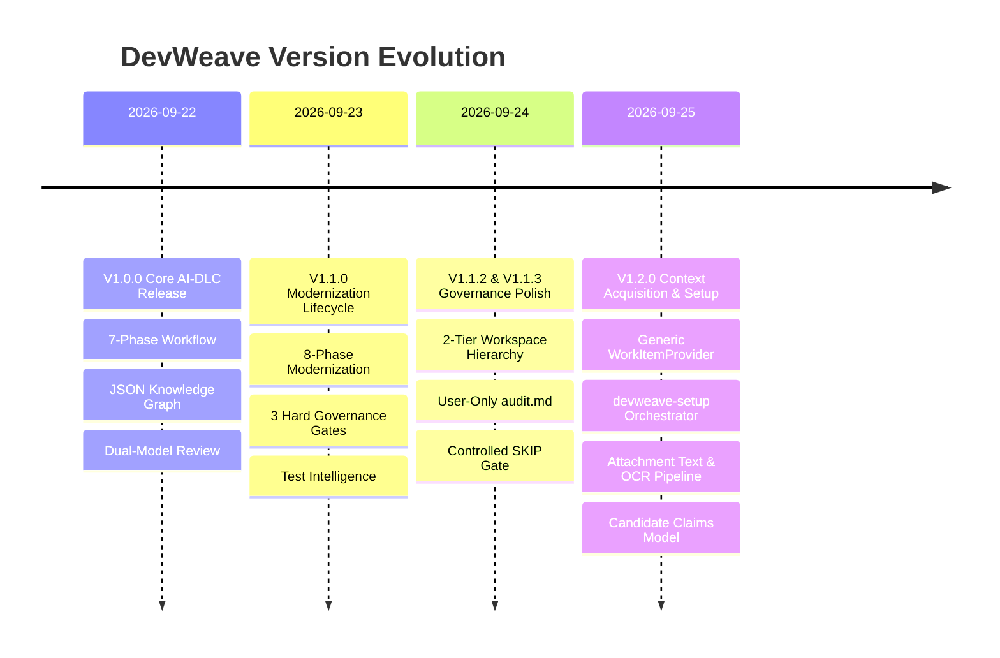

# DevWeave Release Specification & Version Documentation

## Current Version: `1.2.0`
- **Release Name**: Generic Work Item Context Acquisition & Setup Release
- **Release Date**: September 25, 2026
- **Release Branch**: `feature/V1.2.0-Context-acuisition-capabity`
- **Specification Status**: Normative & Conformance Verified (100% Pass across 11 Test Suites)
- **License**: Apache 2.0

---

## 1. Versioning Philosophy & Semantic Versioning Policy

DevWeave adheres to **[Semantic Versioning 2.0.0](https://semver.org/)** (`MAJOR.MINOR.PATCH`):

- **MAJOR (`X.0.0`)**: Incompatible architectural schema breaks or fundamental state machine contract modifications.
- **MINOR (`1.X.0`)**: Backwards-compatible lifecycle phase additions, new provider adapters, new governance gates, or schema extensions.
- **PATCH (`1.2.X`)**: Backward-compatible bug fixes, performance optimizations, token reduction enhancements, and documentation updates.

---

## 2. Release History & Milestones

| Version | Release Date | Key Themes & Deliverables | Conformance |
| :--- | :--- | :--- | :--- |
| **`1.2.0`** | 2026-09-25 | **Generic Work Item Context Acquisition & Setup Subsystem** • Vendor-neutral `WorkItemProvider` (Azure DevOps, Jira, GitHub, Custom) • Central `devweave-setup` environment & auth orchestrator • Safe attachment text extraction & non-blocking image OCR • Candidate claims modeling (`evidence.json`, `UNVERIFIED`) • Bounded migration slicing (`migration-slice.json`) • 4 new JSON schemas & 11 test suites | **100% Verified** (11/11 Suites) |
| **`1.1.3`** | 2026-09-24 | **Strict Gate Isolation & Controlled Skipping** • Immediate stop on gate approval (zero auto-chaining) • Mandatory developer justification for `SKIP` decisions • Interactive branch & base selection with confirmation | **100% Verified** (10/10 Suites) |
| **`1.1.2`** | 2026-09-23 | **2-Tier Hierarchical Workspace & User Audit Trail** • Split central intent from story-level deliverables • User-only `audit.md` logging strictly human actions • Blocking legacy source path checkpoint in INIT | **100% Verified** (10/10 Suites) |
| **`1.1.0`** | 2026-09-23 | **V1.1 Modernization Lifecycle & Test Intelligence** • 8-phase modernization lifecycle with 3 Hard Gates • Shared test intelligence with atomic updates & framework detection | **100% Verified** (10/10 Suites) |
| **`1.0.0`** | 2026-09-22 | **Initial Core AI-DLC Release** • Declarative 7-phase software engineering lifecycle • Git-native JSON Knowledge Graph durable memory • Dual-Model Review (Principal Architect + Senior DBA) | **100% Verified** (6/6 Suites) |

---

## 3. Detailed Breakdown of V1.2.0 Capabilities

### 3.1 Generic Project Management Provider Adapters
DevWeave is completely decoupled from any single PM vendor through the generic `WorkItemProvider` abstraction:
- **Azure DevOps (`azure-devops`)**: Bridges Azure Boards (`az boards` CLI & REST API) with parent/child hierarchies and WIQL search.
- **Atlassian Jira (`jira`)**: Integrates with Jira Cloud / Server via `jira-cli`, `acli`, or REST API.
- **GitHub Issues & Projects (`github`)**: Bridges GitHub Issues and Projects v2 via `gh` CLI and GraphQL.
- **Custom / Offline (`custom`)**: Provides interactive markdown prompt templates and custom REST connectors.

### 3.2 Environment & Setup Orchestrator (`devweave-setup`)
A dedicated command for environment diagnostics, client CLI discovery (`az`, `jira`/`acli`, `gh`, `tesseract`), human authorization before running package manager installations, and verifying secure session authentication without repository secret pollution.

### 3.3 Mandatory Setup Routing
In `devweave-modernization-context <ID>`, if `ProviderAdapter.detectClient()` detects a missing client CLI, execution halts immediately and directs the developer to run `devweave-setup`. Unmanaged silent installations are strictly prohibited.

### 3.4 Generic Privacy & Data-Processing Hard Gate
Prior to issuing external API requests for work-item data, comments, attachments, or remote AI processing, DevWeave prompts the developer with a clear consent gate (`[Approve] [Reject]`).

### 3.5 Zero Secret Storage Invariance
Passwords, Personal Access Tokens (PATs), and API tokens are NEVER written to `.devweave/`, Git history, JSON schemas, Markdown artifacts, state files, logs, or AI prompts. Authentication relies on OS credential managers (Windows Credential Manager, macOS Keychain, Linux Secret Service).

### 3.6 Attachment Classification & Safe Text Extraction
Attachments are classified into `TEXT`, `DOCUMENT`, `IMAGE`, `ARCHIVE`, and `OTHER`. Extracted text is sanitized against directory traversal attacks (`../`) and stored in isolated story workspaces.

### 3.7 Non-Blocking Optical Character Recognition (OCR)
Image attachments (`.png`, `.jpg`, `.jpeg`, `.webp`, `.bmp`) are processed via OCR and evaluated for confidence and quality (`SUCCESS`, `PARTIAL`, `FAILED`). OCR engine unavailability or low confidence is non-blocking, and the AI is strictly forbidden from hallucinating visual text.

### 3.8 Candidate Claims & Evidence Modeling (`evidence.json`)
Assertions made in user stories, comments, or attachments are formally modeled as claims and initialized to `UNVERIFIED`. Downstream phases (`PLAN`, `IMPLEMENT`) require verification against actual repository code/schema.

### 3.9 Bounded Migration Slicing & Graph Deltas
Extracts focused migration slices (`migration-slice.json`) under 12,000 tokens tracing Views &rarr; Controllers &rarr; Services &rarr; Database &rarr; Tests, and emits incremental graph patches (`graph-delta.json`).

### 3.10 Context Phase Human Checkpoint
Concludes `devweave-modernization-context` with a structured summary, transitions state to `WAITING_FOR_HUMAN`, and enforces a strict stop before `devweave-modernization-analyze`.

---

## 4. Complete 32 Commands Reference Across All 6 Hosts

| Command | Phase / Lane | Antigravity (`agy run`) | Claude Code (`claude /`) | GitHub Copilot (`@devweave`) | Gemini / Codex / Devin | Description |
| :--- | :--- | :--- | :--- | :--- | :--- | :--- |
| **`devweave-setup`** | `SETUP` | `devweave-setup` | `/devweave-setup` | `/setup` | `devweave-setup` | Environment diagnostics, PM client CLI detection, and secure auth verification. |
| **`devweave-init`** | `INIT` | `devweave-init` | `/devweave-init` | `/init` | `devweave-init` | Maps 5-layer tech stack, physical layers, and JSON Knowledge Graph. |
| **`devweave-context`** | `CONTEXT` | `devweave-context <ID>` | `/devweave-context <ID>` | `/context <ID>` | `devweave-context <ID>` | Ingests ticket, cleans PII, and runs 1-hop graph traversal (< 32k tokens). |
| **`devweave-analyze`** | `ANALYZE` | `devweave-analyze <ID>` | `/devweave-analyze <ID>` | `/analyze <ID>` | `devweave-analyze <ID>` | Evaluates database and API contract impacts. |
| **`devweave-plan`** | `PLAN` | `devweave-plan <ID>` | `/devweave-plan <ID>` | `/plan <ID>` | `devweave-plan <ID>` | Produces atomic step-by-step implementation blueprint. |
| **`devweave-branch`** | `BRANCH` | `devweave-branch <ID>` | `/devweave-branch <ID>` | `/branch <ID>` | `devweave-branch <ID>` | Creates isolated Git branch with interactive name & base branch selection. |
| **`devweave-implement`** | `IMPLEMENT` | `devweave-implement <ID>` | `/devweave-implement <ID>` | `/implement <ID>` | `devweave-implement <ID>` | Surgical code edits with atomic test updates & graph delta. |
| **`devweave-pr-review`** | `REVIEW` | `devweave-pr-review <ID>` | `/devweave-pr-review <ID>` | `/pr-review <ID>` | `devweave-pr-review <ID>` | Dual-Model Review: Principal Architect + Senior DBA. |
| **`devweave-pr`** | `PR` | `devweave-pr <ID>` | `/devweave-pr <ID>` | `/pr <ID>` | `devweave-pr <ID>` | Assembles final PR, merges graph delta, updates domain memory. |
| **`devweave-modernization-init`** | `INIT` | `devweave-modernization-init` | `/devweave-modernization-init` | `/modernization-init` | `devweave-modernization-init` | Natural-language intent ingestion with legacy source path checkpoint. |
| **`devweave-modernization-context`** | `CONTEXT` | `devweave-modernization-context <ID>` | `/devweave-modernization-context <ID>` | `/modernization-context <ID>` | `devweave-modernization-context <ID>` | Generic work-item intake, attachment text & OCR, claims modeling, legacy slice. |
| **`devweave-modernization-analyze`** | `ANALYZE` | `devweave-modernization-analyze <ID>` | `/devweave-modernization-analyze <ID>` | `/modernization-analyze <ID>` | `devweave-modernization-analyze <ID>` | Maps legacy business rules (**Hard Gate #1**). |
| **`devweave-modernization-plan`** | `PLAN` | `devweave-modernization-plan <ID>` | `/devweave-modernization-plan <ID>` | `/modernization-plan <ID>` | `devweave-modernization-plan <ID>` | Decomposes architecture into file tasks & DB migrations (**Hard Gate #2**). |
| **`devweave-modernization-branch`** | `BRANCH` | `devweave-modernization-branch <ID>` | `/devweave-modernization-branch <ID>` | `/modernization-branch <ID>` | `devweave-modernization-branch <ID>` | Branch isolation with interactive branch and base selection. |
| **`devweave-modernization-implement`** | `IMPLEMENT` | `devweave-modernization-implement <ID>` | `/devweave-modernization-implement <ID>` | `/modernization-implement <ID>` | `devweave-modernization-implement <ID>` | Surgical modernization implementation + test execution. |
| **`devweave-modernization-verify`** | `VERIFY` | `devweave-modernization-verify <ID>` | `/devweave-modernization-verify <ID>` | `/modernization-verify <ID>` | `devweave-modernization-verify <ID>` | Dual functional & architectural verification (**Hard Gate #3**). |
| **`devweave-modernization-pr`** | `PR` | `devweave-modernization-pr <ID>` | `/devweave-modernization-pr <ID>` | `/modernization-pr <ID>` | `devweave-modernization-pr <ID>` | PR release package assembly & graph delta promotion. |
| **`devweave-modernization-status`** | `STATUS` | `devweave-modernization-status <ID>` | `/devweave-modernization-status <ID>` | `/modernization-status <ID>` | `devweave-modernization-status <ID>` | Non-mutating state inspection and next suggested command. |
| **`devweave-modernization-report`** | `REPORT` | `devweave-modernization-report <ID>` | `/devweave-modernization-report <ID>` | `/modernization-report <ID>` | `devweave-modernization-report <ID>` | End-to-end modernization executive report. |
| **`devweave-fix-triage`** | `FIX` | `devweave-fix-triage <ID>` | `/devweave-fix-triage <ID>` | `/fix-triage <ID>` | `devweave-fix-triage <ID>` | Rapid defect classification and blast radius calculation. |
| **`devweave-fix-diagnose`** | `FIX` | `devweave-fix-diagnose <ID>` | `/devweave-fix-diagnose <ID>` | `/fix-diagnose <ID>` | `devweave-fix-diagnose <ID>` | Minimal root-cause isolation and regression test design. |
| **`devweave-fix-land`** | `FIX` | `devweave-fix-land <ID>` | `/devweave-fix-land <ID>` | `/fix-land <ID>` | `devweave-fix-land <ID>` | Minimal surgical patch + regression suite execution. |
| **`devweave-modernize`** | `MODERNIZE` | `devweave-modernize <ID>` | `/devweave-modernize <ID>` | `/modernize <ID>` | `devweave-modernize <ID>` | Framework upgrade manifests (.NET 8 &rarr; 9, Angular 16 &rarr; 17). |
| **`devweave-express`** | `EXPRESS` | `devweave-express <ID>` | `/devweave-express <ID>` | `/express <ID>` | `devweave-express <ID>` | Single-pass fast track for low-risk typos and documentation. |
| **`devweave-update`** | `SYSTEM` | `devweave-update` | `/devweave-update` | `/update` | `devweave-update` | In-place plugin updater and 24h daily auto-sync. |
| **`devweave-status`** | `UTILITY` | `devweave-status` | `/devweave-status` | `/status` | `devweave-status` | Current AI-DLC lifecycle phase and active gate status. |
| **`devweave-handoff`** | `UTILITY` | `devweave-handoff` | `/devweave-handoff` | `/handoff` | `devweave-handoff` | Packages story state for shift-left team handoffs. |
| **`devweave-archive`** | `UTILITY` | `devweave-archive <ID>` | `/devweave-archive <ID>` | `/archive <ID>` | `devweave-archive <ID>` | Archives completed story artifacts. |
| **`devweave-report`** | `UTILITY` | `devweave-report` | `/devweave-report` | `/report` | `devweave-report` | Generates consolidated engineering and efficiency report. |
| **`devweave-improve`** | `UTILITY` | `devweave-improve` | `/devweave-improve` | `/improve` | `devweave-improve` | Re-calibrates knowledge graph and technology rules. |
| **`devweave-document-product`** | `KNOWLEDGE` | `devweave-document-product` | `/devweave-document-product` | `/document-product` | `devweave-document-product` | Synthesizes product capabilities and catalog. |
| **`devweave-document-domain`** | `KNOWLEDGE` | `devweave-document-domain` | `/devweave-document-domain` | `/document-domain` | `devweave-document-domain` | Synthesizes domain business rules and ubiquitous language. |

---

## 5. Machine-Readable Schema Inventory

| Schema File | Spec Path | Conformance Path | Purpose |
| :--- | :--- | :--- | :--- |
| **`work-item.schema.json`** | `spec/schemas/` | `conformance/schemas/` | Normalized work item structure, comments, attachments, links, and prior art. |
| **`evidence.schema.json`** | `spec/schemas/` | `conformance/schemas/` | Candidate claims and evidence verification statuses. |
| **`migration-slice.schema.json`** | `spec/schemas/` | `conformance/schemas/` | Bounded dependency graph slice (< 12,000 tokens). |
| **`provider-config.schema.json`**| `spec/schemas/` | `conformance/schemas/` | Non-secret provider and client configuration. |
| **`architecture-intent.schema.json`**| `spec/schemas/` | `conformance/schemas/` | Target architecture intent declarations. |
| **`source-memory.schema.json`** | `spec/schemas/` | `conformance/schemas/` | Read-only legacy repository mapping. |
| **`modernization-state.schema.json`**| `spec/schemas/`| `conformance/schemas/` | Story phase progression and 3 Hard Gate trackers. |
| **`technology-profile.schema.json`** | `spec/schemas/` | `conformance/schemas/` | Target stack coding standards and architectural patterns. |
| **`migration-unit.schema.json`** | `spec/schemas/` | `conformance/schemas/` | Modernization unit scope definition. |
| **`mappings.schema.json`** | `spec/schemas/` | `conformance/schemas/` | Legacy-to-modern behavioral and endpoint mappings. |
| **`context.schema.json`** | `spec/schemas/` | `conformance/schemas/` | V1.0 bounded context and token budget tracker. |
| **`plan.schema.json`** | `spec/schemas/` | `conformance/schemas/` | File-anchored implementation plan tasks. |
| **`state.schema.json`** | `spec/schemas/` | `conformance/schemas/` | V1.0 story state machine tracker. |
| **`verification.schema.json`** | `spec/schemas/` | `conformance/schemas/` | Build, test, and acceptance criteria verification. |
| **`review-finding.schema.json`**| `spec/schemas/` | `conformance/schemas/` | Dual-Model review findings and severity levels. |
| **`solution.schema.json`** | `spec/schemas/` | `conformance/schemas/` | Architectural solution design. |
| **`test-traceability.schema.json`** | `spec/schemas/` | `conformance/schemas/` | Traceability matrix between stories, code, and tests. |

---

## 6. Conformance Test Suite Matrix

All 11 automated test suites pass with 100% conformance:

| # | Test Suite | Script | Tests Run | Pass Rate | Status |
|---|:---|:---|:---:|:---:|:---:|
| 1 | **JSON Schema Validation Suite** | `conformance/tests/validate_schemas.ps1` | 34 | 100% | **PASSED** |
| 2 | **AI-DLC State Machine Transition Suite** | `conformance/tests/validate_state_transitions.ps1` | 18 | 100% | **PASSED** |
| 3 | **18 Conformance Scenarios Suite** | `conformance/tests/run_scenarios.ps1` | 18 | 100% | **PASSED** |
| 4 | **12-Ecosystem Technology Neutrality Suite** | `conformance/tests/validate_tech_neutrality.ps1` | 12 | 100% | **PASSED** |
| 5 | **Multi-Repository `.devweave` Init Suite** | `conformance/tests/init_all_fixtures.ps1` | 8 | 100% | **PASSED** |
| 6 | **Token & Cost Efficiency Benchmark Suite** | `conformance/tests/measure_efficiency.ps1` | 4 | 100% | **PASSED** |
| 7 | **V1.1 Modernization CLI Contract Suite** | `conformance/tests/validate_modernization_cli.ps1` | 36 | 100% | **PASSED** |
| 8 | **V1.1 Modernization State Machine Suite** | `conformance/tests/validate_modernization_state.ps1` | 16 | 100% | **PASSED** |
| 9 | **V1.1 Modernization Modules & E2E Suite** | `conformance/tests/validate_modernization_e2e.ps1` | 8 | 100% | **PASSED** |
| 10 | **V1.0/V1.1 Test Intelligence Suite** | `conformance/tests/validate_test_intelligence.ps1` | 10 | 100% | **PASSED** |
| 11 | **V1.2 Work Item Context Acquisition Suite** | `conformance/tests/validate_context_acquisition.ps1` | 21 | 100% | **PASSED** |
| **TOTAL** | **Master Conformance & Readiness** | `conformance/tests/run_all_tests.ps1` | **185** | **100%** | **PASSED** |
