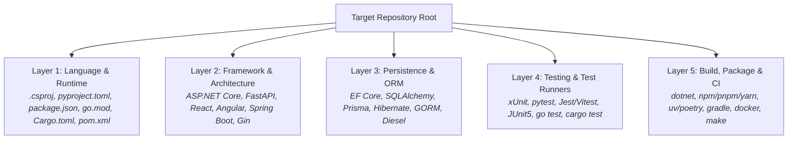
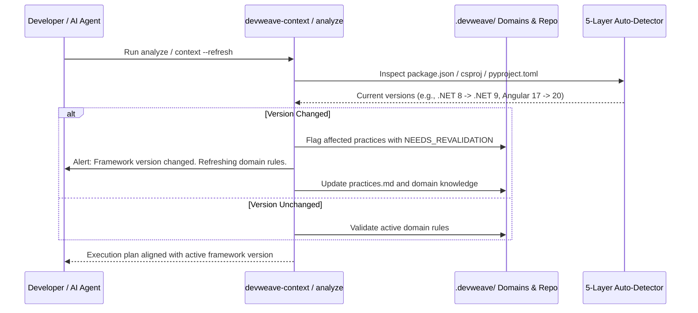

# DevWeave System Architecture

DevWeave provides a **declarative, technology-neutral AI-Driven Development Lifecycle (AI-DLC)** architecture that decouples engineering governance from specific programming languages, runtimes, and AI coding hosts.

---

## 1. High-Level Architecture Diagram

```mermaid
flowchart TD
    subgraph SPEC["1. AI-DLC Formal Specification Layer"]
        LIFECYCLE["Lifecycle & State Machine<br>(28 Transitions, 12 States)"]
        HITL["Human-in-the-Loop Governance<br>(Zero Self-Approval, Gated Phases)"]
        REVAL["Dynamic Technology Revalidation<br>(Version Tracking, Invalidation)"]
        TAXONOMY["Best Practices Taxonomy<br>(MANDATORY, RECOMMENDED, ADVISORY, ANTI_PATTERN)"]
    end

    subgraph REPO_INTEL["2. Autonomous Repository Intelligence"]
        L1["Layer 1: Runtime & Language"]
        L2["Layer 2: Framework & Web"]
        L3["Layer 3: Persistence & DB"]
        L4["Layer 4: Testing & Quality"]
        L5["Layer 5: Build & Packaging"]
        KNOWLEDGE[".devweave/ Repository & Domain Knowledge"]
    end

    subgraph LANES["3. Workflow & Execution Engine"]
        CANONICAL["Canonical 7-Phase Flow<br>(init -> context -> analyze -> plan -> branch -> implement -> review -> pr)"]
        MODERNIZATION["V1.1 Modernization Pipeline (8 Phases)<br>(init -> context -> analyze [G1] -> plan [G2] -> branch -> implement -> verify [G3] -> pr)"]
        FIX_LANE["Fix Fast Lane<br>(fix-triage -> fix-diagnose -> fix-land)"]
        EXPRESS["Express Mode<br>(low-risk fast path)"]
    end

    subgraph ADAPTERS["4. Host Adapters & Runtime Integration"]
        ANTIGRAVITY["Google Antigravity Native Host Adapter<br>(31 Skills, rules/AGENTS.md, plugin.json)"]
        OTHER_HOSTS["Multi-Host Adapter Contract<br>(Claude, Copilot, Gemini, Codex, Devin)"]
    end

    SPEC --> REPO_INTEL
    REPO_INTEL --> LANES
    LANES --> ADAPTERS
```



---

## 2. Five-Layer Autonomous Technology Detection

DevWeave operates without hardcoded technology rules. During `devweave-init` and `devweave-context`, it scans repository lockfiles, project manifests, and directory structures across five distinct layers:



### Knowledge Base Generation
The detected evidence is compiled into durable, structured Markdown documents in `.devweave/`:
- `.devweave/repository/profile.md` — Holistic repository profile and stack overview.
- `.devweave/repository/technologies.md` — Detected languages and runtime targets.
- `.devweave/repository/frameworks.md` — Web, API, and UI frameworks with active versions.
- `.devweave/repository/dependencies.md` — Comprehensive dependency analysis.
- `.devweave/repository/build.md` — Deterministic build commands and toolchains.
- `.devweave/repository/testing.md` — Deterministic test runner commands and flags.
- `.devweave/repository/architecture.md` — Discovered directory structure and component hierarchy.
- `.devweave/repository/practices.md` — 4-tier technology practices and patterns.

---

## 3. Dynamic Technology Revalidation & Invalidation Model

Software dependencies and framework versions change over time. DevWeave maintains freshness through automated revalidation:



---

## 4. Human-in-the-Loop (HITL) Governance & Invariants

DevWeave enforces strict governance invariants:
1. **Phase Isolation**: Every command performs only its scoped responsibilities, produces its artifact, and halts.
2. **Zero Automatic Progression**: The agent never automatically transitions across phases without human review.
3. **Zero Self-Approval**: Gate approvals (`[APPROVE]`, `[REQUEST_CHANGES]`, `[REJECT]`) must be explicitly supplied by the human developer.
4. **Mandatory Description Prompting (Optional Input)**: Prompts developer for optional notes or constraints at every phase.
5. **Pre-Processing Transparency**: AI states its intent, targets, and objectives before executing.
6. **Mandatory Hard Gates**:
   - **Feature Lifecycle Hard Gates**:
     - **Branch Gate** (`devweave-branch`): Requires human authorization before Git branch creation.
     - **PR Review Gate** (`devweave-pr-review`): Dual-model consensus review sign-off.
     - **PR Gate** (`devweave-pr`): Human sign-off before generating the PR package.
   - **Modernization Lifecycle Hard Gates**:
     - **Hard Gate #1 (Post-ANALYZE)**: Approval of legacy behavioral mapping (`mappings.json`).
     - **Hard Gate #2 (Post-PLAN)**: Approval of implementation tasks, test specs, and DB migration scripts.
     - **Hard Gate #3 (Post-VERIFY)**: Approval of dual verification scorecard and functional parity proof.

---

## 5. Antigravity Reference Host Adapter

DevWeave is packaged natively as an Antigravity Plugin located at `plugins/antigravity/`:

```
plugins/antigravity/
├── plugin.json               # Plugin manifest (name: "devweave", version: "1.1.0")
├── rules/
│   └── AGENTS.md             # AI-DLC core rules loaded into agent context
└── skills/                   # 31 specialized skills
    ├── devweave-init/
    ├── devweave-context/
    ├── devweave-analyze/
    ├── devweave-plan/
    ├── devweave-branch/
    ├── devweave-implement/
    ├── devweave-pr-review/
    ├── devweave-pr/
    ├── devweave-modernization-init/
    ├── devweave-modernization-context/
    ├── devweave-modernization-analyze/
    ├── devweave-modernization-plan/
    ├── devweave-modernization-branch/
    ├── devweave-modernization-implement/
    ├── devweave-modernization-verify/
    ├── devweave-modernization-pr/
    ├── devweave-modernization-status/
    ├── devweave-modernization-report/
    ├── devweave-fix-triage/
    ├── devweave-fix-diagnose/
    ├── devweave-fix-land/
    ├── devweave-modernize/
    ├── devweave-express/
    ├── devweave-update/
    ├── devweave-status/
    ├── devweave-handoff/
    ├── devweave-archive/
    ├── devweave-report/
    ├── devweave-improve/
    ├── devweave-document-product/
    └── devweave-document-domain/
```

- **Autonomous Tool Execution**: Leverages host native tools (`run_command`, `view_file`, `write_to_file`, `replace_file_content`) to inspect code and run tests.
- **Zero Mandatory Daemons**: Entire system operates statelessly inside agent turns using file-based `.devweave/` state persistence.

---

## 6. 2-Tier Hierarchical Workspace Architecture

DevWeave prevents configuration duplication across stories by separating global architectural declarations from individual story migration deliverables:

```text
.devweave/modernization/
├── workspace.json              # [Tier 1] Target solution metadata & persisted PM tool selection
├── architecture-intent.json    # [Tier 1] Declared target architecture intent
├── technology-profile.json     # [Tier 1] Enforced technology practices & rules
├── source-memory.json          # [Tier 1] Legacy repository pointer (READ_ONLY access mode)
└── stories/                    # [Tier 2] Story-Level Deliverables
    └── <ID>/                   # (e.g., stories/98, stories/99)
        ├── state.json          # Story lifecycle phase & hard gate tracker
        ├── audit.md            # Append-only user activity & prompt audit log (Author attribution)
        ├── context.md          # Bounded legacy slice context
        ├── migration-unit.json # Targeted legacy components & DTOs
        ├── analysis.md         # Behavioral rules & dependency analysis
        ├── mappings.json       # Legacy-to-target component mappings
        ├── plan.md             # File-anchored tasks & DB migrations
        ├── evidence.md         # Implementation & test execution evidence
        ├── verification.md     # Behavioral parity & test scorecards
        └── pr-description.md   # Pull request release package
```

---

## 7. User-Only Chronological Story Audit Trail (`audit.md`)

DevWeave maintains strict auditability by generating an append-only `.devweave/modernization/stories/<ID>/audit.md` (and `.devweave/work-items/<ID>/audit.md`) capturing **EXCLUSIVELY developer interactions**:
- **Author Identity**: Each entry records `Author: <User Name> <email@example.com>` from Git config.
- **Developer Prompts**: Full text of user instructions, custom descriptions, and pasted requirements.
- **Interactive Configurations**: PM tool choices and custom branch configurations (`--name`, `--base`, or natural phrasing).
- **Governance Gate Records**: Explicit human decisions (`APPROVE`, `REQUEST_CHANGES`, `STOP`) and reviewer comments at Hard Gates #1, #2, and #3.
- **Zero Framework Operations**: AI-DLC internal machinery, AST scans, and agent traces are excluded to maintain clean human governance history.
