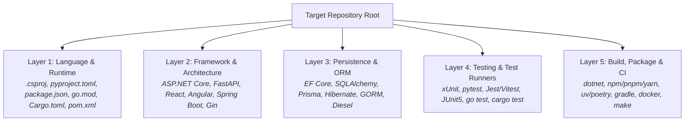
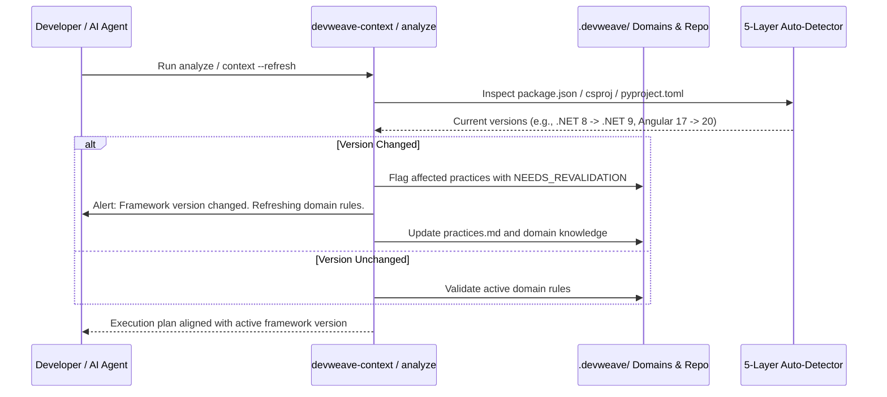

# DevWeave System Architecture

DevWeave provides a **declarative, technology-neutral AI-Driven Development Lifecycle (AI-DLC)** architecture that decouples engineering governance from specific programming languages, runtimes, and AI coding hosts.

---

## 1. High-Level Architecture Diagram

```mermaid
flowchart TD
    subgraph SPEC["1. AI-DLC Formal Specification Layer"]
        LIFECYCLE["Lifecycle & State Machine<br>(28 Transitions, 12 States)"]
        HITL["Human-in-the-Loop Governance<br>(Zero Self-Approval, Gated Phases)"]
        REVAL["Dynamic Technology Revalidation<br>(Version Tracking, Invalidation)"]
        TAXONOMY["Best Practices Taxonomy<br>(MANDATORY, RECOMMENDED, ADVISORY, ANTI_PATTERN)"]
    end

    subgraph REPO_INTEL["2. Autonomous Repository Intelligence"]
        L1["Layer 1: Runtime & Language"]
        L2["Layer 2: Framework & Web"]
        L3["Layer 3: Persistence & DB"]
        L4["Layer 4: Testing & Quality"]
        L5["Layer 5: Build & Packaging"]
        KNOWLEDGE[".devweave/ Repository & Domain Knowledge"]
    end

    subgraph LANES["3. Workflow & Execution Engine"]
        CANONICAL["Canonical 6-Phase Flow<br>(context -> analyze -> plan -> branch -> implement -> pr)"]
        FIX_LANE["Fix Fast Lane<br>(fix-triage -> fix-diagnose -> fix-land)"]
        MODERNIZE["Modernization Lane<br>(migration_manifest.md)"]
        EXPRESS["Express Mode<br>(low-risk fast path)"]
    end

    subgraph ADAPTERS["4. Host Adapters & Runtime Integration"]
        ANTIGRAVITY["Google Antigravity Native Host Adapter<br>(19 Skills, rules/AGENTS.md, plugin.json)"]
        OTHER_HOSTS["Generic Host Adapter Contract<br>(Markdown, JSON Schema, CLI)"]
    end

    SPEC --> REPO_INTEL
    REPO_INTEL --> LANES
    LANES --> ADAPTERS
```



---

## 2. Five-Layer Autonomous Technology Detection

DevWeave operates without hardcoded technology rules. During `devweave-init` and `devweave-context`, it scans repository lockfiles, project manifests, and directory structures across five distinct layers:



### Knowledge Base Generation
The detected evidence is compiled into durable, structured Markdown documents in `.devweave/`:
- `.devweave/repository/profile.md` — Holistic repository profile and stack overview.
- `.devweave/repository/technologies.md` — Detected languages and runtime targets.
- `.devweave/repository/frameworks.md` — Web, API, and UI frameworks with active versions.
- `.devweave/repository/dependencies.md` — Comprehensive dependency analysis.
- `.devweave/repository/build.md` — Deterministic build commands and toolchains.
- `.devweave/repository/testing.md` — Deterministic test runner commands and flags.
- `.devweave/repository/architecture.md` — Discovered directory structure and component hierarchy.
- `.devweave/repository/practices.md` — 4-tier technology practices and patterns.

---

## 3. Dynamic Technology Revalidation & Invalidation Model

Software dependencies and framework versions change over time. DevWeave maintains freshness through automated revalidation:



---

## 4. Human-in-the-Loop (HITL) Governance & Phase Isolation

DevWeave enforces strict governance invariants:
1. **Phase Isolation**: Every command (e.g., `devweave-analyze`) performs only its scoped responsibilities, produces its artifact (`analysis.md`), and halts.
2. **Zero Automatic Chaining**: The agent never automatically transitions from `ANALYZE` to `PLAN` without human review.
3. **Zero Self-Approval**: Gate approvals (`[APPROVE]`, `[REQUEST_CHANGES]`, `[REJECT]`) must be explicitly supplied by the human developer.
4. **Mandatory Hard Gates**:
   - **PII/Privacy Gate** (`devweave-context`): Sanitizes credentials and sensitive data.
   - **Branch Gate** (`devweave-branch`): Requires human authorization before Git branch creation.
   - **PR Gate** (`devweave-pr`): Requires human sign-off before generating the PR package.

---

## 5. Antigravity Reference Host Adapter

DevWeave is packaged natively as an Antigravity Plugin located at `plugins/devweave/`:

```
plugins/devweave/
├── plugin.json               # Plugin manifest (name, version, description)
├── rules/
│   └── AGENTS.md             # AI-DLC core rules loaded into agent context
└── skills/
    ├── devweave-init/
    ├── devweave-context/
    ├── devweave-analyze/
    ├── devweave-plan/
    ├── devweave-branch/
    ├── devweave-implement/
    ├── devweave-pr/
    ├── devweave-status/
    ├── devweave-handoff/
    ├── devweave-archive/
    ├── devweave-fix-triage/
    ├── devweave-fix-diagnose/
    ├── devweave-fix-land/
    ├── devweave-modernize/
    ├── devweave-express/
    ├── devweave-report/
    ├── devweave-improve/
    ├── devweave-document-product/
    └── devweave-document-domain/
```

- **Autonomous Tool Execution**: Leverages host native tools (`run_command`, `view_file`, `write_to_file`, `replace_file_content`) to inspect code and run tests.
- **Zero Mandatory Daemons**: Entire system operates statelessly inside agent turns using file-based `.devweave/` state persistence.
