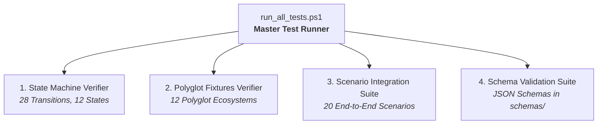

# DevWeave Conformance & Test Suite

The DevWeave Conformance Suite validates that DevWeave implementations, workflow profiles, state machines, and polyglot repository fixtures adhere strictly to the canonical AI-DLC specification.

---

## 1. Conformance Architecture



---

## 2. Test Suite Breakdown

### A. State Machine Verification (`run_state_machine.ps1`)
- Validates all **28 canonical state transitions**.
- Asserts invalid transition rejection (e.g., `INIT` $\to$ `IMPLEMENT` without `PLAN`).
- Tests rollback and remediation loops (`RETEST`, `REVERIFY`, `FIX`).

### B. Polyglot Ecosystem Fixtures (`run_fixtures.ps1`)
Tests 5-layer autonomous technology detection across **12 distinct ecosystems**:
1. **.NET Core / ASP.NET 9** (`csharp-dotnet`)
2. **Python / FastAPI / Poetry** (`python-fastapi`)
3. **TypeScript / React / Vite** (`typescript-react`)
4. **Java / Spring Boot / Maven** (`java-springboot`)
5. **Go / Gin / Modules** (`go-gin`)
6. **Rust / Tokio / Cargo** (`rust-tokio`)
7. **PHP / Laravel / Composer** (`php-laravel`)
8. **Ruby on Rails / Bundler** (`ruby-rails`)
9. **C++ / CMake** (`cpp-cmake`)
10. **Legacy ASP.NET Monolith** (`legacy-dotnet-framework`)
11. **Multi-Service Monorepo** (`monorepo-polyglot`)
12. **Minimal / Unconfigured Repo** (`minimal-generic`)

### C. Scenario Integration Suite (`run_scenarios.ps1`)
20 comprehensive automated test scenarios including:
- **Scenario 1–18**: Core lifecycle phases, artifact schemas, review gates, branch protections, rollback loops, and express mode.
- **Scenario 19**: **Human-in-the-Loop (HITL) Phase Isolation & Checkpoints** (verifies zero self-approval, zero auto-chaining, manual gate requirements).
- **Scenario 20**: **Dynamic Technology Revalidation** (verifies framework version changes trigger `NEEDS_REVALIDATION` and targeted practice refresh).

---

## 3. Running Conformance Tests

To run the complete test suite locally:

```powershell
.\conformance\tests\run_all_tests.ps1
```

### Expected Output:
```text
================================================================
  DevWeave Master Conformance & Release Test Suite
================================================================
  [PASS] State Machine Tests (28/28 transitions verified)
  [PASS] Polyglot Repository Fixtures (12/12 ecosystems verified)
  [PASS] Scenario Integration Suite (20/20 scenarios verified)
  [PASS] JSON Schema Validation Suite (schemas valid)
----------------------------------------------------------------
  TOTAL SUITES: 6 | PASSED: 6 | FAILED: 0
  ALL CONFORMANCE TESTS PASSED (100% COMPLIANT)
================================================================
```
