# DevWeave Conformance & Test Suite

The DevWeave Conformance Suite validates that DevWeave implementations, workflow profiles, state machines, modernization lifecycles, test intelligence, and polyglot repository fixtures adhere strictly to the canonical AI-DLC specification.

---

## 1. Conformance Architecture

```mermaid
flowchart TD
    RUN_ALL["run_all_tests.ps1<br><b>Master Test Runner (10 Suites)</b>"] --> S1["1. JSON Schema Validator<br><i>18 Formal Schemas</i>"]
    RUN_ALL --> S2["2. State Machine Verifier<br><i>28 Transitions, 12 States</i>"]
    RUN_ALL --> S3["3. Scenario Integration Suite<br><i>20 End-to-End Scenarios</i>"]
    RUN_ALL --> S4["4. Polyglot Neutrality Suite<br><i>12 Polyglot Ecosystems</i>"]
    RUN_ALL --> S5["5. Multi-Repo Fixtures Suite<br><i>14 Artifacts / Fixture</i>"]
    RUN_ALL --> S6["6. Token Efficiency Benchmarks<br><i>&gt;84% Token Savings</i>"]
    RUN_ALL --> S7["7. Modernization CLI Contract<br><i>10 Hyphenated Commands</i>"]
    RUN_ALL --> S8["8. Modernization State Machine<br><i>3 Human Hard Gates</i>"]
    RUN_ALL --> S9["9. Modernization Modules & E2E<br><i>Source Isolation & Slicing</i>"]
    RUN_ALL --> S10["10. Test Intelligence Suite<br><i>10 Testing Scenarios</i>"]
```



---

## 2. Test Suite Breakdown

### A. V1.0 Core Conformance
1. **JSON Schema Validation Suite** (`validate_schemas.ps1`): Validates all 18 JSON schemas against valid and invalid fixtures.
2. **AI-DLC State Machine Transition Suite** (`validate_state_transitions.ps1`): Validates 28 canonical transitions and rejection of illegal bypasses.
3. **18 Conformance Scenarios Suite** (`run_scenarios.ps1`): 20 comprehensive end-to-end integration scenarios.
4. **12-Ecosystem Technology Neutrality Suite** (`validate_tech_neutrality.ps1`): Tests autonomous stack discovery across 12 distinct language ecosystems.
5. **Multi-Repository Initialization Suite** (`init_all_fixtures.ps1`): Validates 5-layer detection and knowledge graph synthesis across 12 test fixtures.
6. **Token & Cost Efficiency Benchmark Suite** (`measure_efficiency.ps1`): Proves 84%–93% token savings and 95%–99% cost reduction.

### B. V1.1 Modernization & Test Intelligence
7. **Modernization CLI Contract Suite** (`validate_modernization_cli.ps1`): Asserts recognition of 10 hyphenated `devweave-modernization-*` commands and rejection of space/colon syntax.
8. **Modernization State Machine Suite** (`validate_modernization_state.ps1`): Validates the 8-phase modernization state machine and 3 Human Hard Gates.
9. **Modernization Modules & E2E Suite** (`validate_modernization_e2e.ps1`): Tests natural-language initialization, conflict detection, legacy source `READ_ONLY` isolation, and knowledge graph reconciliation.
10. **Test Intelligence Suite** (`validate_test_intelligence.ps1`): Validates atomic production/test implementation, E2E framework auto-detection (Playwright, Cypress), and failure classification without test weakening.

---

## 3. Running Conformance Tests

To run the complete test suite locally:

```powershell
.\conformance\tests\run_all_tests.ps1
```

### Expected Output:
```text
=================================================================
                     SUITE EXECUTION SUMMARY                    
=================================================================
  [PASSED] JSON Schema Validation Suite                  (2.15s)
  [PASSED] AI-DLC State Machine Transition Suite         (1.14s)
  [PASSED] 18 Conformance Scenarios Suite                (1.16s)
  [PASSED] 12-Ecosystem Technology Neutrality Suite      (1.44s)
  [PASSED] Multi-Repository .devweave Initialization Suite (1.95s)
  [PASSED] Token & Cost Efficiency Benchmark Suite       (0.78s)
  [PASSED] V1.1 Modernization CLI Contract Suite         (1.28s)
  [PASSED] V1.1 Modernization State Machine Suite        (1.54s)
  [PASSED] V1.1 Modernization Modules & E2E Suite        (1.07s)
  [PASSED] V1.0/V1.1 Test Intelligence Suite             (1.30s)
-----------------------------------------------------------------
RELEASE CANDIDATE STATUS: 100% CONFORMANCE VERIFIED (ALL SUITES PASSED)
=================================================================
```
