```mermaid
flowchart LR
    P0["<b>Phase 0: Init</b><br><code>devweave-init</code>"] --> P1["<b>Phase 1: Context</b><br><code>devweave-context &lt;ID&gt;</code>"]
    P1 --> P2["<b>Phase 2: Analyze</b><br><code>devweave-analyze &lt;ID&gt;</code>"]
    P2 --> P3["<b>Phase 3: Plan</b><br><code>devweave-plan &lt;ID&gt;</code>"]
    P3 --> P4["<b>Phase 4: Branch</b><br><code>devweave-branch &lt;ID&gt;</code><br><b>[HARD GATE]</b>"]
    P4 --> P5["<b>Phase 5: Implement</b><br><code>devweave-implement &lt;ID&gt;</code>"]
    P5 --> P6["<b>Phase 6: PR Review</b><br><code>devweave-pr-review &lt;ID&gt;</code><br><b>[HARD GATE]</b>"]
    P6 --> P7["<b>Phase 7: PR</b><br><code>devweave-pr &lt;ID&gt;</code><br><b>[HARD GATE]</b>"]
```

# DevWeave V1.1 — Getting Started & User Guide

Welcome to **DevWeave** — the declarative, evidence-based, and technology-neutral **AI-Driven Development Lifecycle (AI-DLC)** framework.

> **Core Mission:** *Less Tokens. More Work. Lower Bill.*

DevWeave guides developers and autonomous AI coding agents from initial work item requirements through analysis, planning, branch governance, implementation, deterministic testing with Test Intelligence, dual-model code/SQL review, end-to-end legacy modernization, and pull request readiness across **all 6 major AI coding platforms**.

---

## 1. What is DevWeave?

DevWeave provides AI coding assistants with a **disciplined, structured engineering process**:

```mermaid
flowchart TD
    subgraph Traditional["❌ Traditional Unstructured AI Coding"]
        T1["Prompt: 'Build this feature'"] --> T2["Whole-Repo Dump (Token Bloat)"]
        T2 --> T3["Hallucinated Architecture & Regressions"]
        T3 --> T4["Broken Tests & Silent Bugs"]
        T4 --> T5["High Cost ($$$) & Frustration"]
    end

    subgraph DevWeave["✅ DevWeave AI-DLC Framework"]
        D1["Work Item / Ticket (Jira, ADO, GitHub, Linear, Manual)"] --> D2["Autonomous Detection & Scoped Context (.devweave/)"]
        D2 --> D3["Deep Analysis & Root-Cause Evaluation"]
        D3 --> D4["File-Anchored Plan & Branch Governance"]
        D4 --> D5["Plan-Bound Incremental Implementation & Test Intelligence"]
        D5 --> D6["Deterministic Testing & Verification"]
        D6 --> D7["Dual-Model Code & SQL Review (Architect + DBA)"]
        D7 --> D8["Durable Domain Knowledge Promotion & PR Package"]
    end
```



---

## 2. Supported Multi-Host Platforms

DevWeave runs natively across **6 AI coding hosts** with **31 validated skills and commands**:

| Host Platform | Native Plugin Directory | Primary Command Style | Supported Models |
|---|---|---|---|
| **Google Antigravity** | [`plugins/antigravity/`](file:///D:/DevWeave/plugins/antigravity/) | `agy run devweave-<phase>` | `flash_lite`, `flash`, `pro` |
| **Anthropic Claude Code** | [`plugins/claude/`](file:///D:/DevWeave/plugins/claude/) | `claude /devweave-<phase>` | `Claude 3.5 Haiku`, `Sonnet`, `Opus` |
| **GitHub Copilot** | [`plugins/copilot/`](file:///D:/DevWeave/plugins/copilot/) | `@devweave /<phase>` | `GPT-4o-mini`, `GPT-4o`, `o3-mini`, `o1` |
| **Google Gemini CLI** | [`plugins/gemini/`](file:///D:/DevWeave/plugins/gemini/) | `gemini devweave-<phase>` | `Gemini 2.0 Flash Lite`, `Flash`, `Pro` |
| **OpenAI Codex** | [`plugins/codex/`](file:///D:/DevWeave/plugins/codex/) | `codex run devweave-<phase>`| `GPT-4o-mini`, `GPT-4o`, `o3-mini`, `o1` |
| **Cognition Devin** | [`plugins/devin/`](file:///D:/DevWeave/plugins/devin/) | `devin run /devweave-<phase>` | `Devin Fast`, `Standard`, `Deep Research` |

---

## 3. Core Interaction Rules

DevWeave strictly enforces two developer interaction standards across all phases:

1. **Mandatory Description Prompting (Optional Input)**:
   - For every phase, DevWeave asks: *"Do you have any additional description, architectural context, or instructions for this phase?"*
   - Providing input is optional; if skipped or confirmed without extra notes, DevWeave continues with standard defaults.
2. **Pre-Processing Transparency ("State Intent Before Action")**:
   - Before executing file inspections, modifications, builds, or test commands, DevWeave declares what it is about to do, which files it will touch, and why.

---

## 4. The Canonical 7-Phase User Workflow



### Phase Breakdown & Test Intelligence
- **Phase 0 (`devweave-init`)**: Inspects manifests across 5 layers (Runtime, Framework, Persistence, Testing, Build) and builds `.devweave/graph/knowledge-graph.json`.
- **Phase 1 (`devweave-context <ID>`)**: Prompts for PII/Privacy verification, presents the interactive PM tool selector, and isolates the blast radius under a 32,000 token budget.
- **Phase 2 (`devweave-analyze <ID>`)**: Deep codebase archaeology, competing hypothesis analysis, and version-aware practice binding.
- **Phase 3 (`devweave-plan <ID>`)**: Decomposes the task into atomic, file-anchored tasks with explicit test commands and test specs.
- **Phase 4 (`devweave-branch <ID>`)**: **[HARD GATE]** Enforces isolated branch creation before any code modifications.
- **Phase 5 (`devweave-implement <ID>`)**: Executes plan-bound code changes with **Test Intelligence**: production code and test changes form an atomic changeset. Automatically classifies test failures (`IMPLEMENTATION_DEFECT` vs `EXPECTED_BEHAVIOR_CHANGE`) and strictly forbids test weakening.
- **Phase 6 (`devweave-pr-review <ID>`)**: **[HARD GATE]** Dual-model consensus review (Principal Architect + Senior DBA + Security + Downstream Impact + Cascading Resilience).
- **Phase 7 (`devweave-pr <ID>`)**: **[HARD GATE]** Reuses verified review evidence, promotes durable domain knowledge, and creates the PR.

---

## 5. V1.1 Modernization Lifecycle (Legacy Migration)

DevWeave V1.1 provides an end-to-end 8-phase modernization lifecycle to migrate legacy monoliths to modern architectures with zero regressions:

```mermaid
flowchart LR
    M0["0. Modernization Init<br><code>devweave-modernization-init</code>"] --> M1["1. Context Slicing<br><code>devweave-modernization-context &lt;ID&gt;</code>"]
    M1 --> M2["2. Legacy Mapping<br><code>devweave-modernization-analyze &lt;ID&gt;</code><br><b>[HARD GATE #1]</b>"]
    M2 --> M3["3. Modernization Plan<br><code>devweave-modernization-plan &lt;ID&gt;</code><br><b>[HARD GATE #2]</b>"]
    M3 --> M4["4. Isolated Branch<br><code>devweave-modernization-branch &lt;ID&gt;</code>"]
    M4 --> M5["5. Implement & Tests<br><code>devweave-modernization-implement &lt;ID&gt;</code>"]
    M5 --> M6["6. Parity Verification<br><code>devweave-modernization-verify &lt;ID&gt;</code><br><b>[HARD GATE #3]</b>"]
    M6 --> M7["7. PR & Promotion<br><code>devweave-modernization-pr &lt;ID&gt;</code>"]
```



### The 3 Mandatory Modernization Hard Gates:
1. **Hard Gate #1 (Post-ANALYZE)**: Human approval of legacy behavioral mappings and target pattern selection.
2. **Hard Gate #2 (Post-PLAN)**: Human approval of implementation blueprint, test specs, and DB migration scripts.
3. **Hard Gate #3 (Post-VERIFY)**: Human approval of dual-layer functional parity scorecard and verification evidence.

---

## 6. Specialized Fast Lanes

### A. Fix Fast Lane (Accelerated Bug Remediation)
```text
devweave-fix-triage <ID>  ──►  devweave-fix-diagnose <ID>  ──►  devweave-fix-land <ID> [HARD GATE]
 (Log & Severity Triage)       (Root-Cause Investigation)        (Patch, Retest, Review & PR)
```

### B. Express Mode (Low-Risk Fast Track)
```text
devweave-express <ID> ──► Unified Context + Patch + Test + PR (For verified single-file typos & docs)
```

---

## 7. Central Compounding Knowledge Base

DevWeave continuously builds domain memory under [`.devweave/domains/`](file:///D:/DevWeave/.devweave/domains/):
- **First Story in Domain**: Discovers architecture and builds domain scorecard.
- **Subsequent Stories**: Reads existing domain file at **0 token rediscovery cost** (**93.3% token savings**).
- **PR Phase**: Promotes newly discovered patterns back to central storage, compounding intelligence with every merged PR.

For full empirical benchmarks across 12 polyglot repositories and cost calculations, see [V1.0 Benchmarks & Performance Guide](file:///D:/DevWeave/docs/v1-benchmarks.md).

