# DevWeave V1.0 — Developer & User Guide

Welcome to **DevWeave** — the declarative, evidence-based, and technology-neutral **AI-Driven Development Lifecycle (AI-DLC)** framework.

> **Core Mission:** *Less Tokens. More Work. Lower Bill.*

DevWeave guides developers and autonomous AI coding agents from initial work item requirements through analysis, planning, branch governance, implementation, deterministic testing, dual-model code/SQL review, and pull request readiness across **all major AI coding platforms**.

---

## 1. What is DevWeave?

DevWeave provides AI coding assistants with a **disciplined, structured engineering process**:


---

## 2. Supported Multi-Host Platforms

DevWeave runs natively across **6 AI coding hosts**:

| Host Platform | Native Plugin Directory | Primary Command Style | Supported Models |
|---|---|---|---|
| **Google Antigravity** | [`plugins/antigravity/`](file:///D:/DevWeave/plugins/antigravity/) | `agy run devweave-<phase>` | `flash_lite`, `flash`, `pro` |
| **Anthropic Claude Code** | [`plugins/claude/`](file:///D:/DevWeave/plugins/claude/) | `claude /devweave-<phase>` | `Claude 3.5 Haiku`, `Sonnet`, `Opus` |
| **GitHub Copilot** | [`plugins/copilot/`](file:///D:/DevWeave/plugins/copilot/) | `@devweave /<phase>` | `GPT-4o-mini`, `GPT-4o`, `o3-mini`, `o1` |
| **Google Gemini CLI** | [`plugins/gemini/`](file:///D:/DevWeave/plugins/gemini/) | `gemini devweave-<phase>` | `Gemini 2.0 Flash Lite`, `Flash`, `Pro` |
| **OpenAI Codex** | [`plugins/codex/`](file:///D:/DevWeave/plugins/codex/) | `codex run devweave-<phase>`| `GPT-4o-mini`, `GPT-4o`, `o3-mini`, `o1` |
| **Cognition Devin** | [`plugins/devin/`](file:///D:/DevWeave/plugins/devin/) | `devin run /devweave-<phase>` | `Devin Fast`, `Standard`, `Deep Research` |

---

## 3. The Canonical 7-Phase User Workflow

```mermaid
flowchart LR
    P0["<b>Phase 0: Init</b><br><code>devweave-init</code>"] --> P1["<b>Phase 1: Context</b><br><code>devweave-context &lt;ID&gt;</code>"]
    P1 --> P2["<b>Phase 2: Analyze</b><br><code>devweave-analyze &lt;ID&gt;</code>"]
    P2 --> P3["<b>Phase 3: Plan</b><br><code>devweave-plan &lt;ID&gt;</code>"]
    P3 --> P4["<b>Phase 4: Branch</b><br><code>devweave-branch &lt;ID&gt;</code><br><b>[HARD GATE]</b>"]
    P4 --> P5["<b>Phase 5: Implement</b><br><code>devweave-implement &lt;ID&gt;</code>"]
    P5 --> P6["<b>Phase 6: PR Review</b><br><code>devweave-pr-review &lt;ID&gt;</code><br><b>[HARD GATE]</b>"]
    P6 --> P7["<b>Phase 7: PR</b><br><code>devweave-pr &lt;ID&gt;</code><br><b>[HARD GATE]</b>"]
```



### Phase-by-Phase Breakdown

#### Phase 0: Repository Onboarding (`devweave-init`)
- **Action**: Inspects manifests, lockfiles, and configs across 5 layers (Runtime, Framework, Persistence, Testing, Build).
- **Artifacts**: Populates [`.devweave/repository/`](file:///D:/DevWeave/.devweave/repository/) intelligence files.

#### Phase 1: Context Intake (`devweave-context <ID>`)
- **Action**: Prompts for PII/Privacy verification, presents the **Interactive PM Tool Selector** (Jira, Azure DevOps, GitHub, Linear, Manual Paste), loads central domain context from `.devweave/domains/`, and establishes blast radius.
- **Artifact**: `.devweave/work-items/<ID>/context.md`.

#### Phase 2: Architectural Analysis (`devweave-analyze <ID>`)
- **Action**: Deep codebase archaeology, competing hypothesis analysis, root-cause defect diagnosis, and version-aware practice binding (`NEEDS_REVALIDATION`).
- **Artifact**: `.devweave/work-items/<ID>/analysis.md`.

#### Phase 3: Implementation Planning (`devweave-plan <ID>`)
- **Action**: Decomposes solution into file-anchored, atomic tasks with explicit test commands.
- **Artifact**: `.devweave/work-items/<ID>/plan.md`.

#### Phase 4: Branch Isolation Gate (`devweave-branch <ID>`) — **[HARD GATE]**
- **Action**: Enforces branch creation (`feature/<ID>`, `fix/<ID>`) before any code is modified.

#### Phase 5: Surgical Implementation (`devweave-implement <ID>`)
- **Action**: Executes plan-bound code edits strictly matching stack naming conventions and runs automated tests.
- **Artifacts**: Source files, `.devweave/work-items/<ID>/test-results.json`.

#### Phase 6: Dual-Model PR Review (`devweave-pr-review <ID>`) — **[HARD GATE]**
- **Action**: Executes concurrent dual-model review:
  - **Model A (Principal Software Architect)**: System boundaries, Clean/DDD modularity, public API contracts, and **downstream impact**.
  - **Model B (Senior Database Administrator & Security Specialist)**: SQL table locks (`ONLINE=ON`/`CONCURRENTLY`), query execution plans, indexes, reversible migrations, **side effects**, and **cascading failures**.
- **Artifact**: `.devweave/work-items/<ID>/review.md`.

#### Phase 7: PR Packaging & Knowledge Promotion (`devweave-pr <ID>`) — **[HARD GATE]**
- **Action**: Reuses the approved `review.md`, prompts to promote durable domain insights to `.devweave/domains/`, and assembles `pr-description.md`.
- **Artifact**: `.devweave/work-items/<ID>/pr-description.md`.

---

## 4. Specialized Fast Lanes

### A. Fix Fast Lane (Accelerated Bug Remediation)
```text
devweave-fix-triage <ID>  ──►  devweave-fix-diagnose <ID>  ──►  devweave-fix-land <ID> [HARD GATE]
 (Log & Severity Triage)       (Root-Cause Investigation)        (Patch, Retest, Review & PR)
```

### B. Modernization Lane (Legacy Stack Upgrades)
```text
devweave-context <ID> ──► devweave-analyze <ID> ──► devweave-modernize <ID> ──► Branch ──► Implement ──► Review ──► PR
                                                    (migration_manifest.md)
```

### C. Express Mode (Low-Risk Fast Track)
```text
devweave-express <ID> ──► Unified Context + Patch + Test + PR (For verified single-file typos & docs)
```

---

## 5. Central Compounding Knowledge Base

DevWeave continuously builds domain memory under [`.devweave/domains/`](file:///D:/DevWeave/.devweave/domains/):
- **First Story in Domain**: Discovers architecture and builds domain scorecard.
- **Subsequent Stories**: Reads existing domain file at **0 token rediscovery cost** (**93.3% token savings**).
- **PR Phase**: Promotes newly discovered patterns back to central storage, compounding intelligence with every merged PR.
