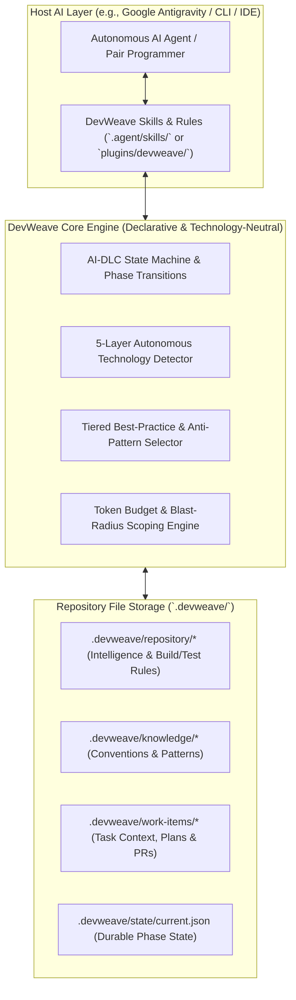
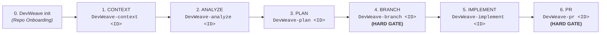
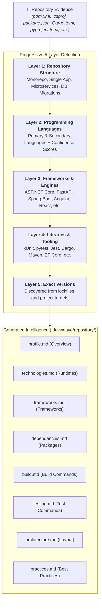
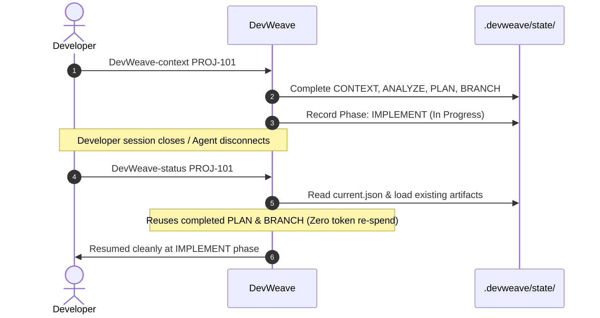
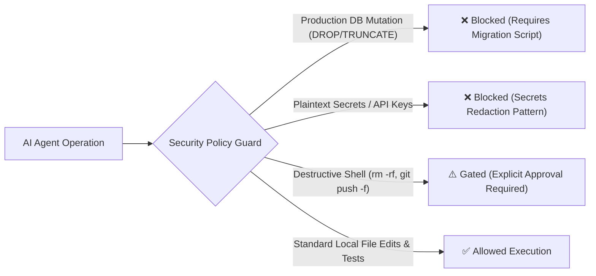

# DevWeave V1.0 — Developer & User Guide

Welcome to **DevWeave** — the declarative, evidence-based, and technology-neutral **AI-Driven Development Lifecycle (AI-DLC)** framework.

> **Core Mission:** *Less Tokens. More Work. Lower Bill.*

DevWeave guides developers and autonomous AI coding agents from initial work item requirements through analysis, planning, branch governance, implementation, deterministic testing, independent verification, and pull request readiness.

---

## 1. What is DevWeave?

DevWeave gives AI coding assistants a **disciplined, structured engineering process**:

```mermaid
flowchart TD
    subgraph Traditional["❌ Traditional Unstructured AI Coding"]
        T1["Prompt: 'Build this feature'"] --> T2["Whole-Repo Dump (Token Bloat)"]
        T2 --> T3["Hallucinated Architecture & Regressions"]
        T3 --> T4["Broken Tests & Silent Bugs"]
        T4 --> T5["High Cost ($$$) & Frustration"]
    end

    subgraph DevWeave["✅ DevWeave AI-DLC Framework"]
        D1["Work Item / Ticket"] --> D2["Autonomous Detection & Scoped Context"]
        D2 --> D3["Deep Analysis & Solution Trade-offs"]
        D3 --> D4["File-Anchored Plan & Branch Governance"]
        D4 --> D5["Plan-Bound Incremental Implementation"]
        D5 --> D6["Deterministic Testing & Verification"]
        D6 --> D7["Multi-Perspective Review & PR Ready"]
    end
```



### Architectural Overview & Host Decoupling
DevWeave separates host interactions from core engineering lifecycle rules:



---

## 2. Installation & Setup in Antigravity (`agy`)

> 📖 **Looking for step-by-step instructions for all skill levels?** See the complete [**Installation Guide**](installation-guide.md) with 5 installation options, team check-in procedures, and troubleshooting.

You can install DevWeave in your target project using the Antigravity CLI (`agy`) or via Git clone.

### Option A: Install via Antigravity CLI (`agy`) — (Recommended)
In your target project directory (e.g., `D:\DatingAPP`):
```powershell
# From local DevWeave directory:
agy plugin install D:\DevWeave\plugins\devweave

# Or direct from GitHub:
git clone --depth 1 https://github.com/paarthivnaik/DevWeave.git temp-devweave
agy plugin install .\temp-devweave\plugins\devweave
Remove-Item -Recurse -Force temp-devweave
```

Verify installation:
```powershell
agy plugin list
```

---

## 3. Official Antigravity Command & Skill Surface

DevWeave provides a deterministic CLI command surface mapped directly to Antigravity skills with **mandatory human checkpoints** and **phase isolation**:



### Command & Skill Surface Reference

| CLI Command | Antigravity Skill | AI-DLC Phase | Purpose | Primary Artifact |
| :--- | :--- | :--- | :--- | :--- |
| `DevWeave init` | `devweave-init` | `INIT` | 5-Layer autonomous repo onboarding | `.devweave/repository/*` |
| `DevWeave-context <ID>` | `devweave-context` | `CONTEXT` | Ingest ticket & scope blast radius | `.devweave/work-items/<ID>/context.md` |
| `DevWeave-analyze <ID>` | `devweave-analyze` | `ANALYZE` | Code investigation & approach design | `.devweave/work-items/<ID>/analysis.md` |
| `DevWeave-plan <ID>` | `devweave-plan` | `PLAN` | File-anchored task decomposition | `.devweave/work-items/<ID>/plan.md` |
| `DevWeave-branch <ID>` | `devweave-branch` | `BRANCH` | **Hard Gate**: Isolated branch creation | Git branch record |
| `DevWeave-implement <ID>` | `devweave-implement` | `IMPLEMENT` | Plan-bound code changes & tests | Source diffs, `test-results.json` |
| `DevWeave-pr <ID>` | `devweave-pr` | `PR` | **Hard Gate**: Review & PR assembly | `verification.md`, `pr-description.md` |
| `DevWeave-status <ID>` | `devweave-status` | Cross-Phase | Inspect real-time phase progression | `.devweave/state/current.json` |
| `DevWeave-handoff <ID>` | `devweave-handoff` | Cross-Phase | Generate handoff package for team | `.devweave/work-items/<ID>/handoff.md` |
| `DevWeave-archive <ID>` | `devweave-archive` | Post-Merge | Archive workspace to `.devweave/archive/` | Archived artifacts & audit log |

---

## 4. Specialized Workflow Lanes

DevWeave provides three specialized lanes sharing the same underlying state machine:

### 1. General / Feature Lane (6 Phases)
```bash
DevWeave-context PROJ-1042
DevWeave-analyze PROJ-1042
DevWeave-plan PROJ-1042
DevWeave-branch PROJ-1042
DevWeave-implement PROJ-1042
DevWeave-pr PROJ-1042
```

### 2. Fix Lane — Defect Remediation (3 Phases)
```bash
DevWeave-fix-triage BUG-201
DevWeave-fix-diagnose BUG-201
DevWeave-fix-land BUG-201
```

### 3. Modernization Lane — Stepwise Framework Upgrades
```bash
DevWeave-modernize-context MOD-301
DevWeave-modernize-analyze MOD-301
DevWeave-modernize-plan MOD-301      # Generates migration_manifest.md with 100% parity contract
DevWeave-modernize-branch MOD-301
DevWeave-modernize-implement MOD-301 # Lockstep status updates (🔴 → 🟡 → 🟢)
DevWeave-modernize-pr MOD-301
```

---

## 5. Non-Negotiable Human-in-the-Loop Governance

DevWeave enforces four strict engineering invariants:

1. **Phase Isolation**: Every command executes **only its own phase**, outputs its artifact, and halts.
2. **Mandatory Human Checkpoints**: Every phase ends with an explicit decision:
   ```text
   PHASE COMPLETE: PLAN
   Artifact: .devweave/work-items/PROJ-1042/plan.md
   
   Human Decision: [Approve Plan] [Request Changes] [Stop]
   Suggested Next Phase: BRANCH (Run: DevWeave-branch PROJ-1042)
   
   DevWeave is waiting for your instruction.
   ```
3. **Zero Automatic Chaining**: The AI never self-approves or triggers the next command automatically.
4. **Durable State Persistence**: All state transitions and human decisions are saved to `.devweave/work-items/<ID>/state.md`.

---

## 6. Autonomous 5-Layer Technology Detection Flow

When `DevWeave init` runs, it traverses repository manifests and builds evidence-backed intelligence without guessing:



### Best-Practice Tiering
Practices loaded into context are tiered to prevent ambiguity:
- **`MANDATORY`**: Security, data safety, and compliance requirements. Violations block PR progression.
- **`RECOMMENDED`**: Strong idiomatic guidance. Departure requires recorded technical rationale.
- **`ADVISORY`**: Optional optimizations and code clarity improvements.
- **`ANTI_PATTERN`**: Harmful habits (e.g., sync-over-async, raw SQL in UI, unindexed joins) explicitly blocked during review.

---

## 7. Dynamic Technology Revalidation

When target technology changes (e.g., migrating from .NET Core 3.1 $\to$ .NET 9):
- **Skills are never recreated**: Skills remain stable and permanent.
- **Knowledge is refreshed**: Affected knowledge items are flagged as `NEEDS_REVALIDATION` in `ANALYZE`.
- **Practices update dynamically**: Version-specific idiomatic patterns (e.g., EF Core 9, Angular Standalone Components) are loaded automatically.

---

## 8. Durable State & Resuming Work

Every task maintains durable state in `.devweave/state/current.json` and `.devweave/work-items/<ID>/state.md`.



---

## 9. Security & Governance Boundaries

DevWeave enforces hard security boundaries to protect production environments:



---

## 10. Customizing Conventions for Your Team

To customize how DevWeave generates code and reviews PRs for your repository:
- Edit [`.devweave/knowledge/conventions.md`](file:///D:/DevWeave/spec/specification/best-practices.md) for naming conventions, folder patterns, and architectural rules.
- Edit [`.devweave/repository/practices.md`](file:///D:/DevWeave/spec/specification/best-practices.md) for custom team practices or prohibited patterns.

DevWeave always gives **local repository conventions highest priority**, ensuring AI agents adhere strictly to your team's existing codebase style.
