# DevWeave V1.0 — Developer & User Guide

Welcome to **DevWeave** — the declarative, evidence-based, and technology-neutral **AI-Driven Development Lifecycle (AI-DLC)** framework.

> **Core Mission:** *Less Tokens. More Work. Lower Bill.*

DevWeave guides developers and autonomous AI coding agents from initial work item requirements through solution design, implementation, testing, independent verification, multi-perspective code review, and pull request readiness.

---

## 1. What is DevWeave?

DevWeave is **not** another raw prompt wrapper or ad-hoc chatbot. It gives AI coding models a **disciplined, structured engineering process**:

```mermaid
flowchart TD
    subgraph Traditional["❌ Traditional Unstructured AI Coding"]
        T1["Prompt: 'Build this feature'"] --> T2["Whole-Repo Dump (Token Bloat)"]
        T2 --> T3["Hallucinated Architecture & Regressions"]
        T3 --> T4["Broken Tests & Silent Bugs"]
        T4 --> T5["High Cost ($$$) & Frustration"]
    end

    subgraph DevWeave["✅ DevWeave AI-DLC Framework"]
        D1["Work Item / Ticket"] --> D2["Autonomous Detection & Focused Context"]
        D2 --> D3["Traceable Requirements & Solution Trade-offs"]
        D3 --> D4["Human Approval Governance Gate"]
        D4 --> D5["Plan-Bound Incremental Coding"]
        D5 --> D6["Deterministic Testing & Verification"]
        D6 --> D7["Multi-Perspective Review & PR Ready"]
    end
```

### Architectural Overview & Host Decoupling
DevWeave separates host interactions from core engineering lifecycle rules:

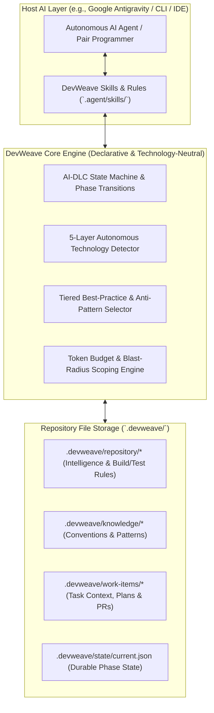

---

## 2. Official Antigravity Command & Skill Contract

DevWeave provides a deterministic CLI command surface mapped directly to Antigravity skills and specialized subagents:

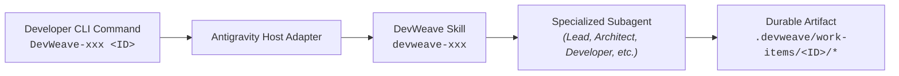

### Command & Skill Surface Reference

| CLI Command | Antigravity Skill | Assigned Subagent | AI-DLC Phase | Primary Artifact |
| :--- | :--- | :--- | :--- | :--- |
| `DevWeave init` | `devweave-init` | `devweave-lead` | `INIT` | `.devweave/repository/*` |
| `DevWeave-context <ID>` | `devweave-discovery` | `devweave-architect` | `DISCOVERY` | `.devweave/work-items/<ID>/context.md` |
| `DevWeave-requirements <ID>` | `devweave-requirements` | `devweave-lead` | `REQUIREMENTS` | `.devweave/work-items/<ID>/requirements.md` |
| `DevWeave-solution <ID>` | `devweave-solution` | `devweave-architect` | `SOLUTION` | `.devweave/work-items/<ID>/solution.md` |
| `DevWeave-approve <ID>` | `devweave-approval` | `devweave-gatekeeper` | `APPROVAL` | `.devweave/work-items/<ID>/approval.json` |
| `DevWeave-plan <ID>` | `devweave-plan` | `devweave-lead` | `PLAN` | `.devweave/work-items/<ID>/plan.md` |
| `DevWeave-implement <ID>` | `devweave-implement` | `devweave-developer` | `IMPLEMENT` | Modified source files |
| `DevWeave-test <ID>` | `devweave-test` | `devweave-tester` | `TEST` | `.devweave/work-items/<ID>/test-results.json` |
| `DevWeave-verify <ID>` | `devweave-verify` | `devweave-gatekeeper` | `VERIFY` | `.devweave/work-items/<ID>/verification.md` |
| `DevWeave-review <ID>` | `devweave-review` | `devweave-reviewer` | `REVIEW` | `.devweave/work-items/<ID>/review.md` |
| `DevWeave-pr <ID>` | `devweave-pr` | `devweave-lead` | `PR_READY` | `.devweave/work-items/<ID>/pr-description.md` |
| `DevWeave-status <ID>` | — | — | Cross-phase | `.devweave/state/current.json` |
| `DevWeave-knowledge capture` | `devweave-knowledge` | `devweave-curator` | Cross-phase | `.devweave/knowledge/*.md` |

> **Explicit `<ID>` Invariant**: All work-item commands require the `<ID>` parameter explicitly to guarantee isolation in multi-task and multi-branch environments.

---

## 3. Quick Start: 3 Steps to Your First Task

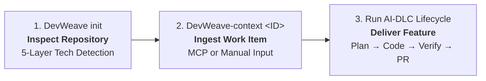

### Step 1: Initialize Your Repository (`DevWeave init`)
Run in your project root or trigger via Antigravity:
```bash
DevWeave init
```
DevWeave inspects project manifests, lockfiles, build configurations, and test runners using **5-Layer Autonomous Detection** without requiring manual configuration.

### Step 2: Ingest a Work Item (`DevWeave-context <ID>`)
Ingest tasks from Jira, Azure DevOps, GitHub Issues, Linear, or manual paste:
```bash
DevWeave-context PROJ-1042
```
*If no MCP server is configured, DevWeave prompts you to paste the title, description, and acceptance criteria.*

### Step 3: Progress Through the AI-DLC Flow
Progress smoothly through the phases using explicit commands or let the lead agent coordinate:
```bash
DevWeave-requirements PROJ-1042
DevWeave-solution PROJ-1042
DevWeave-approve PROJ-1042
DevWeave-plan PROJ-1042
DevWeave-implement PROJ-1042
DevWeave-test PROJ-1042
DevWeave-verify PROJ-1042
DevWeave-review PROJ-1042
DevWeave-pr PROJ-1042
```

---

## 4. The 9-Phase AI-DLC Lifecycle & State Transitions

DevWeave organizes work into a deterministic state machine with explicit validation gates and feedback loops:

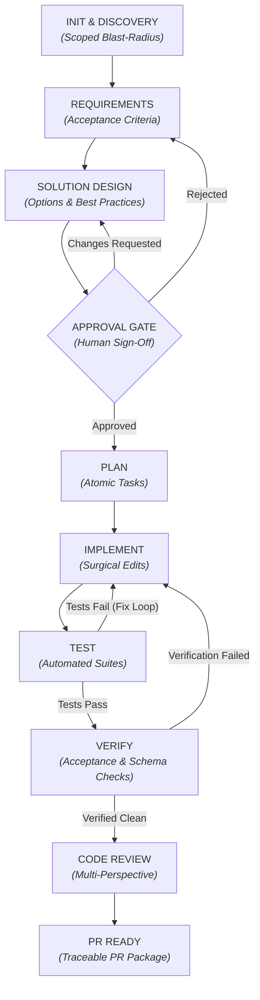

---

### Lifecycle Phase Breakdown & Produced Artifacts

```mermaid
flowchart LR
    subgraph Analysis["1. Analysis & Design"]
        A1["Discovery<br><code>context.md</code>"]
        A2["Requirements<br><code>requirements.md</code>"]
        A3["Solution<br><code>solution.md</code>"]
    end

    subgraph Governance["2. Governance & Plan"]
        G1["Approval Gate<br><code>approval.json</code>"]
        G2["Planning<br><code>plan.md</code>"]
    end

    subgraph Execution["3. Execution & Verification"]
        E1["Implementation<br><i>Source Diffs</i>"]
        E2["Testing<br><code>test-results.json</code>"]
        E3["Verification<br><code>verification.md</code>"]
    end

    subgraph Delivery["4. Review & PR"]
        D1["Review<br><code>review.md</code>"]
        D2["PR Package<br><code>pr-description.md</code>"]
    end

    Analysis --> Governance --> Execution --> Delivery
```

1. **Discovery (`devweave-discovery`)**: Identifies affected components, dependencies, and schema migrations, establishing an initial token budget (e.g., 32,000 tokens).
2. **Requirements (`devweave-requirements`)**: Normalizes requirements into testable acceptance criteria in `.devweave/work-items/<ID>/requirements.md`.
3. **Solution Design (`devweave-solution`)**: Evaluates architectural trade-offs, selects tiered best practices, and creates `.devweave/work-items/<ID>/solution.md`.
4. **Approval Gate (`devweave-approval`)**: Pauses execution for human authorization on high-impact architectural or schema changes.
5. **Planning (`devweave-plan`)**: Decomposes the approved solution into atomic, ordered tasks in `.devweave/work-items/<ID>/plan.md`.
6. **Implementation (`devweave-implement`)**: Executes surgical, bounded file edits strictly constrained to the approved plan.
7. **Testing (`devweave-test`)**: Runs deterministic project test runners and records outcomes in `.devweave/work-items/<ID>/test-results.json`.
8. **Verification (`devweave-verify`)**: Verifies 100% acceptance criteria fulfillment and zero schema violations in `.devweave/work-items/<ID>/verification.md`.
9. **Review & PR Ready (`devweave-review`, `devweave-pr`)**: Conducts multi-perspective code review and generates `.devweave/work-items/<ID>/pr-description.md`.

---

## 5. Autonomous 5-Layer Technology Detection Flow

When `DevWeave init` runs, it traverses repository manifests and builds evidence-backed intelligence without guessing:

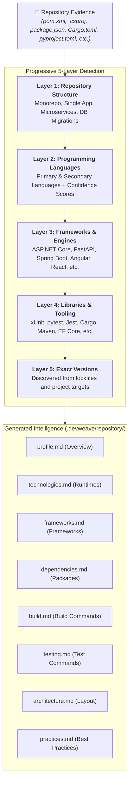

### Best-Practice Tiering
Practices loaded into context are tiered to prevent ambiguity:
- **`MANDATORY`**: Security, data safety, and compliance requirements. Violations block PR progression.
- **`RECOMMENDED`**: Strong idiomatic guidance. Departure requires recorded technical rationale.
- **`ADVISORY`**: Optional optimizations and code clarity improvements.
- **`ANTI_PATTERN`**: Harmful habits (e.g., sync-over-async, raw SQL in UI, unindexed joins) explicitly blocked during review.

---

## 6. Work Item Ingestion & Blast-Radius Scoping

DevWeave ensures **84%–93% token savings** by converting raw inputs into structured contexts and scoping LLM access:

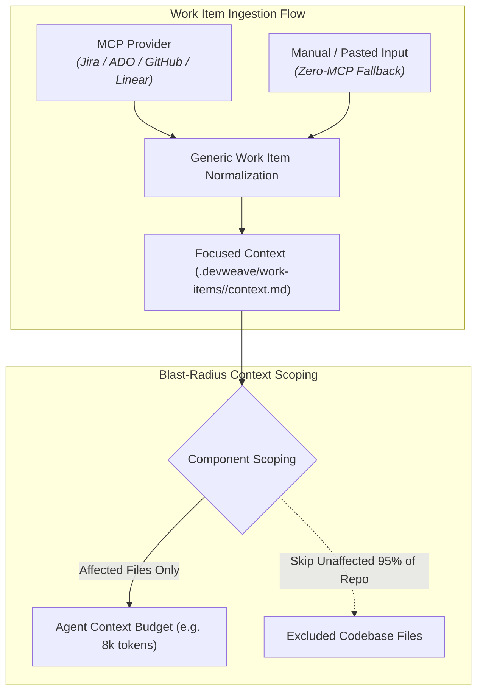

### Ingestion Commands
- **Via MCP**: `DevWeave-context PROJ-1234`
- **Manual Fallback**: `DevWeave-context PROJ-1234` (prompts for title, description, criteria)
- **Context Refresh**: `DevWeave-context --refresh PROJ-1234` (safely resets lifecycle if ticket changed)

---

## 7. Workflow Profiles (Matching Rigor to Task Complexity)

DevWeave dynamically routes work items to the most efficient lifecycle profile:

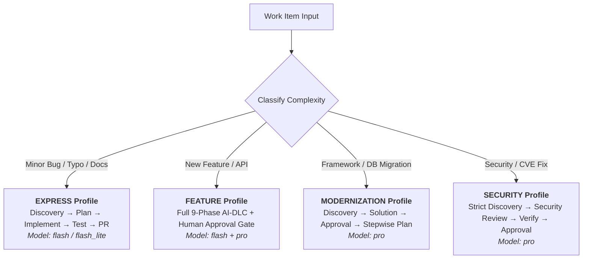

---

## 8. Durable State & Resuming Interrupted Sessions

Every task maintains durable state in `.devweave/state/current.json` and `.devweave/work-items/<ID>/state.md`.

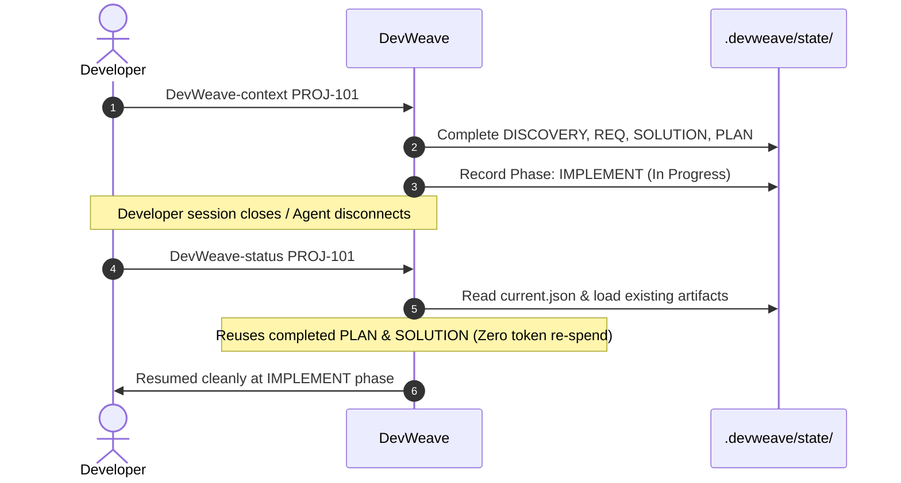

---

## 9. Multi-Perspective Code Review Architecture

Before generating the pull request package, DevWeave evaluates changes across four independent review lenses:

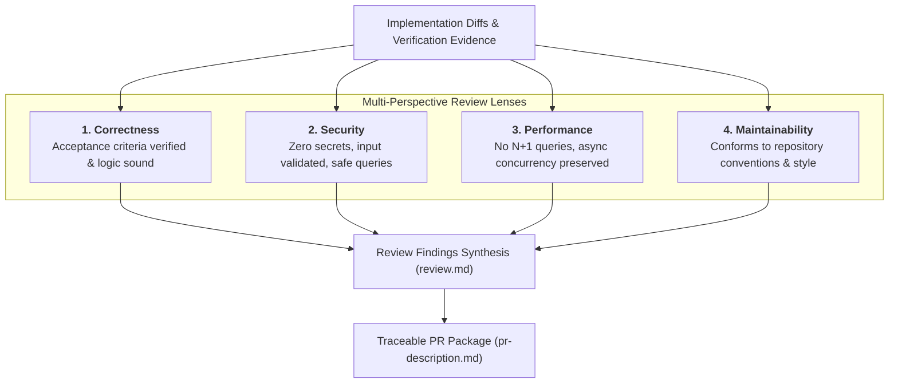

---

## 10. Security & Governance Boundaries

DevWeave enforces hard security boundaries to protect production environments:

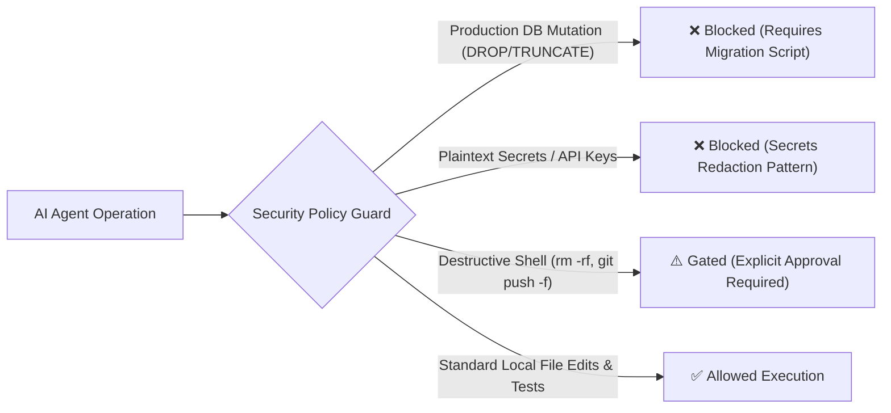

---

## 11. Customizing Conventions for Your Team

To customize how DevWeave generates code and reviews PRs for your repository:
- Edit [`.devweave/knowledge/conventions.md`](file:///D:/DevWeave/spec/specification/best-practices.md) for naming conventions, folder patterns, and architectural rules.
- Edit [`.devweave/repository/practices.md`](file:///D:/DevWeave/spec/specification/best-practices.md) for custom team practices or prohibited patterns.

DevWeave always gives **local repository conventions highest priority**, ensuring AI agents adhere strictly to your team's existing codebase style.
