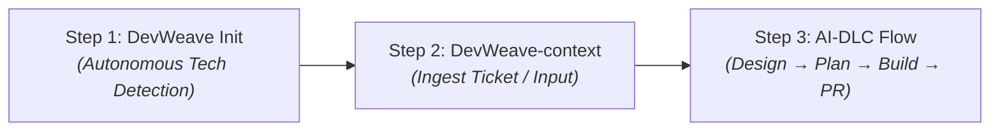
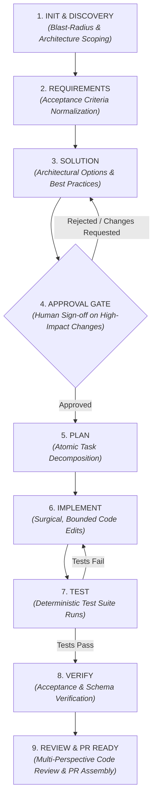

# DevWeave V1.0 — Developer & User Guide

Welcome to **DevWeave** — the declarative, evidence-based, and technology-neutral **AI-Driven Development Lifecycle (AI-DLC)** framework.

> **Core Mission:** *Less Tokens. More Work. Lower Bill.*

DevWeave guides developers and autonomous AI coding agents from initial work item requirements through solution design, implementation, testing, independent verification, multi-perspective code review, and pull request readiness.

---

## 1. What is DevWeave?

DevWeave is **not** another raw prompt wrapper or ad-hoc chatbot. It gives AI coding models a **disciplined, structured engineering process**:

```text
              Traditional AI Coding               DevWeave AI-DLC Framework
        ┌───────────────────────────────┐     ┌───────────────────────────────┐
        │  "Write this feature for me"  │     │ 1. Autonomous Tech Discovery  │
        │               │               │     │ 2. Normalized Requirements    │
        │               ▼               │     │ 3. Solution Design & Options  │
        │   Hallucinated Architecture   │     │ 4. Human Approval Gate        │
        │   Scope Creep / Broken Tests  │     │ 5. Atomic Task Plan           │
        │   Runaway Token Costs ($$$)   │     │ 6. Bounded Implementation     │
        │                               │     │ 7. Automated Test Suite       │
        │                               │     │ 8. Deterministic Verification │
        │                               │     │ 9. Multi-Perspective Review   │
        └───────────────────────────────┘     └───────────────────────────────┘
```

### Key Architectural Invariants
- **Declarative-First**: Zero background daemons, zero mandatory runtimes. All metadata is tracked in clean Markdown, JSON, and JSON Schema files inside `.devweave/`.
- **Technology-Neutral, Runtime-Aware**: Works out-of-the-box across **C#/.NET, Python, TypeScript/JavaScript, Java, Go, Rust, C++, PHP, and Ruby**.
- **Context Scoping & Knowledge Reuse**: Slashes token consumption and LLM bills by **84% to 93%** by caching repository intelligence and scoping file access to the task's exact blast radius.

---

## 2. Quick Start: 3 Steps to Your First Task



### Step 1: Initialize Your Repository (`DevWeave init`)
Run in your project root or ask your AI assistant:
```bash
DevWeave init
```
DevWeave inspects project manifests, lockfiles, build configurations, and test runners using **5-Layer Autonomous Detection** without requiring you to manually configure stack settings.

### Step 2: Ingest a Work Item (`DevWeave-context`)
Ingest tasks from Jira, Azure DevOps, GitHub Issues, Linear, or manual paste:
```bash
DevWeave-context PROJ-1042
```
*If no MCP server is configured, DevWeave prompts you to paste the title, description, and acceptance criteria.*

### Step 3: Run the Guided AI-DLC Flow
DevWeave guides the agent systematically through requirements normalization, solution trade-offs, human approval, task execution, testing, and PR creation.

---

## 3. The 9-Phase AI-DLC Lifecycle

DevWeave organizes work into a deterministic state machine. Each phase produces structured artifacts under `.devweave/work-items/<ID>/`:



---

### Phase 1 — Discovery & Impact Analysis (`devweave-discovery`)
- Analyzes existing source files, imports, and dependencies relevant to the task.
- Scopes the task blast-radius to affected components (avoids whole-repo scanning).
- Allocates an initial context token budget (e.g., 32,000 tokens).

### Phase 2 — Requirements Engineering (`devweave-requirements`)
- Normalizes external tickets or user requests into explicit acceptance criteria.
- Separates functional requirements, non-functional constraints, and out-of-scope items.
- Produces: `.devweave/work-items/<ID>/requirements.md`

### Phase 3 — Solution Design (`devweave-solution`)
- Evaluates architectural options and trade-offs before writing code.
- Automatically selects applicable best practices and flags anti-patterns.
- Identifies database migrations, API changes, and backward-compatibility risks.
- Produces: `.devweave/work-items/<ID>/solution.md`

### Phase 4 — Human Approval Gate (`devweave-approval`)
- **Hard Governance Boundary**: Mandatory sign-off required for high-impact decisions (database schema changes, breaking API contracts, security modifications).
- Execution is safely paused until the human developer approves.

### Phase 5 — Implementation Planning (`devweave-plan`)
- Decomposes the approved solution into atomic, ordered tasks with specific file paths and verification commands.
- Produces: `.devweave/work-items/<ID>/plan.md`

### Phase 6 — Incremental Implementation (`devweave-implement`)
- Agents perform surgical, localized file edits strictly bound to the approved plan.
- If unexpected architectural conflicts arise, DevWeave returns to Solution Design rather than making unauthorized assumptions.

### Phase 7 — Automated Testing (`devweave-test`)
- Runs test suites using deterministic commands discovered during initialization (e.g., `dotnet test`, `pytest`, `npm test`, `cargo test`).
- Captures test results, coverage, and failures in `.devweave/work-items/<ID>/test-results.json`.

### Phase 8 — Deterministic Verification (`devweave-verify`)
- Independently checks that all acceptance criteria from Phase 2 are met.
- Validates clean compilation, zero schema violations, and zero unintended file modifications.
- Produces: `.devweave/work-items/<ID>/verification.md`

### Phase 9 — Multi-Perspective Review & PR (`devweave-review`, `devweave-pr`)
- Evaluates code across four perspectives: **Correctness**, **Security**, **Performance**, and **Maintainability**.
- Assembles an evidence-backed pull request package with full traceability links: `.devweave/work-items/<ID>/pr-description.md`.

---

## 4. Autonomous 5-Layer Technology Detection

When `DevWeave init` runs, it builds a complete repository intelligence profile under `.devweave/repository/`:

```text
.devweave/
├── repository/
│   ├── profile.md          # 5-Layer classification & repository overview
│   ├── technologies.md     # Primary & secondary runtimes with evidence citations
│   ├── frameworks.md       # Detected web, ORM, and UI frameworks
│   ├── dependencies.md     # Package managers, lockfiles, and key libraries
│   ├── build.md            # Deterministic build commands and targets
│   ├── testing.md          # Test runners, single-test syntax, coverage flags
│   ├── architecture.md     # Component layout, entry points, and module boundaries
│   └── practices.md        # Applicable best practices and anti-patterns
├── knowledge/
│   └── conventions.md      # Team coding styles, naming conventions, and lint rules
├── work-items/             # Active and historical task artifacts
└── state/
    └── current.json        # AI-DLC lifecycle state, token usage, and gate status
```

### Best-Practice Tiering
Practices loaded into context are tiered to prevent ambiguity:
- **`MANDATORY`**: Security, data safety, and compliance requirements. Violations block PR progression.
- **`RECOMMENDED`**: Strong idiomatic guidance. Departure requires recorded technical rationale.
- **`ADVISORY`**: Optional optimizations and code clarity improvements.
- **`ANTI_PATTERN`**: Harmful habits (e.g., sync-over-async, raw SQL in UI, unindexed joins) explicitly blocked during review.

---

## 5. Work Item Ingestion & Context Management

### Ingestion via Model Context Protocol (MCP)
DevWeave supports integration with Jira, Azure DevOps, GitHub, GitLab, and Linear via MCP:
```bash
DevWeave-context PROJ-1234
```
- Retrieves ticket metadata, acceptance criteria, priority, and parent Epics.
- Normalizes ticket contents into a vendor-neutral schema.
- **Security Guarantee**: Personal Access Tokens (PATs) and OAuth tokens are **never stored** in `.devweave/` files, Git history, or LLM prompts.

### Local & Manual Fallback (Zero Setup)
If no MCP is configured, DevWeave prompts you to paste the requirements:
```text
No project-management MCP integration is configured.
Please paste the requirements (Title, Description, Acceptance Criteria):
> 
```
Pasted input is normalized into the exact same structured format as MCP tickets.

### Context Refresh & Invalidation
If requirements in Jira/ADO change while a task is in progress, refresh context:
```bash
DevWeave-context --refresh PROJ-1234
```
If material acceptance criteria have changed, DevWeave safely resets the state to `REQUIREMENTS` to prevent outdated implementations.

---

## 6. Workflow Profiles (Matching Rigor to Task Complexity)

DevWeave dynamically routes work items to the most efficient lifecycle profile:

| Profile | Target Workload | Lifecycle Path | Model Routing |
| :--- | :--- | :--- | :--- |
| **`EXPRESS`** | Simple bug fixes, typos, minor doc updates | Discovery $\to$ Plan $\to$ Implement $\to$ Test $\to$ PR | `flash` / `flash_lite` |
| **`FEATURE`** | Standard features, new APIs, domain logic | Full 9-Phase AI-DLC with Approval Gate | `flash` + `pro` (Design/Review) |
| **`MODERNIZATION`** | Framework migrations, runtime upgrades | Discovery $\to$ Solution $\to$ Approval $\to$ Plan $\to$ Stepwise Migrations | `pro` |
| **`SECURITY`** | Vulnerability patches, auth/credential fixes | Strict Discovery $\to$ Security Review $\to$ Verify $\to$ Approval | `pro` |

---

## 7. Durable State & Resuming Work

Every work item maintains a persistent state record in `.devweave/state/current.json` and `.devweave/work-items/<ID>/state.md`.

If a developer's session ends or an agent is interrupted mid-way:
1. Re-open the workspace and run `DevWeave-status` or trigger your agent.
2. DevWeave reads the completed phase records.
3. Work seamlessly resumes from the exact interruption point (e.g., resuming halfway through `IMPLEMENT` without re-running `DISCOVERY` or `SOLUTION`).

---

## 8. Security & Governance Boundaries

DevWeave enforces strict safety boundaries to protect your codebase:
1. **Production Database Mutation Guard**: Raw `DROP TABLE`, `TRUNCATE`, or manual schema modifications outside approved migration scripts are blocked.
2. **Secret Redaction**: Automated pattern scanning prevents API keys, private keys, and passwords from being committed or logged.
3. **Destructive Command Gating**: Destructive shell operations (e.g., `rm -rf`, `git push --force`) require explicit developer confirmation.

---

## 9. Developer Command & Skill Reference

| Command / Trigger | Skill Name | Purpose | Output Artifact |
| :--- | :--- | :--- | :--- |
| `DevWeave init` | `devweave-init` | 5-Layer autonomous repo onboarding | `.devweave/repository/*` |
| `DevWeave-context <ID>` | `devweave-discovery` | Ingest ticket & initialize context budget | `.devweave/work-items/<ID>/context.md` |
| `DevWeave-requirements` | `devweave-requirements` | Normalize acceptance criteria | `requirements.md` |
| `DevWeave-solution` | `devweave-solution` | Architectural design & trade-offs | `solution.md` |
| `DevWeave-approve <ID>` | `devweave-approval` | Authorize progression past approval gate | `approval.json` |
| `DevWeave-plan` | `devweave-plan` | Decompose into atomic tasks | `plan.md` |
| `DevWeave-implement` | `devweave-implement` | Surgical, plan-bound code execution | Modified source files |
| `DevWeave-test` | `devweave-test` | Run test runners & capture results | `test-results.json` |
| `DevWeave-verify` | `devweave-verify` | Validate criteria & build integrity | `verification.md` |
| `DevWeave-review` | `devweave-review` | Multi-perspective code review | `review.md` |
| `DevWeave-pr` | `devweave-pr` | Assemble pull request package | `pr-description.md` |
| `DevWeave-status` | — | Inspect current AI-DLC state & open gates | `current.json` |
| `DevWeave-knowledge capture`| `devweave-knowledge` | Save reusable domain rules & conventions | `.devweave/knowledge/*.md` |

---

## 10. Customizing Conventions for Your Team

To customize how DevWeave generates code and reviews PRs for your repository:
- Edit [`.devweave/knowledge/conventions.md`](file:///D:/DevWeave/spec/specification/best-practices.md) for naming conventions, folder patterns, and architectural rules.
- Edit [`.devweave/repository/practices.md`](file:///D:/DevWeave/spec/specification/best-practices.md) for custom team practices or prohibited patterns.

DevWeave always gives **local repository conventions highest priority**, ensuring AI agents adhere strictly to your team's existing codebase style.
