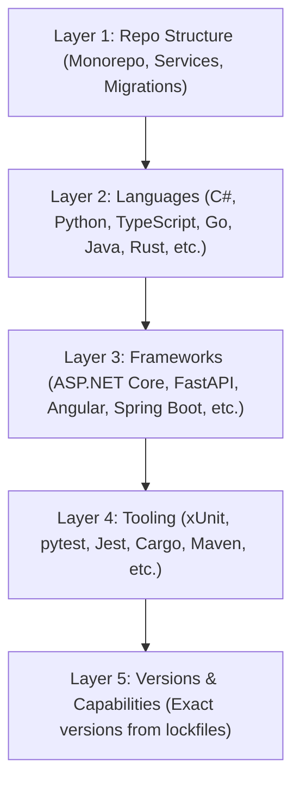
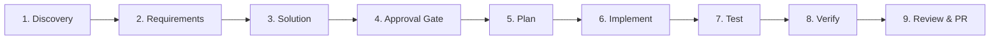

# Getting Started with DevWeave V1.0

Welcome to **DevWeave** — the declarative, evidence-based, and technology-neutral **AI-Driven Development Lifecycle (AI-DLC)** framework.

> **Core Mission:** *Less Tokens. More Work. Lower Bill.*

DevWeave orchestrates autonomous AI agents to deliver reliable, production-ready code with complete traceability, deterministic verification, and up to **90%+ token and cost reduction** compared to raw unstructured LLM prompts.

---

## 1. Core Principles & Philosophy

1. **Declarative & File-Driven**: DevWeave has no background daemons or mandatory runtimes. Everything is tracked in clean Markdown, JSON, and JSON Schema files inside your repository's `.devweave/` directory.
2. **Technology-Neutral, Runtime-Aware**: DevWeave works identically across any language or framework (e.g., .NET, Python, TypeScript, Java, Go, Rust, C++, PHP, Ruby) by autonomously detecting project tools and selecting applicable best practices.
3. **Structured 9-Phase AI-DLC**: Moves systematically from work item ingestion to PR readiness, preventing hallucinations and ad-hoc scope drift.
4. **Zero-Token Waste**: By maintaining persistent repository intelligence under `.devweave/`, agents do not repeatedly re-read the entire repository on every prompt.

---

## 2. Quick Setup & Prerequisites

DevWeave integrates natively with **Google Antigravity** as its first reference host, and is designed to operate seamlessly with any AI coding assistant or MCP-enabled environment.

### Prerequisites
- **Git** repository initialized for your project.
- **Antigravity CLI** or **Antigravity IDE** (or any compatible AI agent host).
- *Optional:* Model Context Protocol (MCP) server for Jira, Azure DevOps, or GitHub Issues.

### Installation in Your Workspace
Ensure the DevWeave rules and skills are present in your workspace or global Antigravity configuration:
```text
.agent/skills/
  ├── devweave-init/
  ├── devweave-discovery/
  ├── devweave-requirements/
  ├── devweave-solution/
  ├── devweave-approval/
  ├── devweave-plan/
  ├── devweave-implement/
  ├── devweave-test/
  ├── devweave-verify/
  ├── devweave-review/
  ├── devweave-pr/
  └── devweave-knowledge/
```

---

## 3. Step 1: Autonomous Repository Onboarding (`devweave-init`)

Before working on tasks, onboard your repository. DevWeave autonomously inspects project manifests, builds, and dependencies to generate structured intelligence.

### Trigger Initialization
Ask your AI assistant:
```text
Run devweave-init on current repository
```

### What Happens Under the Hood (5-Layer Autonomous Detection)


### Generated `.devweave/` Directory Structure
Upon completion, your repository contains a standardized `.devweave/` directory:

```text
.devweave/
├── repository/
│   ├── profile.md          # 5-layer classification & architecture overview
│   ├── technologies.md     # Primary & secondary runtimes with evidence citations
│   ├── frameworks.md       # Detected web, ORM, and API frameworks
│   ├── dependencies.md     # Package manager & dependency lockfile status
│   ├── build.md            # Deterministic build commands and targets
│   ├── testing.md          # Test runners, single-test syntax, coverage flags
│   ├── architecture.md     # Component boundaries, entry points, and data flows
│   └── practices.md        # Applicable best practices and anti-patterns
├── knowledge/
│   └── conventions.md      # Repository coding conventions, style guides & lint rules
├── work-items/             # Active and historical AI-DLC work item artifacts
└── state/
    └── current.json        # Schema-validated AI-DLC lifecycle state & token budget
```

---

## 4. Step 2: Ingesting Work Items (`DevWeave-context`)

DevWeave initiates tasks from either external issue trackers or local manual descriptions.

### Option A: Via Project Management MCP (Jira / Azure DevOps / GitHub / Linear)
```text
DevWeave-context PROJ-1042
```
DevWeave queries the MCP server, extracts the title, description, acceptance criteria, and priority, and normalizes them into a vendor-neutral work item.

### Option B: Local / Manual Input (No MCP Required)
```text
DevWeave-context "Add customer cancellation endpoint for pending bookings"
```
Or paste your ticket requirements directly when prompted. DevWeave never fabricates missing acceptance criteria and prompts for necessary clarifications.

---

## 5. Step 3: The 9-Phase AI-DLC Lifecycle Walkthrough

Once a work item is loaded, DevWeave progresses through the structured engineering lifecycle:



### 1. Discovery & Impact Analysis (`devweave-discovery`)
- Scopes the task blast-radius to affected files only.
- Identifies dependencies, schema migrations, and impacted endpoints.
- Allocates an initial context token budget (e.g., 32,000 tokens).

### 2. Requirements Engineering (`devweave-requirements`)
- Normalizes functional & non-functional requirements.
- Generates unambiguous acceptance criteria in `.devweave/work-items/<ID>/requirements.md`.

### 3. Solution Design (`devweave-solution`)
- Evaluates architectural options and trade-offs.
- Selects tiered engineering practices (`MANDATORY`, `RECOMMENDED`, `ADVISORY`, `ANTI_PATTERN`).
- Produces `.devweave/work-items/<ID>/solution.md`.

### 4. Human Approval Gate (`devweave-approval`)
- **Hard Governance Boundary:** High-impact changes (database schema mutations, breaking API changes, security modifications) require explicit user sign-off.
- The state machine blocks progression until approved by a human developer.

### 5. Implementation Planning (`devweave-plan`)
- Decomposes the approved solution into atomic, ordered tasks with specific file paths and verification criteria.
- Produces `.devweave/work-items/<ID>/plan.md`.

### 6. Incremental Implementation (`devweave-implement`)
- Agents perform surgical, localized file edits strictly bound to the approved plan.
- Bounded edits avoid unwanted regressions and prevent runaway token consumption.

### 7. Automated Testing (`devweave-test`)
- Runs project test suites using deterministic commands discovered in `.devweave/repository/testing.md`.
- Records test pass/fail results in `.devweave/work-items/<ID>/test-results.json`.

### 8. Deterministic Verification (`devweave-verify`)
- Validates that all acceptance criteria from Phase 2 are satisfied.
- Verifies zero schema violations and confirms build return codes exit with `0`.
- Produces `.devweave/work-items/<ID>/verification.md`.

### 9. Multi-Perspective Code Review & PR (`devweave-review`, `devweave-pr`)
- Performs independent reviews across **Correctness**, **Security**, **Performance**, and **Maintainability**.
- Assembles the complete pull request description with traceability links and verification evidence in `.devweave/work-items/<ID>/pr-description.md`.

---

## 6. Workflow Profiles (Matching Rigor to Task Complexity)

DevWeave adjusts its lifecycle path according to the scope of the task:

| Profile | Typical Workload | Lifecycle Path | Model Routing |
| :--- | :--- | :--- | :--- |
| **`EXPRESS`** | Simple bug fixes, documentation, minor UI tweaks | Discovery → Plan → Implement → Test → PR | `flash` / `flash_lite` |
| **`FEATURE`** | Standard feature implementation, new APIs | Full 9-Phase AI-DLC with Approval Gate | `flash` + `pro` (Design/Review) |
| **`MODERNIZATION`** | Framework upgrades, large refactorings | Discovery → Solution → Approval → Plan → Stepwise Migrations | `pro` |
| **`SECURITY`** | Vulnerability patches, auth/credential fixes | Strict Discovery → Security Review → Verify → Approval | `pro` |

---

## 7. Developer Cheat Sheet & Common Commands

| Command / Trigger | Description | Output Artifact |
| :--- | :--- | :--- |
| `Run devweave-init` | Onboard repository & perform 5-layer tech detection | `.devweave/repository/*` |
| `DevWeave-context <ID>` | Ingest work item & initialize context budget | `.devweave/work-items/<ID>/context.md` |
| `DevWeave-status` | Inspect current AI-DLC state and open gates | `.devweave/state/current.json` |
| `DevWeave-approve <ID>` | Authorize progression past the human approval gate | `.devweave/work-items/<ID>/approval.json` |
| `DevWeave-verify` | Execute acceptance checks and verification matrix | `.devweave/work-items/<ID>/verification.md` |
| `DevWeave-knowledge capture` | Curate reusable domain knowledge & conventions | `.devweave/knowledge/*.md` |

---

## 8. Customizing Conventions & Best Practices

You can customize how DevWeave writes code for your repository by editing:
- [`.devweave/knowledge/conventions.md`](file:///D:/DevWeave/spec/specification/best-practices.md) — Team coding style, naming conventions, architectural boundaries, and formatting rules.
- [`.devweave/repository/practices.md`](file:///D:/DevWeave/spec/specification/best-practices.md) — Custom repository-specific rules and anti-patterns.

DevWeave always prioritizes your **local repository conventions** over generic language defaults.
