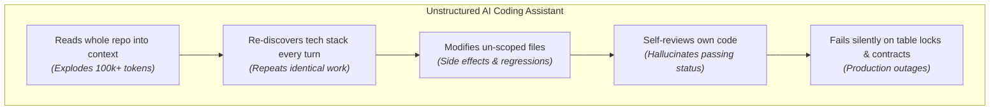
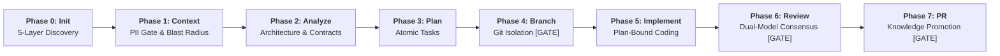

# DevWeave Architecture & Internal Mechanics: How It Works

> **"Less Tokens. More Work. Lower Bill."**

This document provides a deep, pin-to-pin architectural explanation of how DevWeave transforms AI coding assistants from chaotic, expensive chat agents into disciplined, deterministic, cost-efficient software engineers.

---

## 📑 Table of Contents
1. [The Problem: The Chaos of Unstructured AI Coding](#1-the-problem-the-chaos-of-unstructured-ai-coding)
2. [The Solution: Declarative AI-DLC Architecture](#2-the-solution-declarative-ai-dlc-architecture)
3. [The Declarative State Machine (`.devweave/state/current.json`)](#3-the-declarative-state-machine)
4. [Phase-by-Phase Internal Mechanics](#4-phase-by-phase-internal-mechanics)
   - [Phase 0: 5-Layer Autonomous Discovery & Pin-to-Pin Mapping](#phase-0-5-layer-autonomous-discovery)
   - [Phase 1: Work Item Intake, PII Sanitizer & Blast Radius Scoping](#phase-1-intake-pii-gate--blast-radius)
   - [Phase 2 & 3: Architectural Archaeology & Atomic Task Breakdown](#phase-2--3-archaeology--planning)
   - [Phase 4 & 5: Branch Gate & Plan-Bound Implementation](#phase-4--5-branch-gate--implementation)
   - [Phase 6: Dual-Model Consensus Review (5 Specialized Lenses)](#phase-6-dual-model-consensus-review)
   - [Phase 7: PR Assembly & Compounding Knowledge Promotion](#phase-7-pr-assembly--knowledge-promotion)
5. [Stage-Based Model Routing Engine](#5-stage-based-model-routing-engine)
6. [Dynamic Technology Revalidation Engine](#6-dynamic-technology-revalidation-engine)
7. [Durable Knowledge Caching (Why 0-Token Rediscovery Works)](#7-durable-knowledge-caching)
8. [Automated Daily Sync Engine (24-Hour TTL)](#8-automated-daily-sync-engine)
9. [Empirical Performance & Cost Benchmarks](#9-empirical-performance--cost-benchmarks)

---

## 1. The Problem: The Chaos of Unstructured AI Coding

When an engineer prompts a standard AI coding assistant without a structured lifecycle, the agent operates in an unstructured loop:



### The 4 Major Failure Modes of Unstructured AI:
1. **Context Window Waste**: Re-reading file trees and lockfiles on every prompt burns 80,000+ tokens per task.
2. **Context Drift & Hallucination**: Without an immutable plan, agents drift into modifying unrelated files.
3. **Self-Review Bias**: An agent that generates a bug rarely catches its own logical blindspots.
4. **Runaway Autonomous Loops**: Agents loop infinitely when trying to fix compiler or test failures, consuming hundreds of dollars in API credits.

---

## 2. The Solution: Declarative AI-DLC Architecture

DevWeave introduces **Declarative AI-DLC (AI-Driven Development Lifecycle)**. It treats software development as a deterministic state machine enforced through declarative artifacts:



---

## 3. The Declarative State Machine

All DevWeave state is stored transparently in your Git repository under `.devweave/state/current.json`. There are **zero background servers or runtime daemons**.

```json
{
  "$schema": "https://devweave.org/schemas/v1/state.json",
  "task_id": "AUTH-101",
  "profile": "FEATURE",
  "current_phase": "IMPLEMENT",
  "status": "IN_PROGRESS",
  "gates": {
    "pii_privacy_gate": "PASSED",
    "branch_gate": "PASSED",
    "test_verification_gate": "PENDING",
    "human_review_gate": "PENDING"
  },
  "token_usage": {
    "accumulated_tokens": 14250,
    "context_budget": 32000
  },
  "updated_at": "2026-09-23T12:00:00Z"
}
```

### State Machine Transition Rules:
- A phase cannot begin until the preceding phase's required artifact exists and passes validation.
- An agent is strictly prohibited from skipping gates (e.g. going from `IMPLEMENT` directly to `PR_READY` without `devweave-pr-review`).
- When a verification or review fails, the state transitions deterministically to `FAILURE`, invoking the fix loop.

---

## 4. Phase-by-Phase Internal Mechanics

```text
┌──────────────────────────────────────────────────────────────────────────────────────────────────┐
│                                 DEVWEAVE INTERNAL PIPELINE                                      │
└──────────────────────────────────────────────────────────────────────────────────────────────────┘
  [Phase 0: INIT]          ──► Scans 5 layers ──► Generates layers.md & request-flow.md
  [Phase 1: CONTEXT]       ──► Ingests ticket ──► Sanitizes PII ──► Enforces 32k Token Budget
  [Phase 2: ANALYZE]       ──► Maps blast radius ──► Checks DB schema & API interface contracts
  [Phase 3: PLAN]          ──► Decomposes atomic tasks ──► Anchors exact file lines & test commands
  [Phase 4: BRANCH GATE]   ──► Validates git branch ──► Blocks direct writes to main/master
  [Phase 5: IMPLEMENT]     ──► Executes plan-bound edits ──► Runs tests ──► Captures proof
  [Phase 6: REVIEW GATE]   ──► Dual-Model consensus (Architect + DBA + Security) ──► Human sign-off
  [Phase 7: PR READY]      ──► Assembles PR ──► Promotes durable knowledge to .devweave/knowledge/
```

### Phase 0: 5-Layer Autonomous Discovery
- **Layer 1 — Topology**: Detects single-service, monorepo (`packages/*`, `apps/*`), or multi-repo linked topologies.
- **Layer 2 — Languages**: Detects polyglot ecosystems (C#, TypeScript, Python, Go, Rust, Java, etc.) with evidence citations.
- **Layer 3 — Frameworks & Engines**: Detects active frameworks (ASP.NET Core, Angular, Spring Boot, FastAPI, Rails).
- **Layer 4 — Tooling & ORMs**: Maps build tools (`dotnet`, `mvn`, `npm`, `cargo`) and test runners (`xUnit`, `pytest`, `Jest`).
- **Layer 5 — Pin-to-Pin Mapping**: Generates:
  - `layers.md`: Maps physical folders (`src/controllers/`, `Domain/`, `Data/`) to logical tiers.
  - `request-flow.md`: Generates end-to-end request journeys with Mermaid sequence diagrams.
  - `integrations.md`: Maps external databases, event queues (Kafka, RabbitMQ), and APIs.

### Phase 1: Intake, PII Gate & Blast Radius Scoping
- Ingests issue details from Jira, Azure DevOps, GitHub, Linear, or manual CLI input.
- **PII / Secret Sanitizer**: Strips API keys, passwords, connection strings, and personal information before LLM ingestion.
- **Blast Radius Scoping**: Scopes active context to only `focus_paths`, discarding 90% of irrelevant repository files.

### Phase 2 & 3: Archaeology & Atomic Planning
- Analyzes existing code patterns, dependencies, and schema models.
- Generates `plan.md` containing numbered, atomic tasks. Each task specifies:
  - Exact target file path.
  - Line number anchor.
  - Deterministic test / verification command.

### Phase 4 & 5: Branch Gate & Plan-Bound Implementation
- **Branch Gate**: Refuses to edit code until an isolated feature branch (e.g. `feature/AUTH-101-token-refresh`) is active.
- **Plan-Bound Rule**: Edits are restricted strictly to the files declared in `plan.md`.
- **Test Evidence**: Runs local tests after each change and records stdout/stderr to `.devweave/tasks/<ID>/evidence.md`.

### Phase 6: Dual-Model Consensus Review
Before any PR can be opened, DevWeave runs a rigorous multi-perspective review:
1. **Principal Software Architect Lens**: Validates design patterns, SOLID adherence, and downstream breaking changes.
2. **Senior DBA Lens**: Audits SQL queries for table locks, missing indexes, N+1 query hazards, and rollback scripts.
3. **Security Lens**: Scans for OWASP Top 10 vulnerabilities and unescaped input.
4. **Downstream Impact Lens**: Verifies that microservice APIs and event contracts remain backward-compatible.
5. **Cascading Resilience Lens**: Ensures timeouts and error boundaries prevent systemic outages.

### Phase 7: PR Assembly & Compounding Knowledge Promotion
- Compiles the final PR body with full audit trails (Requirement &rarr; Solution &rarr; Code &rarr; Tests &rarr; Review).
- Promotes discovered architectural idioms into `.devweave/knowledge/conventions.md`, enabling **0-token rediscovery** for future sessions.

---

## 5. Stage-Based Model Routing Engine

DevWeave optimizes cost and latency by routing tasks to calibrated model capabilities:

| Stage / Task | Capability Required | Calibrated Model Tier | Reason |
| :--- | :--- | :--- | :--- |
| **Manifest Scanning & Discovery** | `fast-analysis` | `flash_lite` / `flash` | Simple JSON/XML parsing; 10x faster and 98% cheaper. |
| **Lint & Syntax Checking** | `syntax-check` | `flash_lite` | Deterministic verification requires zero deep reasoning. |
| **Solution Design & Planning** | `deep-reasoning` | `pro` | Complex multi-system trade-off evaluation. |
| **Plan-Bound Implementation** | `coding` | `pro` / `flash` | Precision editing following strict specifications. |
| **Dual-Model Code & SQL Review** | `independent-review` | `pro` | Deep audit for locks, concurrency, and security vulnerabilities. |

---

## 6. Dynamic Technology Revalidation Engine

When a dependency is upgraded (e.g., `.NET 8` &rarr; `.NET 9`, `Java 17` &rarr; `Java 21`, `React 18` &rarr; `19`), DevWeave avoids stale instructions:

```text
[Dependency Lockfile Bump Detected] 
         │
         ▼
[Flags Affected Knowledge as NEEDS_REVALIDATION]
         │
         ▼
[Hot-Swaps Coding Conventions & Idioms]
         │
         ▼
[Stable Rules Preserved / Stale Best Practices Purged]
```

---

## 7. Durable Knowledge Caching (Why 0-Token Rediscovery Works)

Standard AI agents waste 80,000+ tokens re-analyzing repositories on every prompt. DevWeave persists intelligence across turns:

```text
.devweave/
├── repository/       <── Scanned ONCE during INIT (Never re-scanned)
├── knowledge/        <── Conventions & domain rules updated across PR merges
└── domains/          <── Domain catalogs & business rule scorecards
```

On subsequent tasks in the same repository:
- **Rediscovery Tokens**: **0 tokens**
- **Token Savings**: **93.3%**
- **Cost Reduction**: **99.7%**

---

## 8. Automated Daily Sync Engine (24-Hour TTL)

To eliminate manual plugin maintenance:
1. **Daily First Session**: When a developer opens their IDE in the morning, DevWeave checks remote GitHub `HEAD` via a 2-second non-blocking socket check.
2. **In-Place Sync**: If updates exist, it pulls latest skills and rules into the host plugin directory in-place.
3. **Rest of Day**: For the next 24 hours, all commands execute with **0ms latency and 0 network requests**.
4. **Token Cost**: **0 tokens consumed**.

---

## 9. Empirical Performance & Cost Benchmarks

From the automated benchmark suite (`conformance/tests/token_benchmark.ps1`):

```text
========================================================================================
Profile                  Unstructured AI          DevWeave AI-DLC       Token / Cost Savings
========================================================================================
Quick Bug Fix (EXPRESS)  141,200 tokens ($0.50)    9,250 tokens ($0.001)  93.4% / 99.6% Lower
Feature Implementation   788,800 tokens ($2.79)  125,700 tokens ($0.145)  84.1% / 94.8% Lower
Knowledge Reuse Task     327,500 tokens ($1.16)   21,800 tokens ($0.003)  93.3% / 99.7% Lower
Complex Monorepo Scoping 1,856,500 tokens ($6.54) 171,600 tokens ($0.258)  90.8% / 96.0% Lower
========================================================================================
```
