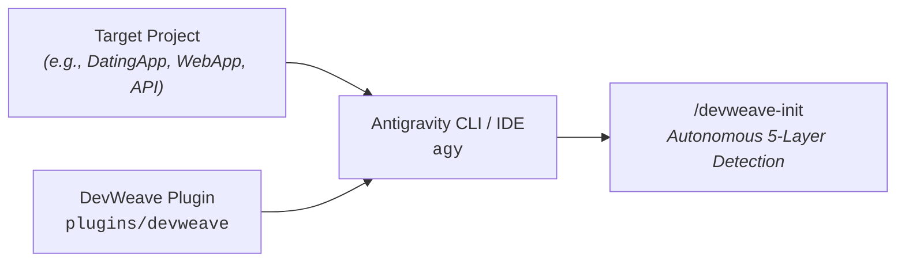

# DevWeave V1.0 — Complete Installation & Setup Guide

Welcome to the **DevWeave Antigravity Plugin Installation Guide**.

Whether you are a **Junior Developer** setting up DevWeave for the first time, a **Mid-Level Engineer** configuring a new team repository, or a **Senior Architect / DevOps Lead** standardizing AI-DLC across enterprise projects, this guide provides clear, step-by-step options suited to your workflow.

---

## Table of Contents
1. [Overview & Prerequisites](#1-overview--prerequisites)
2. [Choose Your Installation Method](#2-choose-your-installation-method)
   - [Method 1: Local CLI Install (Fastest for Local Dev)](#method-1-local-cli-install-fastest-for-local-development)
   - [Method 2: Install from GitHub (For Developers Without Local Monorepo)](#method-2-install-directly-from-github)
   - [Method 3: Global Machine-Wide Install (One-Time Setup for All Projects)](#method-3-global-machine-wide-installation-recommended-for-daily-use)
   - [Method 4: Team / Repository Check-In (Recommended for Team Projects)](#method-4-team--repository-check-in-recommended-for-teams)
   - [Method 5: Git Submodule (For Version Locking & Release Sync)](#method-5-git-submodule-for-enterprise--version-locking)
3. [Verification: Confirming Successful Installation](#3-verification-confirming-successful-installation)
4. [Your First Run: Executing `/devweave-init`](#4-your-first-run-executing-devweave-init)
5. [Managing, Updating & Uninstalling Plugins](#5-managing-updating--uninstalling-the-plugin)
6. [Troubleshooting & Common Questions (FAQ)](#6-troubleshooting--faq)

---

## 1. Overview & Prerequisites

### What is the DevWeave Plugin?
DevWeave is a lightweight, host-neutral plugin for **Google Antigravity** (`agy`). It gives your AI coding assistant structured engineering capabilities:
- **Autonomous 5-Layer Technology Detection** (languages, frameworks, test runners, build tools, exact versions).
- **Persistent Repository Intelligence** (`.devweave/` directory) preventing token bloat.
- **Structured 9-Phase AI-DLC** (Requirements $\to$ Architecture $\to$ Human Approval $\to$ Task Plan $\to$ Code $\to$ Test $\to$ PR).



### Prerequisites
- **Git** installed on your system.
- **Antigravity CLI (`agy`)** or **Antigravity IDE** installed.
- Target repository open in your terminal (e.g., `D:\DatingAPP` or `/Users/dev/my-project`).

---

## 2. Choose Your Installation Method

```text
┌───────────────────────────────────────────────┬─────────────────────────────────────────────────────────┐
│ Use Case                                      │ Recommended Method                                      │
├───────────────────────────────────────────────┼─────────────────────────────────────────────────────────┤
│ I already have DevWeave cloned on my machine  │ Method 1: Local CLI Install                             │
│ I am a developer cloning from GitHub          │ Method 2: GitHub Remote Install                         │
│ I want DevWeave in EVERY project on my PC     │ Method 3: Global Machine-Wide Install                   │
│ I want my entire team to get it upon git clone│ Method 4: Team Repository Check-In                      │
│ Enterprise version control & release locking  │ Method 5: Git Submodule                                 │
└───────────────────────────────────────────────┴─────────────────────────────────────────────────────────┘
```

---

### Method 1: Local CLI Install (Fastest for Local Development)

> **Best for:** Developers who already have `D:\DevWeave` (or a local DevWeave clone) on their machine and want to install it into a project like `D:\DatingAPP`.

#### Step-by-Step:
1. Open your terminal in your **target project** directory:
   ```powershell
   cd D:\DatingAPP
   ```
2. Run the `agy plugin install` command pointing to the `plugins/devweave` folder:
   ```powershell
   agy plugin install D:\DevWeave\plugins\devweave
   ```
   *(On macOS / Linux replace with: `agy plugin install /path/to/DevWeave/plugins/devweave`)*

3. **Expected Output:**
   ```text
     [ok]    devweave
             ✔ skills      : 1 processed
             - agents      : skipped (not found)
             - commands    : skipped (not found)
             - mcpServers  : skipped (not found)
             - hooks       : skipped (not found)
   ```

---

### Method 2: Install Directly from GitHub

> **Best for:** Junior or senior developers setting up DevWeave on a new machine without cloning the entire monorepo permanently.

#### On Windows (PowerShell):
```powershell
# 1. Navigate to your project root
cd D:\DatingAPP

# 2. Clone DevWeave temporarily
git clone --depth 1 https://github.com/paarthivnaik/DevWeave.git temp-devweave

# 3. Install the plugin using agy CLI
agy plugin install .\temp-devweave\plugins\devweave

# 4. Remove the temporary folder
Remove-Item -Recurse -Force temp-devweave
```

#### On macOS / Linux (Bash):
```bash
# 1. Navigate to your project root
cd /path/to/my-project

# 2. Clone DevWeave temporarily
git clone --depth 1 https://github.com/paarthivnaik/DevWeave.git temp-devweave

# 3. Install the plugin using agy CLI
agy plugin install ./temp-devweave/plugins/devweave

# 4. Remove the temporary folder
rm -rf temp-devweave
```

---

### Method 3: Global Machine-Wide Installation (Recommended for Daily Use)

> **Best for:** Developers who want DevWeave to automatically work in **all repositories** on their machine without ever needing to run install commands per project.

Antigravity checks your global configuration file before launching in any folder.

1. Open or create your global Antigravity config file:
   - **Windows:** `%USERPROFILE%\.gemini\config\plugins.json` (e.g., `C:\Users\<YourUser>\.gemini\config\plugins.json`)
   - **macOS / Linux:** `~/.gemini/config/plugins.json`

2. Add the DevWeave plugin definition:

   ```json
   {
     "plugins": {
       "devweave": {
         "path": "D:/DevWeave/plugins/devweave",
         "enabled": true
       }
     }
   }
   ```
   *(If using a remote Git URL):*
   ```json
   {
     "plugins": {
       "devweave": {
         "git": "https://github.com/paarthivnaik/DevWeave.git",
         "subdir": "plugins/devweave",
         "enabled": true
       }
     }
   }
   ```

3. Save the file. DevWeave is now active across every project opened in Antigravity.

---

### Method 4: Team / Repository Check-In (Recommended for Teams)

> **Best for:** Engineering teams who want every developer on the project to automatically get DevWeave as soon as they `git clone` the repository, with zero extra configuration.

Antigravity automatically discovers plugins placed inside a project's `.agents/plugins/` directory.

#### Setup Steps:
1. In your project repository root:
   ```powershell
   # Create the .agents/plugins directory
   New-Item -ItemType Directory -Force -Path ".agents\plugins"

   # Copy the devweave plugin package into it
   Copy-Item -Recurse -Force "D:\DevWeave\plugins\devweave" ".agents\plugins\"
   ```
2. Verify your project structure contains:
   ```text
   YourProject/
   ├── .agents/
   │   └── plugins/
   │       └── devweave/
   │           ├── plugin.json
   │           ├── rules/
   │           │   └── AGENTS.md
   │           └── skills/
   │               └── devweave-init/
   │                   └── SKILL.md
   ├── src/
   └── ...
   ```
3. Commit and push to your team's Git repository:
   ```bash
   git add .agents/plugins/devweave
   git commit -m "chore(ai): add DevWeave AI-DLC plugin for Antigravity"
   git push origin main
   ```
Now, whenever any teammate opens this repository, DevWeave is ready immediately.

---

### Method 5: Git Submodule (For Enterprise & Version Locking)

> **Best for:** Senior engineers and tech leads who want to lock DevWeave to a specific release tag (e.g., `v1.0.0`) and receive official upstream updates seamlessly.

```bash
# In your project root:
git submodule add -b v1.0.0 https://github.com/paarthivnaik/DevWeave.git .devweave-source

# Install via agy CLI pointing to the submodule plugin folder:
agy plugin install .devweave-source/plugins/devweave
```

To update DevWeave in the future:
```bash
cd .devweave-source
git fetch --tags
git checkout v1.1.0
cd ..
agy plugin install .devweave-source/plugins/devweave
```

---

## 3. Verification: Confirming Successful Installation

To verify that DevWeave is properly registered in your workspace:

Run the `agy plugin list` command in your terminal:
```powershell
agy plugin list
```

**Successful Output:**
```json
{
  "imports": [
    {
      "name": "devweave",
      "source": "antigravity",
      "components": [
        "skills"
      ]
    }
  ]
}
```

---

## 4. Your First Run: Executing `/devweave-init`

Once installed, onboard your repository with **5-Layer Autonomous Technology Detection**:

1. Open your target project in Antigravity or launch the CLI:
   ```powershell
   cd D:\DatingAPP
   agy
   ```

2. In the chat prompt, type:
   ```text
   /devweave-init
   ```
   *(or ask: `Run devweave-init on current repository`)*

3. **What DevWeave Does Autonomously:**
   - Detects all programming languages, frameworks, ORMs, build tools, and test suites.
   - Generates the `.devweave/` intelligence files (`profile.md`, `technologies.md`, `build.md`, `testing.md`, etc.).
   - Connects to your project-management MCP (or prepares manual ticket fallback).
   - Prepares the project for your first work item (`DevWeave-context <WorkItemId>`).

---

## 5. Managing, Updating & Uninstalling the Plugin

### Enable / Disable Plugin
```bash
# Disable DevWeave temporarily without deleting files:
agy plugin disable devweave

# Re-enable DevWeave:
agy plugin enable devweave
```

### Validate Plugin Package
To test if a plugin package is structurally sound:
```bash
agy plugin validate plugins/devweave
```

### Uninstall Plugin
```bash
agy plugin uninstall devweave
```

---

## 6. Troubleshooting & FAQ

### Q1: `Error: install target must be a directory: devweave`
- **Why this happens:** When running `agy plugin install`, Antigravity expects a local directory path to the plugin folder (e.g. `.\plugins\devweave` or `D:\DevWeave\plugins\devweave`) rather than a raw package name.
- **Solution:** Pass the full or relative directory path:
  ```powershell
  agy plugin install D:\DevWeave\plugins\devweave
  ```

### Q2: Does DevWeave modify my application code during installation or `init`?
- **No.** DevWeave strictly creates metadata files inside `.devweave/`. It **never** modifies your source code, configuration files, business logic, or database schemas during initialization.

### Q3: Are personal access tokens (PATs) or API keys stored on disk?
- **No.** DevWeave enforces a strict **Zero Secret Storage Policy**. Credentials and tokens are never written into `.devweave/`, committed to Git, or exposed in prompts.

### Q4: Does DevWeave work in polyglot (multi-language) repositories?
- **Yes.** DevWeave's 5-layer detection is polyglot-native. It seamlessly detects combined stacks (e.g., C# .NET Backend + Angular/TypeScript Frontend + Python Scripts + SQLite/PostgreSQL) in a single repository.
