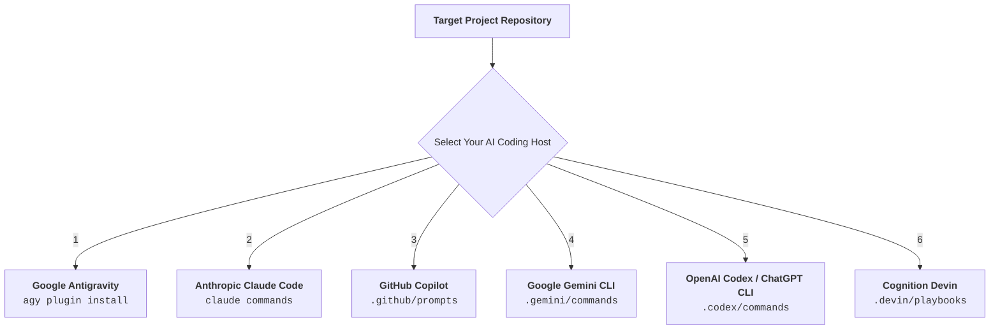

# DevWeave V1.0 — Universal Installation & Setup Guide

> **"Less Tokens. More Work. Lower Bill."**

Welcome to the **DevWeave Multi-Host Installation Guide**.

DevWeave is designed from first principles to be **100% host-neutral**. Whether you use **Google Antigravity**, **Anthropic Claude Code**, **GitHub Copilot**, **Google Gemini CLI**, **OpenAI Codex**, or **Cognition Devin**, this guide provides clear, copy-pasteable setup commands from GitHub with automated updates.

> 📖 **Looking for full command breakdowns and tutorials?** See the [DevWeave Developer Handbook](developer-guide.md).

---

## Quick Platform Selector



---

## 1. Google Antigravity Installation

Install DevWeave directly from GitHub into your Antigravity environment:

```powershell
# Windows (PowerShell):
git clone --depth 1 https://github.com/paarthivnaik/DevWeave.git $env:TEMP\devweave; agy plugin install $env:TEMP\devweave\plugins\antigravity; Remove-Item -Recurse -Force $env:TEMP\devweave
```

```bash
# macOS / Linux (Bash):
git clone --depth 1 https://github.com/paarthivnaik/DevWeave.git /tmp/devweave && agy plugin install /tmp/devweave/plugins/antigravity && rm -rf /tmp/devweave
```

### Verification:
```powershell
agy plugin list
# Expected output: devweave - Components: skills (21 validated skills)
```

---

## 2. Anthropic Claude Code Installation

Install DevWeave rules and 21 custom slash commands from GitHub into your target project:

```bash
# macOS / Linux / Git Bash:
git clone --depth 1 https://github.com/paarthivnaik/DevWeave.git /tmp/devweave && mkdir -p .claude/commands && cp /tmp/devweave/plugins/claude/CLAUDE.md ./CLAUDE.md && cp /tmp/devweave/plugins/claude/commands/* .claude/commands/ && rm -rf /tmp/devweave
```

```powershell
# Windows (PowerShell):
git clone --depth 1 https://github.com/paarthivnaik/DevWeave.git $env:TEMP\devweave; New-Item -ItemType Directory -Force -Path .claude\commands | Out-Null; Copy-Item $env:TEMP\devweave\plugins\claude\CLAUDE.md .\CLAUDE.md; Copy-Item $env:TEMP\devweave\plugins\claude\commands\* .claude\commands\; Remove-Item -Recurse -Force $env:TEMP\devweave
```

### Verification:
Open Claude Code in your project and run:
```bash
claude /devweave-init
```

---

## 3. GitHub Copilot Installation (Workspace, Chat, CLI)

Install DevWeave prompt definitions and custom instructions into your repository's `.github/` folder:

```bash
# macOS / Linux / Git Bash:
git clone --depth 1 https://github.com/paarthivnaik/DevWeave.git /tmp/devweave && mkdir -p .github/prompts && cp /tmp/devweave/plugins/copilot/copilot-instructions.md .github/copilot-instructions.md && cp /tmp/devweave/plugins/copilot/prompts/* .github/prompts/ && rm -rf /tmp/devweave
```

```powershell
# Windows (PowerShell):
git clone --depth 1 https://github.com/paarthivnaik/DevWeave.git $env:TEMP\devweave; New-Item -ItemType Directory -Force -Path .github\prompts | Out-Null; Copy-Item $env:TEMP\devweave\plugins\copilot\copilot-instructions.md .github\copilot-instructions.md; Copy-Item $env:TEMP\devweave\plugins\copilot\prompts\* .github\prompts\; Remove-Item -Recurse -Force $env:TEMP\devweave
```

### Verification in Copilot Chat:
Type `@devweave /init` in the GitHub Copilot Chat window in VS Code, Visual Studio, or CLI.

---

## 4. Google Gemini CLI Installation

Install DevWeave configuration and commands from GitHub into your Gemini CLI project:

```bash
# macOS / Linux / Git Bash:
git clone --depth 1 https://github.com/paarthivnaik/DevWeave.git /tmp/devweave && mkdir -p .gemini/commands && cp /tmp/devweave/plugins/gemini/GEMINI.md .gemini/GEMINI.md && cp /tmp/devweave/plugins/gemini/commands/* .gemini/commands/ && rm -rf /tmp/devweave
```

```powershell
# Windows (PowerShell):
git clone --depth 1 https://github.com/paarthivnaik/DevWeave.git $env:TEMP\devweave; New-Item -ItemType Directory -Force -Path .gemini\commands | Out-Null; Copy-Item $env:TEMP\devweave\plugins\gemini\GEMINI.md .gemini\GEMINI.md; Copy-Item $env:TEMP\devweave\plugins\gemini\commands\* .gemini\commands\; Remove-Item -Recurse -Force $env:TEMP\devweave
```

### Verification:
```bash
gemini devweave-init
```

---

## 5. OpenAI Codex & ChatGPT CLI Installation

Install DevWeave instructions and commands from GitHub into your project:

```bash
# macOS / Linux / Git Bash:
git clone --depth 1 https://github.com/paarthivnaik/DevWeave.git /tmp/devweave && mkdir -p .codex/commands && cp /tmp/devweave/plugins/codex/CODEX.md .codex/CODEX.md && cp /tmp/devweave/plugins/codex/commands/* .codex/commands/ && rm -rf /tmp/devweave
```

```powershell
# Windows (PowerShell):
git clone --depth 1 https://github.com/paarthivnaik/DevWeave.git $env:TEMP\devweave; New-Item -ItemType Directory -Force -Path .codex\commands | Out-Null; Copy-Item $env:TEMP\devweave\plugins\codex\CODEX.md .codex\CODEX.md; Copy-Item $env:TEMP\devweave\plugins\codex\commands\* .codex\commands\; Remove-Item -Recurse -Force $env:TEMP\devweave
```

### Verification:
```bash
$devweave init
```

---

## 6. Cognition Devin Playbook Installation

Install the DevWeave playbook from GitHub into your Devin workspace:

```bash
# In your Devin workspace:
git clone --depth 1 https://github.com/paarthivnaik/DevWeave.git /tmp/devweave && mkdir -p .devin && cp -r /tmp/devweave/plugins/devin/* .devin/ && rm -rf /tmp/devweave
```

### Verification:
Run `devweave:init` in the Devin interactive console to trigger autonomous 5-layer repository detection.

---

## 7. Automated Updates & In-Place Sync

DevWeave provides two ways to stay updated with zero token waste:

### A. Automatic Daily Sync (24-Hour TTL)
- On the **first session of each day**, DevWeave automatically checks remote `HEAD` and syncs new plugin files in-place.
- Subsequent sessions during the day run with **0ms latency and 0 network requests**.

### B. Manual In-Place Update
Run the update command in your AI assistant without needing to uninstall:
- **Google Antigravity**: `agy run devweave-update`
- **Claude Code**: `/devweave-update`
- **GitHub Copilot**: `@devweave /update`
- **Gemini CLI**: `gemini devweave-update`
- **OpenAI Codex**: `$devweave update`
- **Cognition Devin**: `devweave:update`

---

## 8. Canonical Workflow Execution Across All Platforms

Regardless of which AI coding host you use, the command sequence and state progression remain identical:

| Phase | Antigravity (`agy run`) | Claude Code (`claude /`) | GitHub Copilot (`@devweave`) | Gemini / Codex / Devin |
|---|---|---|---|---|
| **Phase 0: Init** | `agy run devweave-init` | `/devweave-init` | `@devweave /init` | `devweave-init` |
| **Phase 1: Context** | `agy run devweave-context <ID>` | `/devweave-context <ID>` | `@devweave /context <ID>` | `devweave-context <ID>` |
| **Phase 2: Analyze** | `agy run devweave-analyze <ID>` | `/devweave-analyze <ID>` | `@devweave /analyze <ID>` | `devweave-analyze <ID>` |
| **Phase 3: Plan** | `agy run devweave-plan <ID>` | `/devweave-plan <ID>` | `@devweave /plan <ID>` | `devweave-plan <ID>` |
| **Phase 4: Branch** | `agy run devweave-branch <ID>` | `/devweave-branch <ID>` | `@devweave /branch <ID>` | `devweave-branch <ID>` |
| **Phase 5: Implement**| `agy run devweave-implement <ID>`| `/devweave-implement <ID>`| `@devweave /implement <ID>` | `devweave-implement <ID>` |
| **Phase 6: PR Review**| `agy run devweave-pr-review <ID>`| `/devweave-pr-review <ID>`| `@devweave /pr-review <ID>` | `devweave-pr-review <ID>` |
| **Phase 7: PR** | `agy run devweave-pr <ID>` | `/devweave-pr <ID>` | `@devweave /pr <ID>` | `devweave-pr <ID>` |

---

## 9. Troubleshooting & FAQ

### Q1: Does DevWeave require a background server or Node runtime?
**No.** DevWeave is 100% declarative. It executes statelessly within agent turns and stores its state directly in your Git repository under `.devweave/`.

### Q2: What happens if I am offline?
Update checks timeout gracefully in 2 seconds and continue using your locally cached plugin files with zero interruption.

### Q3: How do I remove the plugin?
- **Antigravity**: `agy plugin uninstall devweave`
- **Claude Code**: Delete `.claude/commands/devweave-*` and `CLAUDE.md`.
- **Copilot**: Delete `.github/prompts/devweave-*` and `.github/copilot-instructions.md`.
