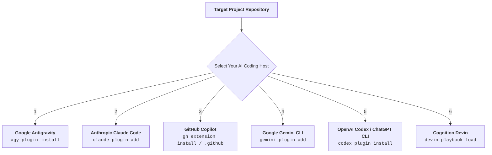

# DevWeave V1.0 — Universal Installation & Setup Guide

Welcome to the **DevWeave Multi-Host Installation Guide**.

DevWeave is designed from first principles to be **100% host-neutral**. Whether you use **Google Antigravity**, **Anthropic Claude Code**, **GitHub Copilot**, **Google Gemini CLI**, **OpenAI Codex**, or **Cognition Devin**, this guide provides clear, step-by-step instructions from junior developer onboarding to enterprise DevOps deployment.

---

## Quick Platform Selector



---

## 1. Google Antigravity Installation

### Option A: Local Monorepo Install (Fastest for Local Dev)
If DevWeave is already cloned on your machine:

```powershell
# In your target project directory:
agy plugin install D:\DevWeave\plugins\devweave
```
*(On macOS / Linux: `agy plugin install /path/to/DevWeave/plugins/devweave`)*

### Option B: One-Liner Install from GitHub
```powershell
git clone --depth 1 https://github.com/paarthivnaik/DevWeave.git temp-devweave
agy plugin install .\temp-devweave\plugins\devweave
Remove-Item -Recurse -Force temp-devweave
```

### Verification:
```powershell
agy plugin list
# Expected output: devweave (plugins/devweave) - Status: active, Skills: 20 available
```

---

## 2. Anthropic Claude Code Installation

### Option A: Direct Plugin Registration
```bash
# Register DevWeave plugin in Claude Code
claude plugin add path/to/DevWeave/plugins/claude
```

### Option B: Repository Level Setup
Copy the rules and 20 custom slash commands into your project:

```bash
# In your target project root:
mkdir -p .claude/commands
cp path/to/DevWeave/plugins/claude/CLAUDE.md ./CLAUDE.md
cp path/to/DevWeave/plugins/claude/commands/* .claude/commands/
```

### Verification:
Open Claude Code and test command auto-completion:
```bash
claude /devweave-init
```

---

## 3. GitHub Copilot Installation (Workspace, Chat, CLI)

### Option A: GitHub CLI Extension Install
```bash
gh extension install path/to/DevWeave/plugins/copilot
```

### Option B: Repository Level Prompt Setup (`.github/`)
Enable DevWeave for all team members cloning your repository:

```bash
# In your target project root:
mkdir -p .github/prompts
cp path/to/DevWeave/plugins/copilot/copilot-instructions.md .github/copilot-instructions.md
cp path/to/DevWeave/plugins/copilot/prompts/* .github/prompts/
git add .github/
git commit -m "chore: enable DevWeave AI-DLC prompts and custom instructions for Copilot"
```

### Verification in Copilot Chat:
Type `@devweave /init` in the GitHub Copilot Chat window in VS Code or Visual Studio.

---

## 4. Google Gemini CLI Installation

### Option A: Plugin Registration
```bash
gemini plugin add path/to/DevWeave/plugins/gemini
```

### Option B: Copy Configuration
```bash
# In your target project root:
mkdir -p .gemini/commands
cp path/to/DevWeave/plugins/gemini/GEMINI.md .gemini/GEMINI.md
cp path/to/DevWeave/plugins/gemini/commands/* .gemini/commands/
```

### Verification:
```bash
gemini devweave-init
```

---

## 5. OpenAI Codex & ChatGPT CLI Installation

### Option A: Plugin Installation
```bash
codex plugin install path/to/DevWeave/plugins/codex
```

### Option B: Local Project Linking
```bash
mkdir -p .codex/commands
cp path/to/DevWeave/plugins/codex/CODEX.md .codex/CODEX.md
cp path/to/DevWeave/plugins/codex/commands/* .codex/commands/
```

### Verification:
```bash
codex run devweave-init
```

---

## 6. Cognition Devin Playbook Installation

Devin uses structured **Playbooks** to automate multi-step engineering lifecycles with deterministic checkpoints:

```bash
# In your Devin workspace / project:
devin playbook load path/to/DevWeave/plugins/devin
```

### Verification:
Run `/devweave-init` in the Devin interactive console to trigger autonomous 5-layer repository detection.

---

## 7. Canonical Workflow Execution Across All Platforms

Regardless of which AI coding host you use, the command sequence and state progression remain identical:

| Phase | Antigravity (`agy run`) | Claude Code (`claude /`) | GitHub Copilot (`@devweave`) | Gemini / Codex / Devin |
|---|---|---|---|---|
| **Phase 0: Init** | `agy run devweave-init` | `/devweave-init` | `@devweave /init` | `devweave-init` |
| **Phase 1: Context** | `agy run devweave-context <ID>` | `/devweave-context <ID>` | `@devweave /context <ID>` | `devweave-context <ID>` |
| **Phase 2: Analyze** | `agy run devweave-analyze <ID>` | `/devweave-analyze <ID>` | `@devweave /analyze <ID>` | `devweave-analyze <ID>` |
| **Phase 3: Plan** | `agy run devweave-plan <ID>` | `/devweave-plan <ID>` | `@devweave /plan <ID>` | `devweave-plan <ID>` |
| **Phase 4: Branch** | `agy run devweave-branch <ID>` | `/devweave-branch <ID>` | `@devweave /branch <ID>` | `devweave-branch <ID>` |
| **Phase 5: Implement**| `agy run devweave-implement <ID>`| `/devweave-implement <ID>`| `@devweave /implement <ID>` | `devweave-implement <ID>` |
| **Phase 6: PR Review**| `agy run devweave-pr-review <ID>`| `/devweave-pr-review <ID>`| `@devweave /pr-review <ID>` | `devweave-pr-review <ID>` |
| **Phase 7: PR** | `agy run devweave-pr <ID>` | `/devweave-pr <ID>` | `@devweave /pr <ID>` | `devweave-pr <ID>` |

---

## 8. Troubleshooting & FAQ

### Q1: Does DevWeave require a background server or Node runtime?
**No.** DevWeave is 100% declarative. It executes statelessly within agent turns and stores its state directly in your Git repository under `.devweave/`.

### Q2: How do I update DevWeave to the latest version?
Simply pull the latest changes from Git and re-run the install command:
```powershell
cd path/to/DevWeave
git pull origin develop
agy plugin install .\plugins\devweave
```

### Q3: How do I remove the plugin?
```powershell
agy plugin uninstall devweave
# Or for Claude:
claude plugin remove devweave
# Or for Copilot:
gh extension remove devweave
```
