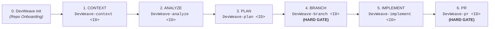

# DevWeave AI-DLC Lifecycle Guide

The **AI-Driven Development Lifecycle (AI-DLC)** defines the formal, deterministic engineering lifecycle that guides developers and autonomous AI agents from task inception to pull request readiness.

---

## 1. Canonical 6-Phase User Lifecycle

DevWeave standardizes developer interactions into **6 distinct, predictable phases**:

---

## 2. Phase-by-Phase Execution Contracts

### Repository Initialization: `DevWeave init`
- **Objective**: Inspect project manifests, lockfiles, and configs to autonomously detect the 5-layer tech stack and create `.devweave/` intelligence files.
- **Artifacts**: `.devweave/repository/profile.md`, `technologies.md`, `frameworks.md`, `dependencies.md`, `build.md`, `testing.md`, `architecture.md`, `practices.md`.

---

### Phase 1: `CONTEXT` (`DevWeave-context <WorkItem-ID>`)
- **Objective**: Ingest work item via PM MCP (Jira, Azure DevOps, GitHub, Linear) or manual paste, enforce the **PII/Privacy Hard Gate**, and scope the blast radius.
- **Resume Detection**: Surfaces existing `handoff.md` and prevents overwriting completed work.
- **Refresh Support**: `--refresh` detects external changes and invalidates downstream artifacts.
- **Artifact**: `.devweave/work-items/<ID>/context.md`.
- **Checkpoint**: User confirms context $\to$ suggests `DevWeave-analyze <ID>`.

---

### Phase 2: `ANALYZE` (`DevWeave-analyze <WorkItem-ID>`)
- **Objective**: Deep codebase archaeology, root-cause diagnosis (bugs) or component mapping (features), and version-aware practice binding.
- **Dynamic Revalidation**: If runtime versions changed, marks affected domain knowledge as `NEEDS_REVALIDATION`.
- **Artifact**: `.devweave/work-items/<ID>/analysis.md`.
- **Checkpoint**: User confirms approach $\to$ suggests `DevWeave-plan <ID>`.

---

### Phase 3: `PLAN` (`DevWeave-plan <WorkItem-ID>`)
- **Objective**: Decompose the approved approach into an unambiguous implementation contract with exact file paths, anchors, changes, tests, and compliance checks.
- **Artifact**: `.devweave/work-items/<ID>/plan.md`.
- **Checkpoint**: User approves plan $\to$ suggests `DevWeave-branch <ID>`.

---

### Phase 4: `BRANCH` (`DevWeave-branch <WorkItem-ID>`) — **[HARD GATE]**
- **Objective**: Enforce isolated workspace branching before any code is modified.
- **Governance Gate**: Hard approval required before creating Git branch (`feature/<ID>`, `fix/<ID>`, `modernize/<ID>`).
- **Artifact**: Branch creation record in `state.md`.
- **Checkpoint**: User authorizes branch $\to$ suggests `DevWeave-implement <ID>`.

---

### Phase 5: `IMPLEMENT` (`DevWeave-implement <WorkItem-ID>`)
- **Objective**: Execute surgical, plan-bound code changes and run automated test runners.
- **Scope Guard**: Any deviation or conflict halts execution and recommends returning to `ANALYZE`/`PLAN`.
- **Artifacts**: Modified source files, `.devweave/work-items/<ID>/test-results.json`.
- **Checkpoint**: User confirms implementation & passing tests $\to$ suggests `DevWeave-pr <ID>`.

---

### Phase 6: `PR` (`DevWeave-pr <WorkItem-ID>`) — **[HARD GATE]**
- **Objective**: Deterministic verification, multi-perspective review (Correctness, Security, Performance, Maintainability), and PR package assembly.
- **Durable Knowledge Promotion**: Hard prompt to promote reusable findings to `.devweave/domains/`.
- **Artifacts**: `.devweave/work-items/<ID>/verification.md`, `review.md`, `pr-description.md`.
- **Checkpoint**: Hard gate $\to$ User authorizes opening the PR.

---

## 3. Four Core Engineering Invariants

1. **Phase Isolation**: Every command executes **only its own phase** and halts.
2. **Mandatory Human Checkpoints**: Every phase ends with an explicit decision (`APPROVE`, `REQUEST_CHANGES`, `PROVIDE_INFORMATION`, `REJECT`, `STOP`).
3. **Zero Automatic Chaining**: The AI never self-approves or auto-advances to the next phase.
4. **Durable State Persistence**: All state transitions, decisions, and metrics are saved to `.devweave/work-items/<ID>/state.md`.
