```mermaid
flowchart LR
    INIT["0. INIT<br><code>devweave-init</code>"] --> P1["1. CONTEXT<br><code>devweave-context &lt;ID&gt;</code>"]
    P1 --> P2["2. ANALYZE<br><code>devweave-analyze &lt;ID&gt;</code>"]
    P2 --> P3["3. PLAN<br><code>devweave-plan &lt;ID&gt;</code>"]
    P3 --> P4["4. BRANCH<br><code>devweave-branch &lt;ID&gt;</code><br><b>[HARD GATE]</b>"]
    P4 --> P5["5. IMPLEMENT<br><code>devweave-implement &lt;ID&gt;</code>"]
    P5 --> P6["6. REVIEW<br><code>devweave-pr-review &lt;ID&gt;</code><br><b>[HARD GATE]</b>"]
    P6 --> P7["7. PR<br><code>devweave-pr &lt;ID&gt;</code><br><b>[HARD GATE]</b>"]
```

# DevWeave AI-DLC Lifecycle Guide

The **AI-Driven Development Lifecycle (AI-DLC)** defines the formal, deterministic engineering lifecycle that guides developers and autonomous AI agents from task inception through implementation, dual-model code review, and pull request readiness.

---

## 1. Canonical 7-Phase User Lifecycle

DevWeave standardizes developer interactions into **7 distinct, predictable, human-gated phases**:

---

## 2. Phase-by-Phase Execution Contracts

### Phase 0: `INIT` (`devweave-init`)
- **Objective**: Inspect project manifests, lockfiles, and configs to autonomously detect the 5-layer tech stack and create `.devweave/` intelligence files.
- **Artifacts**: `.devweave/repository/profile.md`, `technologies.md`, `frameworks.md`, `dependencies.md`, `build.md`, `testing.md`, `architecture.md`, `practices.md`.

---

### Phase 1: `CONTEXT` (`devweave-context <WorkItem-ID>`)
- **Objective**: Ingest work item via PM MCP (Jira, Azure DevOps, GitHub, Linear) or manual paste, enforce the **PII/Privacy Hard Gate**, and scope the blast radius.
- **Resume Detection**: Surfaces existing `handoff.md` and prevents overwriting completed work.
- **Refresh Support**: `--refresh` detects external changes and invalidates downstream artifacts.
- **Artifact**: `.devweave/work-items/<ID>/context.md`.
- **Checkpoint**: User confirms context $\to$ suggests `devweave-analyze <ID>`.

---

### Phase 2: `ANALYZE` (`devweave-analyze <WorkItem-ID>`)
- **Objective**: Deep codebase archaeology, root-cause diagnosis (bugs) or component mapping (features), and version-aware practice binding.
- **Dynamic Revalidation**: If runtime versions changed, marks affected domain knowledge as `NEEDS_REVALIDATION`.
- **Artifact**: `.devweave/work-items/<ID>/analysis.md`.
- **Checkpoint**: User confirms approach $\to$ suggests `devweave-plan <ID>`.

---

### Phase 3: `PLAN` (`devweave-plan <WorkItem-ID>`)
- **Objective**: Decompose the approved approach into an unambiguous implementation contract with exact file paths, anchors, changes, tests, and compliance checks.
- **Artifact**: `.devweave/work-items/<ID>/plan.md`.
- **Checkpoint**: User approves plan $\to$ suggests `devweave-branch <ID>`.

---

### Phase 4: `BRANCH` (`devweave-branch <WorkItem-ID>`) — **[HARD GATE]**
- **Objective**: Enforce isolated workspace branching before any code is modified.
- **Governance Gate**: Hard approval required before creating Git branch (`feature/<ID>`, `fix/<ID>`, `modernize/<ID>`).
- **Artifact**: Branch creation record in `state.md`.
- **Checkpoint**: User authorizes branch $\to$ suggests `devweave-implement <ID>`.

---

### Phase 5: `IMPLEMENT` (`devweave-implement <WorkItem-ID>`)
- **Objective**: Execute surgical, plan-bound code changes adhering to stack-aware naming conventions and run automated test runners.
- **Scope Guard**: Any deviation or conflict halts execution and recommends returning to `ANALYZE`/`PLAN`.
- **Artifacts**: Modified source files, `.devweave/work-items/<ID>/test-results.json`.
- **Checkpoint**: User confirms implementation & passing tests $\to$ suggests `devweave-pr-review <ID>`.

---

### Phase 6: `REVIEW` (`devweave-pr-review <WorkItem-ID>`) — **[HARD GATE]**
- **Objective**: Execute **Dual-Model Consensus Code Review** before opening the PR:
  - **Model A (Principal Software Architect Mindset)**: System design, DDD boundaries, scalability, public API contracts, and downstream impact.
  - **Model B (Senior Database Administrator Mindset & Security Specialist)**: Table locks (`ONLINE=ON`/`CONCURRENTLY`), query execution plans, indexes, rollback safety, N+1 queries, OWASP vulnerabilities, and cascading resilience.
- **Artifact**: `.devweave/work-items/<ID>/review.md`.
- **Checkpoint**: Human approves review findings & verdict $\to$ suggests `devweave-pr <ID>`.

---

### Phase 7: `PR` (`devweave-pr <WorkItem-ID>`) — **[HARD GATE]**
- **Objective**: Verify review sign-off, prompt to promote durable domain knowledge to `.devweave/domains/`, and assemble the final PR package.
- **Artifact**: `.devweave/work-items/<ID>/pr-description.md`.
- **Checkpoint**: Final human gate $\to$ User authorizes opening the PR.

---

## 3. Four Core Engineering Invariants

1. **Phase Isolation**: Every command executes **only its own phase** and halts.
2. **Mandatory Human Checkpoints**: Every phase ends with an explicit decision (`APPROVE`, `REQUEST_CHANGES`, `PROVIDE_INFORMATION`, `REJECT`, `STOP`).
3. **Zero Automatic Chaining**: The AI never self-approves or auto-advances to the next phase.
4. **Durable State Persistence**: All state transitions, decisions, and metrics are saved to `.devweave/work-items/<ID>/state.md`.
