# DevWeave AI-DLC Lifecycle Guide

The **AI-Driven Development Lifecycle (AI-DLC)** defines the formal, deterministic engineering lifecycle that guides developers and autonomous AI agents from task inception through implementation, deterministic testing with Test Intelligence, dual-model code review, end-to-end legacy modernization, and pull request readiness.

---

## 1. Universal Interaction Standards

For every phase across all lifecycles, DevWeave mandates two interaction behaviors:

1. **Mandatory Description Prompting (Optional Input)**:
   - DevWeave must prompt the developer for optional instructions or constraints before processing.
   - If the developer provides no additional input or opts to proceed, standard phase defaults are applied.
2. **Pre-Processing Transparency ("State Intent Before Action")**:
   - DevWeave announces all files to be inspected/modified, command lines to be run, and the exact objective prior to execution.

---

## 2. Canonical 7-Phase Feature Lifecycle

```mermaid
flowchart LR
    INIT["0. INIT<br><code>devweave-init</code>"] --> P1["1. CONTEXT<br><code>devweave-context &lt;ID&gt;</code>"]
    P1 --> P2["2. ANALYZE<br><code>devweave-analyze &lt;ID&gt;</code>"]
    P2 --> P3["3. PLAN<br><code>devweave-plan &lt;ID&gt;</code>"]
    P3 --> P4["4. BRANCH<br><code>devweave-branch &lt;ID&gt;</code><br><b>[HARD GATE]</b>"]
    P4 --> P5["5. IMPLEMENT<br><code>devweave-implement &lt;ID&gt;</code>"]
    P5 --> P6["6. REVIEW<br><code>devweave-pr-review &lt;ID&gt;</code><br><b>[HARD GATE]</b>"]
    P6 --> P7["7. PR<br><code>devweave-pr &lt;ID&gt;</code><br><b>[HARD GATE]</b>"]
```

### Phase-by-Phase Execution Contracts

#### Phase 0: `INIT` (`devweave-init`)
- **Objective**: Inspect project manifests, lockfiles, and configs across 5 layers to autonomously detect the tech stack and synthesize `.devweave/graph/knowledge-graph.json`.
- **Artifacts**: `.devweave/repository/profile.md`, `technologies.md`, `frameworks.md`, `dependencies.md`, `build.md`, `testing.md`, `architecture.md`, `practices.md`.

#### Phase 1: `CONTEXT` (`devweave-context <WorkItem-ID>`)
- **Objective**: Ingest work item via PM MCP (Jira, Azure DevOps, GitHub, Linear) or manual paste, enforce **PII/Privacy Hard Gate**, and scope blast radius under 32k token budget.
- **Resume Detection**: Surfaces existing `handoff.md` and prevents overwriting completed work.
- **Artifact**: `.devweave/work-items/<ID>/context.md`.

#### Phase 2: `ANALYZE` (`devweave-analyze <WorkItem-ID>`)
- **Objective**: Deep codebase archaeology, root-cause diagnosis (bugs) or component mapping (features), and version-aware practice binding (`NEEDS_REVALIDATION`).
- **Artifact**: `.devweave/work-items/<ID>/analysis.md`.

#### Phase 3: `PLAN` (`devweave-plan <WorkItem-ID>`)
- **Objective**: Decompose approved approach into an unambiguous implementation contract with exact file paths, anchors, changes, test specs, and compliance checks.
- **Artifact**: `.devweave/work-items/<ID>/plan.md`.

#### Phase 4: `BRANCH` (`devweave-branch <WorkItem-ID>`) — **[HARD GATE]**
- **Objective**: Enforce isolated workspace branching before any code is modified.
- **Artifact**: Branch creation record in `state.md`.

#### Phase 5: `IMPLEMENT` (`devweave-implement <WorkItem-ID>`)
- **Objective**: Execute surgical, plan-bound code changes with **Test Intelligence**: production code and test changes form an atomic changeset.
- **Failure Classification**: Deterministically categorizes test failures as `IMPLEMENTATION_DEFECT` (fix production code), `EXPECTED_BEHAVIOR_CHANGE` (update test with audit trail), or `UNRELATED_REGRESSION` (block PR). Zero test weakening allowed.
- **Artifacts**: Modified source files, `.devweave/work-items/<ID>/evidence.md`, `test-results.json`.

#### Phase 6: `REVIEW` (`devweave-pr-review <WorkItem-ID>`) — **[HARD GATE]**
- **Objective**: Execute **Dual-Model Consensus Code Review** before opening the PR:
  - **Model A (Principal Software Architect)**: System design, DDD boundaries, scalability, public API contracts, and downstream impact.
  - **Model B (Senior DBA & Security Specialist)**: Table locks (`ONLINE=ON`/`CONCURRENTLY`), query execution plans, indexes, rollback safety, N+1 queries, OWASP vulnerabilities, and cascading resilience.
- **Artifact**: `.devweave/work-items/<ID>/review.md`.

#### Phase 7: `PR` (`devweave-pr <WorkItem-ID>`) — **[HARD GATE]**
- **Objective**: Verify review sign-off, prompt to promote durable domain knowledge to `.devweave/domains/`, and assemble the final PR package.
- **Artifact**: `.devweave/work-items/<ID>/pr-description.md`.

---

## 3. V1.1 Modernization Lifecycle

The Modernization Lifecycle governs migrating legacy monoliths to modern target architectures across 8 distinct phases with 3 mandatory Human Hard Gates:

```mermaid
flowchart LR
    M0["0. M-INIT<br><code>devweave-modernization-init</code>"] --> M1["1. M-CONTEXT<br><code>devweave-modernization-context &lt;ID&gt;</code>"]
    M1 --> M2["2. M-ANALYZE<br><code>devweave-modernization-analyze &lt;ID&gt;</code><br><b>[HARD GATE #1]</b>"]
    M2 --> M3["3. M-PLAN<br><code>devweave-modernization-plan &lt;ID&gt;</code><br><b>[HARD GATE #2]</b>"]
    M3 --> M4["4. M-BRANCH<br><code>devweave-modernization-branch &lt;ID&gt;</code>"]
    M4 --> M5["5. M-IMPLEMENT<br><code>devweave-modernization-implement &lt;ID&gt;</code>"]
    M5 --> M6["6. M-VERIFY<br><code>devweave-modernization-verify &lt;ID&gt;</code><br><b>[HARD GATE #3]</b>"]
    M6 --> M7["7. M-PR<br><code>devweave-modernization-pr &lt;ID&gt;</code>"]
```

### The 3 Mandatory Modernization Hard Gates:
1. **Hard Gate #1 (Post-ANALYZE)**: Explicit human `APPROVE` required on `analysis.md` and `mappings.json` before planning begins.
2. **Hard Gate #2 (Post-PLAN)**: Explicit human `APPROVE` required on `plan.md`, test specifications, and DB migration scripts before branching/implementation.
3. **Hard Gate #3 (Post-VERIFY)**: Explicit human `APPROVE` required on `verification.md` and behavioral parity scorecard before PR preparation.

---

## 4. Core Engineering Invariants

1. **Phase Isolation**: Every command executes **only its own phase** and halts.
2. **Mandatory Human Checkpoints**: Hard gates require explicit human approval decisions.
3. **Zero Automatic Progression**: The AI never auto-chains phases or self-approves.
4. **Legacy Source Read-Only Invariance**: Legacy source repositories are strictly `READ_ONLY`.
5. **Zero Test Weakening**: Test assertions must never be softened, removed, or bypassed.
6. **Durable State Persistence**: All transitions are saved to `.devweave/state/current.json` or `.devweave/modernization/<ID>/state.json`.
