```mermaid
flowchart LR
    INIT["0. INIT<br><code>devweave-init</code>"] --> P1["1. CONTEXT<br><code>devweave-context &lt;ID&gt;</code>"]
    P1 --> P2["2. ANALYZE<br><code>devweave-analyze &lt;ID&gt;</code>"]
    P2 --> P3["3. PLAN<br><code>devweave-plan &lt;ID&gt;</code>"]
    P3 --> P4["4. BRANCH<br><code>devweave-branch &lt;ID&gt;</code><br><b>[HARD GATE]</b>"]
    P4 --> P5["5. IMPLEMENT<br><code>devweave-implement &lt;ID&gt;</code>"]
    P5 --> P6["6. REVIEW<br><code>devweave-pr-review &lt;ID&gt;</code><br><b>[HARD GATE]</b>"]
    P6 --> P7["7. PR<br><code>devweave-pr &lt;ID&gt;</code><br><b>[HARD GATE]</b>"]
```

# DevWeave AI-DLC Lifecycle Guide

The **AI-Driven Development Lifecycle (AI-DLC)** defines the formal, deterministic engineering lifecycle that guides developers and autonomous AI agents across **Normal Development** and **Modernization** workflows running on unified core infrastructure.

---

## 1. Product Lifecycle Models

### 1.1 Canonical Normal Development Lifecycle (7 Phases)



### 1.2 Modernization Lifecycle (7 Phases + Base Init Prerequisite)

```mermaid
flowchart LR
    BINIT["<b>Base Init (Prerequisite)</b><br><code>devweave-init</code>"] --> MINIT["<b>0. M-INIT</b><br><code>devweave-modernization-init</code>"]
    MINIT --> M1["<b>1. M-CONTEXT</b><br><code>devweave-modernization-context &lt;ID&gt;</code>"]
    M1 --> M2["<b>2. M-ANALYZE</b><br><code>devweave-modernization-analyze &lt;ID&gt;</code><br><b>[HARD GATE #1]</b>"]
    M2 --> M3["<b>3. M-PLAN</b><br><code>devweave-modernization-plan &lt;ID&gt;</code><br><b>[HARD GATE #2]</b>"]
    M3 --> M4["<b>4. M-BRANCH</b><br><code>devweave-modernization-branch &lt;ID&gt;</code>"]
    M4 --> M5["<b>5. M-IMPLEMENT</b><br><code>devweave-modernization-implement &lt;ID&gt;</code>"]
    M5 --> M6["<b>6. M-VERIFY</b><br><code>devweave-modernization-verify &lt;ID&gt;</code><br><b>[HARD GATE #3]</b>"]
    M6 --> M7["<b>7. M-PR</b><br><code>devweave-modernization-pr &lt;ID&gt;</code>"]
```



---

## 2. Universal Interaction & Prerequisite Standards

1. **Mandatory Base Initialization (`devweave-init`)**:
   No normal-development command or modernization initialization may run before base `devweave-init` is completed. If uninitialized, execution halts with:
   *"DevWeave has not been initialized for this repository. Run: devweave-init before continuing."*
2. **Mandatory Description Prompting (Optional Input)**:
   For every phase, the agent asks the developer for optional instructions or constraints.
3. **Pre-Processing Transparency**:
   The agent states all files to be inspected/modified and exact objectives prior to execution.
4. **User-Only Story Audit Trail (`audit.md`)**:
   Appends exclusively human developer actions, prompts, branch configurations, and gate decisions with `Author: <User Name> <email@example.com>`.
5. **Preflight Git Verification**:
   Validates Git tools and user identity (`user.name`, `user.email`) before branching operations.

---

## 3. Phase Contracts & Execution Rules

### Phase 0: `INIT` (`devweave-init`)
- Autonomous 5-layer tech stack discovery, physical layers, and Git-native JSON Knowledge Graph (`knowledge-graph.json`).

### Phase 1: `CONTEXT` (`devweave-context <ID>`)
- Ingests work items via generic `WorkItemProvider` (Azure DevOps, Jira, GitHub, Custom).
- **Two-Tier Configuration Resolution**: Reads workspace settings (`.devweave/workspace.json`) $\to$ global user profile (`~/.devweave/config.json`) to persist PM source across stories without repetitive prompting.
- **Dynamic PATH Refresh**: Dynamically syncs process environment PATH before probing CLIs.
- Safe attachment text extraction and non-blocking image OCR.
- Privacy & data-processing hard gate (`[Approve] [Reject]`).
- Outputs `.devweave/work-items/<ID>/context.md` and `work-item.json`.

### Phase 2: `ANALYZE` (`devweave-analyze <ID>`)
- Deep impact analysis across 11 dimensions: Repository, Code, API, UI, Data, Messaging, Tests, Configuration, Security, Operations, Deployment.
- Edge case evaluation (concurrency, timeouts, rollback, consistency).
- Resume validation against active Git branch (prompts if branch mismatch).
- Outputs `.devweave/work-items/<ID>/analysis.md`.

### Phase 3: `PLAN` (`devweave-plan <ID>`)
- Concrete implementation contract with full traceability: `PLAN-001 -> ANALYSIS-007 -> REQUIREMENT-003`.
- Reversible database migration scripts and test specifications.
- Staleness Guard: Marks plan `STALE` if predecessor context/analysis changes.
- Outputs `.devweave/work-items/<ID>/plan.md`.

### Phase 4: `BRANCH` (`devweave-branch <ID>`) — **[HARD GATE]**
- Enforces isolated workspace branch with preflight Git installation & identity verification.
- Interactively prompts for target branch (`--name`) and base branch (`--base`) confirmation if not passed on CLI.

### Phase 5: `IMPLEMENT` (`devweave-implement <ID>`)
- Plan-bound code modifications with atomic test updates.
- Repository pattern vs technology best practice choice prompt.
- Plan deviation detection guard.
- Generates `graph-delta.json` and `test-results.json`.

### Phase 6: `REVIEW` (`devweave-pr-review <ID>`) — **[HARD GATE]**
- Standalone or orchestratable dual-model independent code review:
  - **Reviewer A**: Principal Technical Architect (System design, boundaries, downstream impact).
  - **Reviewer B**: Senior DBA & Security Architect (SQL locking, indexes, OWASP, resilience).
- Consolidated `review.md`. Requires `CRITICAL = 0` and blocking `ERROR = 0` for approval.

### Phase 7: `PR` (`devweave-pr <ID>`) — **[HARD GATE]**
- **Intelligent Review Orchestration**: Automatically runs Phase 6 Dual-Model Review inline if `review.md` is missing or stale. Halts with remediation guidance if blocking findings are found.
- Assembles PR description from existing artifacts without rediscovery.
- Merges graph delta into master knowledge graph.
- **Automated Provider PR Creation**: Upon developer authorization (`[Create PR]`), automatically pushes the active branch (`git push -u origin <branch>`) and creates the remote PR using the provider CLI (`gh pr create`, `az repos pr create`).

---

## 4. Modernization Lifecycle Alignment

1. **Modernization Init (`devweave-modernization-init`)**: Verifies base init, captures architecture intent, creates read-only `source-memory.json`.
2. **Modernization Context (`devweave-modernization-context <ID>`)**: Slices legacy source into bounded slice (`migration-slice.json` < 12k tokens), applies two-tier provider config, processes OCR, models candidate claims (`evidence.json`, `UNVERIFIED`).
3. **Modernization Analyze (`devweave-modernization-analyze <ID>`)**: Deep legacy behavioral and business rule understanding (**Hard Gate #1**).
4. **Modernization Plan (`devweave-modernization-plan <ID>`)**: Decomposes into source-to-target migration mappings (`MIGRATED_TO`, `REPLACED_BY`, etc.) (**Hard Gate #2**).
5. **Modernization Branch (`devweave-modernization-branch <ID>`)**: Git preflight check, author identity validation, and branch isolation.
6. **Modernization Implement (`devweave-modernization-implement <ID>`)**: Preserves legacy behavior while applying target architecture.
7. **Modernization Verify (`devweave-modernization-verify <ID>`)**: Functional parity, database migration, and mapping completeness verification (**Hard Gate #3**).
8. **Modernization PR (`devweave-modernization-pr <ID>`)**: Review orchestration, release packaging, automated provider PR creation on sign-off, and graph delta promotion.

---

## 5. Shared Infrastructure Principles

```text
                    DEVWEAVE CORE
                         |
          +--------------+--------------+
          |                             |
   DEVELOPMENT PROFILE         MODERNIZATION PROFILE
          |                             |
    context/analyze/plan          context/analyze/plan
    branch/implement/review       branch/implement/verify
    PR                             PR
          |                             |
          +--------------+--------------+
                         |
                 Shared Infrastructure
                         |
       State | Graph | Git | Policies | Skills
       Providers | Artifacts | Orchestration
```
