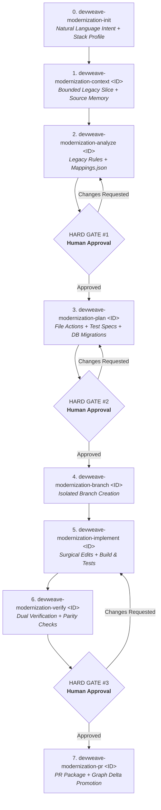

# DevWeave V1.1 Modernization Guide

The DevWeave V1.1 Modernization Lifecycle enables teams to incrementally and deterministically modernize legacy systems (monoliths, older frameworks, legacy UI/API/databases) to modern target architectures (e.g. Angular signals, CQRS microservices, clean architecture) with strict Human-in-the-Loop governance.

---

## 1. Modernization Command Workflow

DevWeave strictly uses **hyphen-separated CLI commands** for modernization:



---

## 2. Mandatory Hyphenated CLI Reference

| Command | Phase | Description |
| :--- | :--- | :--- |
| `devweave-modernization-init` | `INIT` | Captures natural language architecture intent without tedious questionnaires. |
| `devweave-modernization-context <ID>` | `CONTEXT` | Ingests legacy slice, scopes graph neighborhood, loads targeted practices. |
| `devweave-modernization-analyze <ID>` | `ANALYZE` | Analyzes legacy behavior and produces `analysis.md` + `mappings.json`. |
| `devweave-modernization-plan <ID>` | `PLAN` | Constructs file-anchored plan, tests, and DB migrations in `plan.md`. |
| `devweave-modernization-branch <ID>` | `BRANCH` | Creates isolated branch (supports `--name`, `--base`, and interactive/natural language branch selection). |
| `devweave-modernization-implement <ID>`| `IMPLEMENT` | Executes surgical, plan-bound code changes and local tests. |
| `devweave-modernization-verify <ID>` | `VERIFY` | Executes behavioral parity, architecture, and security checks. |
| `devweave-modernization-pr <ID>` | `PR` | Assembles PR package (`report.md`, `pr-description.md`) and promotes graph memory. |
| `devweave-modernization-status <ID>` | `STATUS` | Inspects and displays durable state, completed milestones, and blockers. |
| `devweave-modernization-report <ID>` | `REPORT` | Synthesizes comprehensive markdown report for stakeholders. |

---

## 3. Human-in-the-Loop Hard Governance Gates

Modernization enforces three mandatory Human-in-the-Loop checkpoints where execution automatically pauses:

1. **Hard Gate #1 (Post-ANALYZE)**: Human architect authorizes target architecture and component mappings before planning begins.
2. **Hard Gate #2 (Post-PLAN)**: Human team lead approves file changes, database migrations, and testing strategies before branch creation and code editing.
3. **Hard Gate #3 (Post-VERIFY)**: Human reviewer confirms behavioral parity and test execution before PR assembly.

Supported human decisions: `APPROVE`, `REQUEST_CHANGES`, `PROVIDE_INFORMATION`, `REJECT`, `STOP`, `RETRY`.

## 4. Key Architectural Safeguards

- **Zero Legacy Pollution**: Legacy source code is configured strictly as `READ_ONLY` in `source-memory.json`.
- **Zero Fact Fabrication**: In empty or new target repositories, unstated details remain `UNKNOWN` and unspecified options are marked `AI_DETERMINED`.
- **Version-Aware Practice Intelligence**: Framework changes (e.g. .NET 3 &rarr; 9) dynamically flag affected knowledge as `NEEDS_REVALIDATION`.
- **Generic Migration Units**: Supports `PAGE`, `SCREEN`, `FEATURE`, `MODULE`, `SERVICE`, `DOMAIN`, `WORKFLOW`, `API`, `TRANSACTION`, `COMPONENT`, and `CAPABILITY`.
- **Durable Knowledge Integration**: Reconciles `MIGRATED_TO` and `REPLACED_BY` edges into `graph/knowledge-graph.json` without destroying legacy history.

---

## 5. Hierarchical Workspace Architecture (Zero Duplication)

DevWeave V1.1 organizes modernization artifacts into a clean **2-Tier Hierarchical Structure**, ensuring project-level decisions are declared once and inherited by every migration story:

```text
.devweave/modernization/
│
├── [TIER 1: CENTRAL PROJECT CONFIGURATION] (Created once via devweave-modernization-init)
│   ├── workspace.json              <-- Target solution metadata & PM tool preference
│   ├── architecture-intent.json    <-- Declared target architecture (e.g. Angular 22, CQRS, SQLite)
│   ├── technology-profile.json     <-- Combined engineering practices (SOLID, Clean Code, CQRS)
│   └── source-memory.json          <-- Legacy repository pointer (READ_ONLY access mode)
│
└── stories/                        <-- [TIER 2: STORY-LEVEL MIGRATION SLICES] (Created via devweave-modernization-context <ID>)
    ├── 98/                         <-- Story #98 (e.g. User Login)
    │   ├── state.json              <-- Story lifecycle phase & hard gate tracker
    │   ├── audit.md                <-- Append-only user activity, prompt & decision log
    │   ├── context.md              <-- Bounded legacy slice context
    │   ├── migration-unit.json     <-- Targeted legacy components & DTOs
    │   ├── analysis.md             <-- Behavioral rules & dependency analysis
    │   ├── mappings.json           <-- Legacy-to-target component mappings
    │   ├── plan.md                 <-- File-anchored tasks & DB migrations
    │   ├── verification.md         <-- Behavioral parity & test evidence
    │   └── pr-description.md       <-- Pull request package
    │
    └── 99/                         <-- Story #99 (e.g. User Registration)
        ├── state.json
        ├── audit.md
        ├── context.md
        ├── migration-unit.json
        └── ...
```

---

## 6. User Activity Audit Trail (`audit.md`)
Every story maintains an append-only `.devweave/modernization/stories/<ID>/audit.md` dedicated **EXCLUSIVELY to human developer actions** (internal AI-DLC framework machinery, AST scans, and agent traces are omitted):
- **Author Attribution**: Every entry records `Author: <User Name> <email@example.com>` (from `git config user.name` and `user.email`).
- **User Prompts & Instructions**: Captures developer instructions, custom descriptions, and pasted requirements.
- **Interactive Configurations**: Records PM tool choices, custom branch names, and base branch selections (e.g. `"create feature/99-User-Registration from master"`).
- **Governance Gate Decisions**: Logs human approvals, change requests, and written feedback at Hard Gates #1, #2, and #3.
- **Pull Request Sign-off**: Records developer authorization to open the release PR.

#### Example `audit.md`:
```markdown
# User Audit Trail: Story 99

**Work Item ID**: 99
**Author**: Balaji Naik Mudavatu <balaji.mudavatu@example.com>
**Created At**: 2026-09-23T23:45:00+05:30

---

### [2026-09-23T23:45:00+05:30] Command: devweave-modernization-context 99
- **Author**: Balaji Naik Mudavatu <balaji.mudavatu@example.com>
- **Activity**: Work Item Ingestion & Scope Input
- **User Prompt**: "Modernize user registration screen from legacy JSP to Angular 22"
- **Inputs Provided**: PM Source = Manual Paste, PII Confirmed = Yes

---

### [2026-09-23T23:46:00+05:30] Hard Gate #1: Architecture Authorization
- **Author**: Balaji Naik Mudavatu <balaji.mudavatu@example.com>
- **Activity**: Gate Review Decision
- **Decision**: APPROVE
- **User Feedback / Comments**: "Target architecture approved with Signals store"

---

### [2026-09-23T23:47:00+05:30] Command: devweave-modernization-branch 99
- **Author**: Balaji Naik Mudavatu <balaji.mudavatu@example.com>
- **Activity**: Branch Configuration
- **User Input**: "create feature/99-User-Registration from master"
- **Target Branch**: feature/99-User-Registration
- **Base Branch**: master
```

---

## 7. Strict Gate Isolation & Command Boundaries
When a developer authorizes a Hard Gate (`APPROVE` at Hard Gate #1, #2, or #3):
1. The agent updates story state (`phases.<PHASE>` = `APPROVED`) and records the human approval in `audit.md`.
2. **The agent STOPS IMMEDIATELY**.
3. It is strictly prohibited from automatically running the next command (e.g. auto-running `devweave-modernization-plan` or `devweave-modernization-pr`).
4. The developer must explicitly execute the next phase command.

---

## 8. Controlled Phase & Gate `SKIP` with Mandatory Justification
Developers can fast-track or bypass optional phases or governance gates using `SKIP`:
- **Mandatory Justification**: The agent requires an explicit developer justification comment.
- **Traceability**: The skip decision, comment, and author attribution are permanently logged to `audit.md`.
- **State Transition**: Sets `phases.<PHASE>` = `SKIPPED`, `skipReason` = `"<comment>"`, and halts for the next explicit command.

---

## 9. Technology-Neutral Generic Architecture
DevWeave is 100% generic across all programming languages, web frameworks, ORMs, and databases. Dynamic 5-layer detection extracts runtime, ecosystem, persistence, test runners, and build systems from repository manifests without hardcoded language couplings.


