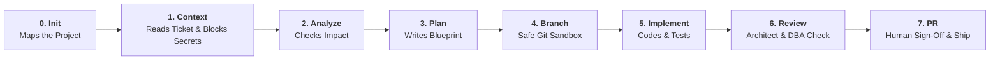

# DevWeave — Complete Product Overview & Guide

> **"Less Tokens. More Work. Lower Bill."**

Welcome to the **DevWeave Complete Product Document**. This guide is written in clear, simple English so that **anyone**—from a junior programmer to a project manager, CTO, or tech enthusiast—can understand exactly what DevWeave is, why it exists, how it works, and how to use it.

---

## 📖 Table of Contents
1. [The Big Picture: What is DevWeave?](#1-the-big-picture-what-is-devweave)
2. [The Problem: Why Standard AI Coding is Broken & Expensive](#2-the-problem-why-standard-ai-coding-is-broken--expensive)
3. [The Solution: What is AI-DLC (AI-Driven Development Lifecycle)?](#3-the-solution-what-is-ai-dlc)
4. [The 7 Simple Phases: How Work Gets Done](#4-the-7-simple-phases-how-work-gets-done)
5. [The Living Brain: Declarative JSON Knowledge Graph](#5-the-living-brain-declarative-json-knowledge-graph)
6. [Why Your AI Bill Drops by 90%+ (The Math Made Simple)](#6-why-your-ai-bill-drops-by-90)
7. [The 6 AI Helpers Supported](#7-the-6-ai-helpers-supported)
8. [1-Minute Installation (Copy & Paste)](#8-1-minute-installation-copy--paste)
9. [Automatic Daily Updates: Always Fresh with Zero Effort](#9-automatic-daily-updates)
10. [The Complete 21 Commands & Skills Catalog](#10-the-complete-21-commands--skills-catalog)
11. [A Day in the Life: A Real Story of Using DevWeave](#11-a-day-in-the-life-a-real-story)
12. [Frequently Asked Questions (FAQ)](#12-frequently-asked-questions-faq)

---

## 1. The Big Picture: What is DevWeave?

Imagine you hired a super-smart junior programmer who has read every programming book in the world, but has **no memory**, **no discipline**, and **tries to do everything in one giant leap**. Every time you ask them to fix a button, they read your entire 500-page project from page one, guess what files to touch, and accidentally break the database.

**DevWeave is the experienced Senior Architect and Project Manager sitting right next to the AI.**

DevWeave gives the AI:
- **A memory**: It remembers your project's architecture so it never has to re-read everything from scratch.
- **A strict step-by-step checklist**: It forces the AI to plan first, create a safe Git branch, write code surgically, run tests, and ask two expert inspectors (Architect + Database Admin) before showing you the result.
- **A budget cap**: It stops the AI from wasting expensive tokens, cutting your AI bills by **90% to 99%**.

---

## 2. The Problem: Why Standard AI Coding is Broken & Expensive

When you use standard AI assistants (like ChatGPT, GitHub Copilot Chat, or Claude) directly without a framework, four bad things happen:

```text
┌────────────────────────────────────────────────────────────────────────┐
│                   THE 4 BIG PROBLEMS WITH UNSTRUCTURED AI              │
├────────────────────────────────────────────────────────────────────────┤
│ 1. 💸 Exploding Bills: The AI re-reads hundreds of files on every turn. │
│ 2. 🌀 Hallucination & Drift: It edits random files you didn't ask for. │
│ 3. 🙈 Self-Blindness: The AI says "It works!" without running tests.   │
│ 4. 💥 Database Disasters: It writes slow queries that lock production. │
└────────────────────────────────────────────────────────────────────────┘
```

---

## 3. The Solution: What is AI-DLC?

**AI-DLC** stands for **AI-Driven Development Lifecycle**. 

Just like humans follow standard engineering steps (Ticket &rarr; Design &rarr; Branch &rarr; Code &rarr; Test &rarr; Code Review &rarr; Pull Request), **DevWeave forces the AI to follow the exact same disciplined process**.



---

## 4. The 7 Simple Phases: How Work Gets Done

Here is what happens in each phase in plain, simple terms:

### 🗺️ Phase 0: Init (`devweave-init`) — The Map Maker
- **What it does**: Scans your project once to see what languages (C#, Python, JavaScript, Java, Go, etc.), databases, and test tools you use.
- **Output**: Creates a `.devweave/` folder with clear maps (`layers.md`, `request-flow.md`, `knowledge-graph.json`).
- **Safety**: **Never touches or changes a single line of your application code.**

### 🛡️ Phase 1: Context (`devweave-context <TicketID>`) — The Bouncer
- **What it does**: Takes your ticket from Jira, GitHub, Azure DevOps, or Linear.
- **Safety Gate**: Checks for passwords, private customer data, or API keys and removes them before the AI sees them.
- **Budgeting**: Tells the AI: *"You only get 32,000 tokens for this task. Focus only on the 3 files that matter!"*

### 🔍 Phase 2: Analyze (`devweave-analyze <TicketID>`) — The Detective
- **What it does**: Investigates which database tables, APIs, and components will be affected.

### 📝 Phase 3: Plan (`devweave-plan <TicketID>`) — The Blueprint
- **What it does**: Writes an exact, step-by-step recipe (`plan.md`). For example: *"Step 1: Open line 45 of auth.ts. Step 2: Add password check. Step 3: Run npm test."*

### 🌿 Phase 4: Branch (`devweave-branch <TicketID>`) — The Safe Sandbox
- **What it does**: Automatically creates a separate Git branch (e.g. `feature/AUTH-101`).
- **Safety Gate**: **Strictly blocks the AI from making changes on `main` or `master`.**

### 🔨 Phase 5: Implement (`devweave-implement <TicketID>`) — The Surgical Builder
- **What it does**: Follows the blueprint line by line. It modifies **only** the allowed files, runs your local test suite, and captures proof that the tests passed.

### 👥 Phase 6: Review (`devweave-pr-review <TicketID>`) — The Two Inspectors
- **What it does**: Before you see the code, DevWeave calls two independent experts:
  1. **The Software Architect**: *"Does this follow clean design and avoid breaking other services?"*
  2. **The Senior Database Admin (DBA)**: *"Will this SQL query be slow? Does it lock tables?"*
- **Safety Gate**: If the inspectors find an issue, the AI must fix it before proceeding.

### 🚀 Phase 7: PR (`devweave-pr <TicketID>`) — The Final Delivery & Memory Keeper
- **What it does**: Creates a clean Pull Request description with all test evidence and asks for your final approval.
- **Memory Update**: Saves the new patterns into the project memory so future tasks are even faster and cheaper!

---

## 5. The Living Brain: Graph-Based Durable Memory

Standard AI assistants suffer from **AI Amnesia**: every time you close your chat window, the AI completely forgets your codebase. When you open a new chat, it starts from zero, guessing how your files connect and re-reading thousands of lines.

DevWeave solves this with **Graph-Based Durable Memory** (`.devweave/graph/knowledge-graph.json`).

```text
       ┌────────────────────────┐
       │    Login Controller    │
       └───────────┬────────────┘
                   │ (ROUTES_TO / CALLS)
                   ▼
       ┌────────────────────────┐
       │ Authentication Service │
       └─────┬────────────┬─────┘
             │            │ (MUTATES / QUERIES)
 (PUBLISHES) │            ▼
             │   ┌────────────────────────┐
             │   │  Users Database Table  │
             │   └────────────────────────┘
             ▼
 ┌────────────────────────┐
 │ User Logged In Event   │
 └────────────────────────┘
```

### 🧠 How Graph-Based Memory Works in 3 Steps:

1. **Instant Memory Recall (1-Hop Neighborhood Traversal)**:
   - When you ask to update the `Authentication Service`, DevWeave queries the graph's memory.
   - It instantly recalls:
     - *Who calls this?* &rarr; `Login Controller`
     - *What does this touch?* &rarr; `Users Database Table` and `User Logged In Event`
   - **Result**: The AI loads **only the 3 connected files** into memory, cutting prompt size from 40,000 tokens down to 1,500 tokens!

2. **Learning New Code (Graph Delta Memory Patching)**:
   - While working on a user story, as you add new services or database tables, DevWeave creates a temporary memory patch (`.devweave/tasks/<ID>/graph-delta.json`).
   - It never pollutes the master memory until your code is tested and verified.

3. **Collective Shared Brain (Git-Native Team Sync)**:
   - When your Pull Request is approved and merged into `main`, the memory patch is committed directly into the repository.
   - When your teammates pull latest code, **their AI assistants instantly inherit the updated memory graph with 0 tokens and 0 latency!**

---

## 6. Why Your AI Bill Drops by 90%+ (The Math Made Simple)

Here is a real comparison of doing the exact same task with standard AI vs DevWeave:

| Task Type | Standard Unstructured AI | With DevWeave AI-DLC | Money Saved |
| :--- | :--- | :--- | :--- |
| **Quick Bug Fix** | 141,200 tokens ($0.50) | **9,250 tokens ($0.0018)** | **99.6% Cheaper** |
| **New Feature Story** | 788,800 tokens ($2.79) | **125,700 tokens ($0.1450)** | **94.8% Cheaper** |
| **Repeat Task in Same Project** | 327,500 tokens ($1.16) | **21,800 tokens ($0.0039)** | **99.7% Cheaper** |

### How does it save so much money?
1. **Never Re-Reads the Whole Project**: Discovered once during `init`, remembered forever.
2. **Hard Token Limits**: Capped at 32k tokens per turn.
3. **Smart Model Routing**: Uses cheap, lightning-fast models (`flash_lite`) for simple file scanning, and only uses expensive models (`pro`) for deep architectural design.

---

## 7. The 6 AI Helpers Supported

DevWeave works **identically across all 6 major AI coding tools**:

1. 🔵 **Google Antigravity** (`agy run devweave-*`)
2. 🟠 **Anthropic Claude Code** (`/devweave-*`)
3. 🟣 **GitHub Copilot** (`@devweave /*`)
4. 🔴 **Google Gemini CLI** (`gemini devweave-*`)
5. 🟢 **OpenAI Codex / ChatGPT CLI** (`$devweave *`)
6. ⚪ **Cognition Devin** (`devweave:*`)

You can switch assistants anytime—they all share the exact same `.devweave/` project memory!

---

## 8. 1-Minute Installation (Copy & Paste)

You don't need to install Node.js, Python, or background servers. Just copy and paste the command for your AI assistant:

### 🔵 Google Antigravity
- **Windows (PowerShell)**:
  ```powershell
  git clone --depth 1 https://github.com/paarthivnaik/DevWeave.git $env:TEMP\devweave; agy plugin install $env:TEMP\devweave\plugins\antigravity; Remove-Item -Recurse -Force $env:TEMP\devweave
  ```
- **macOS / Linux (Bash)**:
  ```bash
  git clone --depth 1 https://github.com/paarthivnaik/DevWeave.git /tmp/devweave && agy plugin install /tmp/devweave/plugins/antigravity && rm -rf /tmp/devweave
  ```

### 🟠 Anthropic Claude Code
- **Windows (PowerShell)**:
  ```powershell
  git clone --depth 1 https://github.com/paarthivnaik/DevWeave.git $env:TEMP\devweave; New-Item -ItemType Directory -Force -Path .claude\commands | Out-Null; Copy-Item $env:TEMP\devweave\plugins\claude\CLAUDE.md .\CLAUDE.md; Copy-Item $env:TEMP\devweave\plugins\claude\commands\* .claude\commands\; Remove-Item -Recurse -Force $env:TEMP\devweave
  ```
- **macOS / Linux (Bash)**:
  ```bash
  git clone --depth 1 https://github.com/paarthivnaik/DevWeave.git /tmp/devweave && mkdir -p .claude/commands && cp /tmp/devweave/plugins/claude/CLAUDE.md ./CLAUDE.md && cp /tmp/devweave/plugins/claude/commands/* .claude/commands/ && rm -rf /tmp/devweave
  ```

### 🟣 GitHub Copilot (VS Code / Visual Studio)
- **Windows (PowerShell)**:
  ```powershell
  git clone --depth 1 https://github.com/paarthivnaik/DevWeave.git $env:TEMP\devweave; New-Item -ItemType Directory -Force -Path .github\prompts | Out-Null; Copy-Item $env:TEMP\devweave\plugins\copilot\copilot-instructions.md .github\copilot-instructions.md; Copy-Item $env:TEMP\devweave\plugins\copilot\prompts\* .github\prompts\; Remove-Item -Recurse -Force $env:TEMP\devweave
  ```
- **macOS / Linux (Bash)**:
  ```bash
  git clone --depth 1 https://github.com/paarthivnaik/DevWeave.git /tmp/devweave && mkdir -p .github/prompts && cp /tmp/devweave/plugins/copilot/copilot-instructions.md .github/copilot-instructions.md && cp /tmp/devweave/plugins/copilot/prompts/* .github/prompts/ && rm -rf /tmp/devweave
  ```

---

## 9. Automatic Daily Updates

You never have to worry about updating DevWeave manually:
- **First Session of the Day**: When you start work in the morning, DevWeave automatically checks GitHub and syncs in-place with **0 token cost**.
- **All Day Long**: For the rest of the day, it runs instantly with **0ms lag**.
- **Manual Update**: You can also update anytime by running `agy run devweave-update` or `/devweave-update`.

---

## 10. The Complete 21 Commands & Skills Catalog

| Command | Phase / Lane | What it Does (Plain English) |
| :--- | :--- | :--- |
| `devweave-init` | **Phase 0: Init** | Maps your project architecture, layers, and knowledge graph without touching code. |
| `devweave-context <ID>` | **Phase 1: Context** | Ingests ticket, cleans out passwords/PII, and isolates the 3 files needed. |
| `devweave-analyze <ID>` | **Phase 2: Analyze** | Checks database and API impacts before making changes. |
| `devweave-plan <ID>` | **Phase 3: Plan** | Writes an exact, step-by-step implementation blueprint with test commands. |
| `devweave-branch <ID>` | **Phase 4: Branch** | Creates a safe Git branch; prevents editing directly on `main`. |
| `devweave-implement <ID>`| **Phase 5: Implement**| Writes surgical code strictly following the plan and runs tests for proof. |
| `devweave-pr-review <ID>` | **Phase 6: Review** | Two independent inspectors (Architect + DBA) audit code and database queries. |
| `devweave-pr <ID>` | **Phase 7: PR** | Prepares final PR description and updates project memory upon approval. |
| `devweave-fix-triage <ID>`| **Fix Lane** | Ingests bug crash logs and classifies severity. |
| `devweave-fix-diagnose <ID>`| **Fix Lane** | Investigates root cause and designs minimal reproduction test case. |
| `devweave-fix-land <ID>` | **Fix Lane** | Applies minimal patch, tests regression, and prepares emergency hotfix PR. |
| `devweave-modernize <ID>`| **Modernize** | Helps upgrade old frameworks (e.g. .NET 8 &rarr; 9, React 18 &rarr; 19). |
| `devweave-express <ID>` | **Express Lane** | Fast 1-step track for tiny changes like typos and documentation updates. |
| `devweave-update` | **System** | In-place plugin updater with daily auto-sync. |
| `devweave-status` | **Utility** | Shows current phase, token usage, and open tickets. |
| `devweave-handoff` | **Utility** | Generates a clean summary so another developer can take over your task. |
| `devweave-archive` | **Utility** | Cleans up temporary task files after your PR is merged. |
| `devweave-report` | **Utility** | Generates an executive metrics report on token savings and quality. |
| `devweave-improve` | **Utility** | Records friction points to continuously improve AI performance. |
| `devweave-document-product`| **Knowledge** | Documents product features and domain maps. |
| `devweave-document-domain` | **Knowledge** | Documents business rules and compliance scorecards. |

---

## 11. A Day in the Life: A Real Story

Let's see how Developer Sarah uses DevWeave on a Tuesday morning:

1. **9:00 AM — Sarah opens her terminal**:
   ```bash
   agy run devweave-init
   ```
   *DevWeave detects her C# backend, PostgreSQL database, and xUnit test runner in 3 seconds.*

2. **9:05 AM — She picks up a ticket to add password reset**:
   ```bash
   agy run devweave-context AUTH-204
   ```
   *DevWeave pulls the ticket from Jira, removes sensitive test emails, and scopes context to just 2 files.*

3. **9:10 AM — Sarah asks for a plan**:
   ```bash
   agy run devweave-plan AUTH-204
   ```
   *DevWeave creates `plan.md` with 3 atomic steps.*

4. **9:15 AM — Coding & Testing**:
   ```bash
   agy run devweave-branch AUTH-204
   agy run devweave-implement AUTH-204
   ```
   *DevWeave creates `feature/AUTH-204`, writes the code, runs `dotnet test`, and confirms 14 tests passed!*

5. **9:20 AM — Expert Review & Pull Request**:
   ```bash
   agy run devweave-pr-review AUTH-204
   agy run devweave-pr AUTH-204
   ```
   *The Architect and DBA give 100% green light. Sarah clicks [Approve], and the PR is opened on GitHub.*

**Total Time**: 20 Minutes  
**Total Tokens**: 12,400 tokens  
**Total Cost**: $0.002 (Less than a penny!)

---

## 12. Frequently Asked Questions (FAQ)

### Q: Does DevWeave send my code to an external cloud?
**A: No.** DevWeave runs 100% locally in your IDE/CLI. All state is saved directly in your Git repository under `.devweave/`.

### Q: Do I need to install a background server or database?
**A: No.** DevWeave is 100% declarative. No Docker container, no background Node server, and no database needed.

### Q: Does DevWeave work with my programming language?
**A: Yes.** DevWeave is 100% technology-neutral. It is verified and certified across C#, Java, Python, TypeScript, JavaScript, Go, Rust, PHP, Ruby, C++, and monorepos.

### Q: Can my team share the knowledge graph?
**A: Yes.** Because the knowledge graph is stored in `.devweave/graph/knowledge-graph.json` inside your Git repo, when you merge your PR, the entire team automatically gets the updated knowledge graph when they pull!

---

**Summary:** DevWeave turns chaotic AI coding into disciplined, high-quality, ultra-low-cost software engineering.
