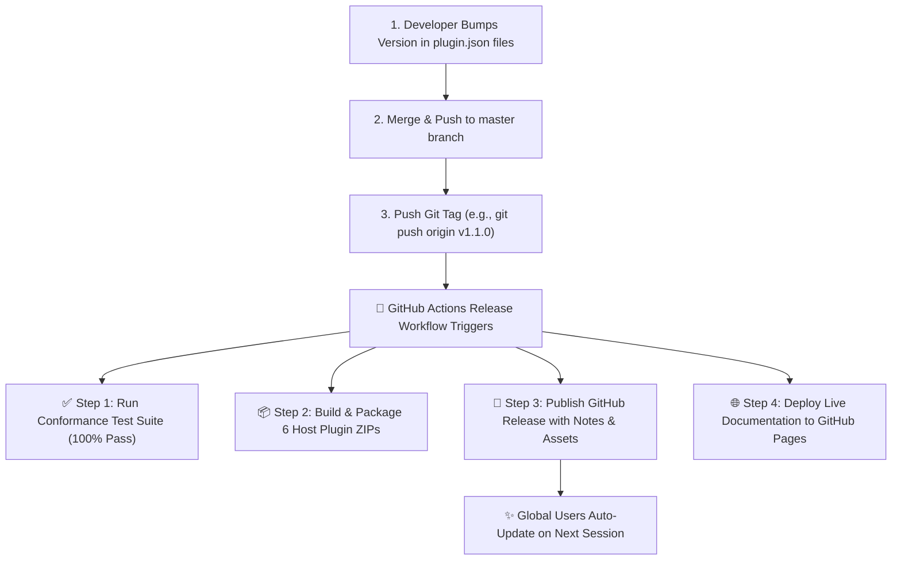

# 📦 DevWeave Release Process & GitHub Actions Runbook

This document provides a simple, step-by-step guide for maintainers to publish future releases of **DevWeave** (`v1.1.0`, `v1.2.0`, `v2.0.0`, etc.) using automated GitHub Actions.

---

## 🎯 How Releases Work in DevWeave

DevWeave utilizes a **fully automated, zero-touch release pipeline**:



---

## 📋 Step-by-Step Release Checklist

When you are ready to ship a new version (e.g., `v1.1.0`), follow these simple steps:

### Step 1: Bump Version Number in Plugin Manifests
Update the `"version": "1.1.0"` in all 6 host plugin manifests:
- `plugins/antigravity/plugin.json`
- `plugins/claude/plugin.json`
- `plugins/copilot/plugin.json`
- `plugins/gemini/plugin.json`
- `plugins/codex/plugin.json`
- `plugins/devin/plugin.json`

### Step 2: Run Local Conformance Verification
Verify that all tests pass cleanly before pushing:
```powershell
powershell -ExecutionPolicy Bypass -File .\conformance\tests\run_all_tests.ps1
```
*Expected output: All 6 test suites pass (100% SUCCESS).*

### Step 3: Commit & Push to `master`
Commit the version changes and push to `master` (the default branch):
```bash
git checkout master
git merge develop
git add .
git commit -m "chore(release): prepare v1.1.0"
git push origin master
```

### Step 4: Tag & Trigger Automated GitHub Actions
Create and push the version tag:
```bash
git tag -fa v1.1.0 -m "DevWeave v1.1.0 Release"
git push origin v1.1.0
```

---

## 🤖 What GitHub Actions Does Automatically

Once you push the tag `v1.1.0`, the automated workflow (`.github/workflows/release.yml`) automatically performs:

1. **Validation & Test Execution**:
   - Validates JSON schemas across all 6 plugin manifests.
   - Runs the 6 automated conformance test suites across all 28 state machine transitions and knowledge graph fixtures.
2. **Package Artifact Generation**:
   - Builds downloadable standalone archives for each host in `dist/`:
     - `devweave-antigravity.zip`
     - `devweave-claude.zip`
     - `devweave-copilot.zip`
     - `devweave-gemini.zip`
     - `devweave-codex.zip`
     - `devweave-devin.zip`
     - `devweave-all-plugins.zip` (complete multi-host bundle)
3. **GitHub Release Publication**:
   - Creates the official GitHub Release under `https://github.com/paarthivnaik/DevWeave/releases/tag/v1.1.0`.
   - Auto-generates changelogs from commits.
   - Attaches all 7 zip archives for direct public download.
4. **Documentation Deployment**:
   - Automatically builds and publishes the latest website showcase and ROI calculator from `site/` to **GitHub Pages**.

---

## 🔄 How Existing End Users Receive the Update

When you complete the steps above, end users don't need to download anything manually:

1. **Automatic Daily Refresh**: On their next session (after the 24h cache TTL), the user's local DevWeave plugin silently fetches the new `master` branch in ~1.5s (using **0 LLM tokens**).
2. **Instant In-Place Upgrade**: The updater replaces their local plugin files with `v1.1.0` in `~/.gemini/config/plugins/devweave/` (and local workspace `.agents/plugins/devweave/` if in a project repo).
3. **Manual Instant Upgrade**: If a user wants `v1.1.0` immediately without waiting, they simply type:
   ```text
   /devweave-update
   ```

---

## 🚑 Hotfix & Patch Procedure (e.g., `v1.1.1`)

If an urgent bug fix is required:
1. Create a fix branch: `git checkout -b hotfix/v1.1.1`
2. Apply the surgical fix and test with `./conformance/tests/run_all_tests.ps1`.
3. Bump version to `"1.1.1"` in the `plugin.json` files.
4. Merge to `master` and `develop`:
   ```bash
   git checkout master
   git merge hotfix/v1.1.1
   git push origin master
   git tag -fa v1.1.1 -m "DevWeave v1.1.1 Hotfix"
   git push origin v1.1.1
   ```
5. GitHub Actions handles packaging and publishing automatically. All users worldwide receive the patch on their next daily check.
