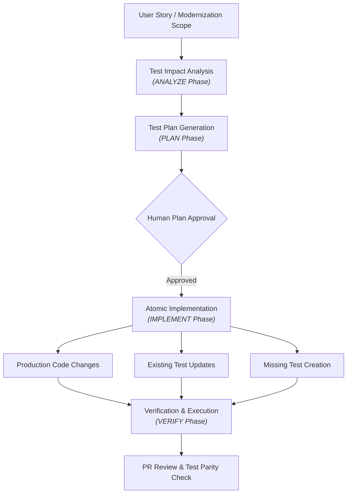

# DevWeave Test Intelligence Specification & Guide

## 1. Overview & Core Principle

DevWeave integrates testing as a first-class citizen of every code change across both **V1.0 Normal Development** and **V1.1 Modernization**:

> **Every code change carries its corresponding test impact. DevWeave automatically updates affected existing tests and creates missing tests based on the approved user story and implementation plan.**

Testing is part of implementation, not an afterthought or disconnected manual phase.

---

## 2. Test Intelligence Architecture



---

## 3. Test Levels Supported

1. **Unit Tests**: Domain logic, calculations, services, commands, queries, standalone components (xUnit, NUnit, pytest, Jest, Vitest, JUnit).
2. **Integration Tests**: Database access, repository behaviors, messaging queues, Testcontainers.
3. **API Tests**: HTTP endpoints, route contracts, parameter validation, problem-details responses.
4. **Database Tests**: Schema constraints, stored procedures, migration scripts, index performance.
5. **UI / E2E Tests**: User journeys, critical business workflows (Playwright, Cypress, Selenium).

---

## 4. Framework Detection & Decision Order

DevWeave adheres strictly to this E2E framework resolution order:

```text
1. Inspect repository for existing E2E framework (Playwright, Cypress, Selenium).
   ├── If Found -> Re-use existing framework.
2. If No E2E framework exists:
   ├── Check declared architecture / technology standards.
   ├── Formulate recommendation in test plan.
   └── Require explicit Human Approval before introducing any new testing tool.
```

**Guardrail**: DevWeave will **never** automatically add both Playwright and Cypress to the same application.

---

## 5. Guard Against "Make Tests Green" Test Weakening

DevWeave strictly prohibits changing tests solely to mask production defects:

```text
Test Failure
     ↓
Classify Failure:
     ├── IMPLEMENTATION_DEFECT   -> Fix production code; keep test strict.
     ├── TEST_DEFECT             -> Fix test code with explicit rationale.
     ├── EXPECTED_BEHAVIOR_CHANGE-> Update test strictly to match approved story.
     ├── ENVIRONMENT_FAILURE     -> Report environment issue and halt.
     └── UNRELATED_REGRESSION    -> Preserve failure and report blocker.
```

---

## 6. Legacy-to-Modern Test Mapping (V1.1)

In modernization workflows, DevWeave tracks behavioral preservation by mapping legacy tests to modern target tests:

```yaml
migrationTestMapping:
  sourceBehavior: legacy.customer.create
  targetBehavior: modern.customer.create
  sourceTests:
    - legacy/tests/CustomerControllerTests.cs
  targetTests:
    - modern/tests/CustomerEndpointsTests.cs
    - modern/e2e/customer-create.spec.ts
  status: PRESERVED # PRESERVED | UPDATED | REPLACED | NEW | NOT_APPLICABLE
```

---

## 7. Knowledge Graph Relationships

DevWeave persists test relationships in its Git-native JSON Knowledge Graph:
- `TEST_COVERS`: Connects test cases to production classes/methods.
- `TEST_VALIDATES`: Connects tests to formal acceptance criteria or business rules.
- `USER_JOURNEY_VERIFIED_BY`: Connects user journey flows to E2E test specs.
- `SOURCE_AFFECTS_TEST`: Connects changed files to their corresponding test suite impact radius.
