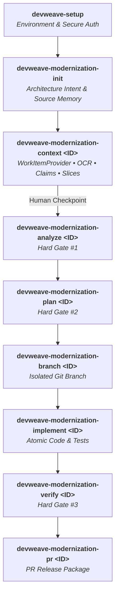

# DevWeave V1.2.0 Release Notes & Specification

## Executive Overview
**Release Date**: September 25, 2026  
**Version**: `1.2.0`  
**Branch**: `feature/V1.2.0-Context-acuisition-capabity`  
**Conformance Status**: 100% (185/185 Conformance Tests Passed across 11 Suites)

---

## 1. What's New in V1.2.0

### Generic Project Management Integration (`WorkItemProvider`)
DevWeave now natively communicates with external project-management tools using a generic provider abstraction, eliminating vendor lock-in.

Supported out-of-the-box:
1. **Azure DevOps Boards (`azure-devops`)**
2. **Atlassian Jira (`jira`)**
3. **GitHub Issues & Projects v2 (`github`)**
4. **Custom & Offline Ingestion (`custom`)**

---

### Environment & Setup Orchestrator (`devweave-setup`)
A standalone CLI command for diagnostic checks, tool detection, package manager installation authorization, and secure OS session authentication.

```bash
# Diagnostic check
devweave-setup --check-only

# Configure Jira or Azure DevOps
devweave-setup --provider jira
devweave-setup --provider azure-devops
```

---

### Safe Attachment Text Extraction & Image OCR
- **Text Attachments**: Extracted safely with directory traversal protection (`../`).
- **Image Mockups & Screenshots**: Processed with OCR, returning structured text and quality scores (`SUCCESS`, `PARTIAL`, `FAILED`).
- **Non-Blocking**: OCR engine absence or partial readability never blocks lifecycle progression.
- **Zero Hallucination**: Prevents fabricating unreadable visual elements.

---

### Candidate Claims & Evidence Modeling (`evidence.json`)
User story statements and attachment text are tracked through a formal verification lifecycle:
- `UNVERIFIED` (Default)
- `VERIFIED` (Confirmed by AST analysis or schema queries)
- `CONTRADICTED` (Refuted by code; blocked from plan generation)
- `PARTIALLY_VERIFIED`
- `UNKNOWN`

---

### Bounded Migration Slicing (`migration-slice.json`)
Surgically maps legacy components (Views &rarr; Controllers &rarr; Services &rarr; Database &rarr; Tests) with strict token budgeting (< 12,000 tokens).

---

## 2. Updated Lifecycle Architecture


