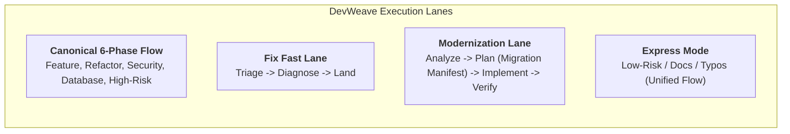
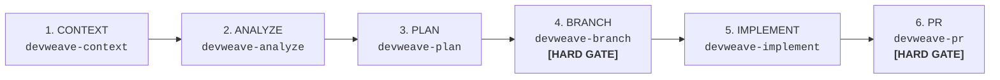
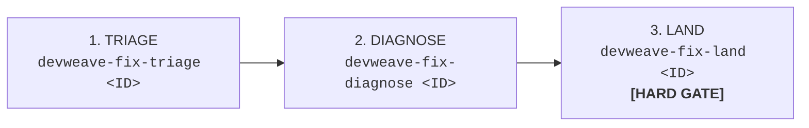
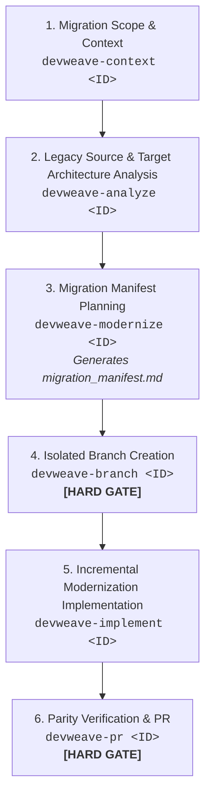
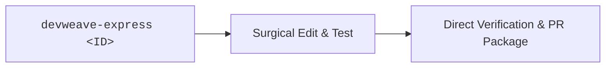
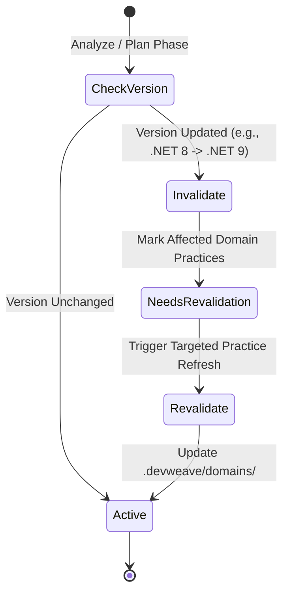

# DevWeave Workflow Profiles & Execution Lanes

DevWeave provides **risk-calibrated workflow profiles** and **specialized execution lanes** to optimize token usage, turnaround velocity, and safety governance.

---

## 1. Overview of Execution Lanes

---

## 2. Canonical 6-Phase User Workflow

The standard pathway for net-new features, complex refactoring, and multi-file architecture changes:

### Phase Summary:
1. **`devweave-context <ID>`**: Work item intake, PII/Privacy gating, blast-radius scoping, durable resume detection (`handoff.md`).
2. **`devweave-analyze <ID>`**: Deep architectural exploration, root-cause investigation, and technology revalidation.
3. **`devweave-plan <ID>`**: Precise, verifiable implementation plan with exact file anchors and test criteria.
4. **`devweave-branch <ID>`**: Mandatory branch checkpoint (`feature/<ID>`, `refactor/<ID>`).
5. **`devweave-implement <ID>`**: Surgical code modifications and automated test verification.
6. **`devweave-pr <ID>`**: Final compliance check, multi-perspective code review, durable domain knowledge promotion, and PR assembly.

---

## 3. Specialized Fast Lanes

### A. Fix Lane (Bug Triage & Rapid Remediation)

Designed for accelerated bug fixes with deterministic root-cause diagnosis:

| Skill | Role & Output | Checkpoint Gate |
|---|---|---|
| `devweave-fix-triage` | Ingests error logs, stack traces, reproduction steps, and assigns severity (`P0` to `P3`). | Human reviews severity and reproduction viability. |
| `devweave-fix-diagnose` | Pinpoints offending source code, captures root cause, and generates targeted fix plan. | Human approves root-cause diagnosis and proposed fix. |
| `devweave-fix-land` | Creates `fix/<ID>` branch, implements patch, executes regression tests, verifies fix, and generates PR package. | Hard approval required before opening PR. |

---

### B. Modernization Lane (Legacy Migration & Upgrades)

Tailored for migrating legacy stacks (e.g., monolith to microservices, framework upgrades, language migrations):

#### Key Modernization Artifact: `migration_manifest.md`
Contains:
- Source component contract & legacy behavior definition.
- Target component architecture & pattern alignment.
- API & schema translation mapping.
- Feature parity verification matrix.
- Rollback & coexistence strategy.

---

### C. Express Mode (Low-Risk Fast Track)

For typos, documentation updates, configuration tweaks, or single-line trivial fixes:

- **Execution**: Single autonomous command verifying safety thresholds.
- **Safety Guard**: Halts immediately and escalates to the canonical 6-phase flow if blast radius exceeds 3 files or touches core business logic.

---

## 4. Complete Workflow Profiles Matrix

| Profile | Target Scenario | State Progression | Human Gates | Risk Tier |
|---|---|---|---|---|
| **`EXPRESS`** | Typos, doc fixes, comments, trivial config | `CONTEXT` $\to$ `IMPLEMENT` $\to$ `VERIFY` $\to$ `PR` | Pre-PR | Low |
| **`BUG`** | Production defects, test failures, regressions | `TRIAGE` $\to$ `DIAGNOSE` $\to$ `PLAN` $\to$ `IMPLEMENT` $\to$ `LAND` | Diagnose, Land | Medium |
| **`FEATURE`** | Net-new business capabilities, user stories | `CONTEXT` $\to$ `ANALYZE` $\to$ `PLAN` $\to$ `BRANCH` $\to$ `IMPLEMENT` $\to$ `PR` | Context, Analyze, Plan, Branch, PR | Medium-High |
| **`REFACTOR`** | Code cleanup, performance tuning, architecture decoupling | `CONTEXT` $\to$ `BASELINE_TEST` $\to$ `ANALYZE` $\to$ `PLAN` $\to$ `IMPLEMENT` $\to$ `VERIFY` $\to$ `PR` | Plan, Branch, PR | Medium-High |
| **`MODERNIZATION`** | Framework migrations, runtime upgrades, monolith extraction | `CONTEXT` $\to$ `ANALYZE` $\to$ `MODERNIZE_MANIFEST` $\to$ `BRANCH` $\to$ `IMPLEMENT` $\to$ `PR` | Analysis, Manifest, Branch, PR | High |
| **`SECURITY`** | CVE remediation, auth/authz fixes, crypto upgrades | `CONTEXT` $\to$ `THREAT_MODEL` $\to$ `PLAN` $\to$ `BRANCH` $\to$ `IMPLEMENT` $\to$ `SEC_SCAN` $\to$ `PR` | Threat Model, Plan, PR | Critical |
| **`DATABASE`** | Schema migrations, index tuning, ORM updates | `CONTEXT` $\to$ `SCHEMA_INSPECT` $\to$ `MIGRATION_PLAN` $\to$ `DRY_RUN` $\to$ `IMPLEMENT` $\to$ `PR` | Migration Plan, Dry Run, PR | High |
| **`HIGH_RISK`** | Core financial logic, PII pipelines, kernel modules | `CONTEXT` $\to$ `DEEP_DISCOVERY` $\to$ `MULTI_PLAN` $\to$ `PANEL_APPROVAL` $\to$ `IMPLEMENT` $\to$ `PR` | All Phases Mandatory | Critical |

---

## 5. Dynamic Technology Revalidation in Profiles

When any profile executes, DevWeave continuously validates that repository technology practices match active framework versions:

- **`NEEDS_REVALIDATION` Flag**: Applied to domain practices when major/minor framework updates occur.
- **Context Refresh (`--refresh`)**: Invalidates stale work-item state if underlying codebase or PM tickets change mid-stream.
