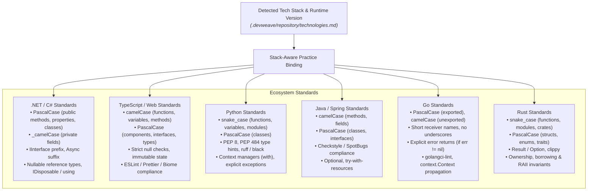

# DevWeave Stack-Aware Best Practices & Coding Standards Specification

DevWeave enforces **stack-aware, idiomatic coding standards, naming conventions, and linting rules** dynamically tailored to the detected programming language, framework version, and repository patterns.

---

## 1. Practice Classifications & Enforcement Tiers

Practices are categorized into four standard tiers:

| Tier | Meaning | Enforcement |
| :--- | :--- | :--- |
| **`MANDATORY`** | Strict security, typing invariants, and compiler/linter compliance. | Blocking gate in verification and review. |
| **`RECOMMENDED`** | High-signal idiomatic engineering patterns (e.g., `AsNoTracking`, React hooks rules, RAII). | High priority in implementation and review. |
| **`ADVISORY`** | Non-blocking readability or maintainability suggestions. | Contextual note in review findings. |
| **`ANTI_PATTERN`** | Known anti-patterns (e.g. N+1 queries, swallowing exceptions, mutating props, raw SQL). | Flagged by reviewers for mandatory remediation. |

---

## 2. Stack-Specific Naming Conventions & Idioms Matrix

DevWeave binds the appropriate standards automatically based on Layer 1 & Layer 2 autonomous detection:



### A. C# / .NET Conventions & Idioms
- **Naming**: `PascalCase` for classes, methods, public properties; `_camelCase` for private fields; `I` prefix for interfaces (`IUserRepository`); `Async` suffix for Task-returning methods.
- **Idioms**: Nullable reference types enabled (`#nullable enable`), pattern matching, `record` types for DTOs/Value Objects, proper `IDisposable`/`IAsyncDisposable` with `using` declarations, `AsNoTracking()` for read-only EF Core queries.
- **Analyzers**: Roslyn analyzers, `.editorconfig` rules, TreatWarningsAsErrors enforcement.

### B. TypeScript / React / Angular Conventions
- **Naming**: `camelCase` for functions, variables, and hooks (`useUserData`); `PascalCase` for components, classes, types, and interfaces; `UPPER_SNAKE_CASE` for global constants.
- **Idioms**: Strict TypeScript mode (`noImplicitAny: true`, `strictNullChecks: true`), immutable state updates, exhaustive deps in React hooks, dependency injection in Angular, async/await with `Promise.allSettled`.
- **Linters**: ESLint, Prettier, Biome, Angular ESLint.

### C. Python / FastAPI / Django Conventions
- **Naming**: `snake_case` for functions, variables, methods, and filenames; `PascalCase` for classes and Pydantic models; `UPPER_SNAKE_CASE` for module constants; `_` prefix for private methods.
- **Idioms**: PEP 8 compliance, full type annotations (PEP 484), Pydantic v2 schemas, `with` context managers for files/sessions, structured logging, `pytest` fixtures.
- **Linters**: `ruff`, `black`, `mypy`, `flake8`.

### D. Java / Spring Boot Conventions
- **Naming**: `camelCase` for methods, parameters, and variable names; `PascalCase` for classes and interfaces; `UPPER_SNAKE_CASE` for static constants.
- **Idioms**: Constructor injection over field injection (`@Autowired`), `Optional<T>` return types for nullable finders, `try-with-resources` for AutoCloseable streams, Spring validation annotations (`@Valid`, `@NotNull`).
- **Linters**: SpotBugs, Checkstyle, PMD.

### E. Go Conventions
- **Naming**: `PascalCase` for exported package identifiers; `camelCase` for internal identifiers; concise receiver names (e.g. `s *Server`); no snake_case in Go source.
- **Idioms**: Explicit error propagation (`if err != nil`), `context.Context` as first argument in I/O methods, goroutine leak prevention with `sync.WaitGroup` / channels.
- **Linters**: `golangci-lint`, `go vet`, `gofmt`.

### F. Rust Conventions
- **Naming**: `snake_case` for functions, variables, modules, and macros; `PascalCase` for structs, enums, and traits; `SCREAMING_SNAKE_CASE` for `const` and `static`.
- **Idioms**: Exhaustive pattern matching, `Result<T, E>` and `Option<T>` over panics, explicit borrowing lifetimes, zero `unwrap()` in production code paths (`?` operator).
- **Linters**: `cargo clippy -- -D warnings`, `rustfmt`.

---

## 3. Precedence Hierarchy

When multiple guidance sources apply to a task, DevWeave resolves conflicts using strict precedence:

```text
Priority 1 (Highest): Repository-Established Conventions (.devweave/repository/practices.md & .editorconfig)
Priority 2:           Official Framework / Language Guidance (e.g., Microsoft C# Docs, PEP 8, Go Code Review Comments)
Priority 3:           Enterprise / Organization Standards (.devweave/domains/)
Priority 4 (Lowest):  Generic AI Recommendations
```

---

## 4. Dual-Model Review Enforcement

During Phase 6 (`devweave-pr`), **both Review Models** enforce stack conventions:
- **Model A**: Audits semantic correctness, type rigor, interface contracts, and naming consistency.
- **Model B**: Audits anti-patterns, resource leaks, unhandled exceptions, and linter warnings.
- Any violation of a `MANDATORY` convention is flagged as a **blocking review finding (P1)**.
