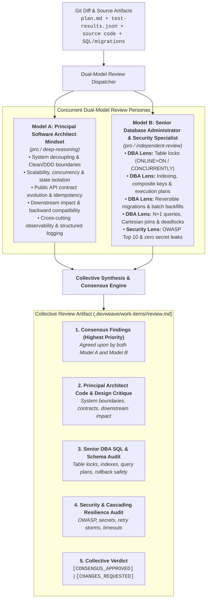

# DevWeave Dual-Model Consensus Code Review Specification

DevWeave mandates a **Dual-Model Collective Review** architecture for Phase 6 (`PR`) and Fix Lane remediation. Instead of relying on a single AI model's blind spots, code changes are evaluated concurrently by **two distinct model perspectives**:
1. **Model A**: Reviews code thinking like a **Principal Software Architect** (System design, decoupling, scalability, API contracts, downstream impact).
2. **Model B**: Reviews SQL scripts, data access, and migrations thinking like a **Senior Database Administrator (DBA)** (Table locks, indexing, rollback safety, query plans) while auditing security vulnerabilities (OWASP, secrets).

---

## 1. Dual-Model Review Architecture & Personas



---

## 2. Deep Dive: Reviewer Personas

### A. Model A: Principal Software Architect
When reviewing application code, Model A evaluates:
- **Separation of Concerns & Modularity**: Adherence to Clean Architecture, Hexagonal patterns, and DDD bounded contexts.
- **Contract Robustness**: Idempotency on mutation endpoints, graceful error handling, and strict backward compatibility for API consumers.
- **Concurrency & State Safety**: Thread safety, immutability, avoidance of race conditions, and clean distributed state management.
- **Observability**: Consistent correlation IDs, structured logging (no raw `Console.WriteLine` / `print`), and OpenTelemetry metric emission.

### B. Model B: Senior Database Administrator (DBA)
When reviewing SQL scripts, ORM entities, and database migrations, Model B evaluates:
- **Lock Contention & Table Availability**: Ensures `ALTER TABLE` operations on large tables use non-blocking options (`CONCURRENTLY` in Postgres, `ONLINE = ON` in SQL Server).
- **Index Optimization**: Checks that foreign keys, filter predicates, and join columns are properly indexed without redundant/bloated indexes.
- **Migration Rollback & Idempotency**: Requires reversible `down` migrations and atomic DDL wrappers where supported.
- **High-Volume Data Operations**: Recommends chunked batching for backfills and updates on tables exceeding 100k rows.
- **Query Efficiency**: Flags ORM N+1 query patterns, Cartesian products, cursor iterations, and unindexed full-table scans.

---

## 3. Collective Review Output Structure (`review.md`)

```markdown
# Collective Code Review: <WorkItem-ID>

## 1. Executive Summary & Verdict
- **Principal Architect Reviewer (Model A)**: PASSED (0 Blocking, 1 Advisory)
- **Senior DBA & Security Reviewer (Model B)**: PASSED (0 Blocking, 0 Advisory)
- **Collective Verdict**: CONSENSUS_APPROVED
- **Blocking Issues (P0/P1)**: 0
- **Advisory Improvements (P2/P3)**: 1

---

## 2. Principal Architect System & Design Critique (Model A)
- **Architectural Boundaries**: Adheres to repository DDD and Clean Architecture layers.
- **API Contracts & Downstream Impact**: Zero breaking changes; backward compatibility verified.
- **Observability**: Structured logs and correlation IDs injected.

---

## 3. Senior DBA SQL & Migration Audit (Model B)
- **Table Lock Safety**: Migration applies `CREATE INDEX CONCURRENTLY`; zero table locks.
- **Indexing & Query Plan**: Foreign key `user_id` indexed; estimated query cost reduced by 85%.
- **Rollback Safety**: Reversible `down.sql` script verified and tested.
- **ORM Optimization**: Queries use `AsNoTracking()` and explicit projections (`Select(x => ...)`).

---

## 4. Security & Cascading Resilience Audit (Model B)
- Zero raw secrets detected.
- Polly retry policy configured with exponential backoff and jitter.

---

## 5. Consensus Findings & Remediation Plan
*High-confidence issues identified independently by both review models.*
```

---

## 4. Enforcement & Gating Invariants

1. **Zero Unreviewed Migrations**: Any PR containing SQL files, migrations, or ORM mapping changes strictly requires Senior DBA sign-off.
2. **Blocking Finding Remediation**: Any P0/P1 finding from either the Principal Architect or Senior DBA triggers an isolated `FIX` $\to$ `RETEST` loop before human gate presentation.
