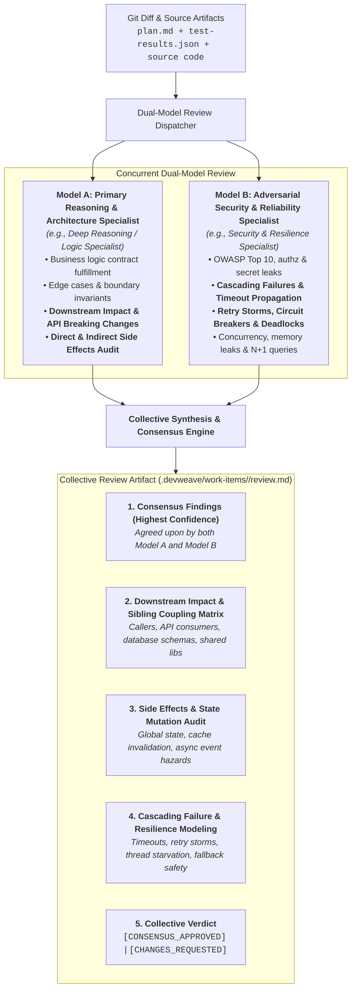

# DevWeave Dual-Model Consensus Code Review Specification

DevWeave mandates a **Dual-Model Collective Review** architecture for Phase 6 (`PR`) and Fix Lane remediation. Instead of relying on a single AI model's blind spots, code changes are evaluated concurrently by **two distinct model perspectives** with exhaustive analysis of **downstream impact, side effects, and cascading failure modes**, synthesized into a collective consensus report.

---

## 1. Dual-Model Review Architecture



---

## 2. Mandatory Analysis Dimensions

Every review must rigorously evaluate the following four dimensions:

### A. Downstream Impact Analysis
- **API & Contract Breaking Changes**: Checks whether modified method signatures, REST endpoints, DTO schemas, or GraphQL types break external or internal callers.
- **Consumer & Sibling Module Scoping**: Identifies all upstream callers and downstream consumers across the repository or monorepo.
- **Database Schema & Data Flow Impact**: Evaluates whether query modifications or column alterations affect downstream reports, ETL pipelines, or background jobs.

### B. Side Effects & State Mutation Audit
- **Global & Shared State Mutations**: Detects hidden mutations in singletons, shared caches, static variables, or DI scoped containers.
- **Cache Invalidation & Consistency Hazards**: Verifies that cached records are evicted or updated cleanly without stale reads or race conditions.
- **Transaction & Rollback Integrity**: Audits whether database mutations execute inside atomic transactions and roll back cleanly on errors.
- **Asynchronous & Event-Driven Side Effects**: Evaluates out-of-order message processing, dead-letter queue routing, and unhandled event worker failures.

### C. Cascading Failure & Resilience Modeling
- **Timeout & Error Propagation**: Checks if unhandled downstream service timeouts bubble up and crash caller processes.
- **Circuit Breaking & Graceful Degradation**: Verifies fallback mechanisms when third-party or internal dependencies become unavailable.
- **Retry Storms & Backoff**: Ensures failed network/database operations use exponential backoff with jitter to prevent self-inflicted DDoS.
- **Resource Exhaustion & Concurrency Safety**: Audits connection pools, file descriptors, cancellation token propagation, and thread pool deadlocks.

### D. Security & Quality Standards
- **Zero Raw Secrets / OWASP Top 10**: Complete SAST scan and credential sanitation.
- **Domain Rule Compliance**: Compliance with patterns in `.devweave/domains/`.

---

## 3. Collective Review Output Structure (`review.md`)

The collective output is recorded in `.devweave/work-items/<ID>/review.md`:

```markdown
# Collective Code Review: <WorkItem-ID>

## 1. Executive Summary & Verdict
- **Model A Reviewer**: Completed (Logic, Downstream Impact, Architecture)
- **Model B Reviewer**: Completed (Security, Side Effects, Cascading Failures)
- **Collective Verdict**: CONSENSUS_APPROVED | CHANGES_REQUESTED
- **Blocking Issues (P0/P1)**: 0
- **Advisory Improvements (P2/P3)**: 2

---

## 2. Downstream Impact & API Coupling Matrix
| Component / Consumer | Direct / Indirect | Risk Tier | Impact Description & Mitigations |
|---|---|---|---|
| `PaymentGatewayClient` | Direct | High | New optional parameter; backward compatibility verified. |
| `BillingWorkerService` | Indirect | Low | Schema addition non-breaking; zero ETL disruption. |

---

## 3. Side Effects & State Mutation Audit
- **Shared State**: Zero unauthorized static/singleton state mutations.
- **Cache Invalidation**: Redis cache keys invalidated on update.
- **Transaction Integrity**: UnitOfWork transaction rolls back on exception.

---

## 4. Cascading Failure & Resilience Assessment
- **Timeout Handling**: CancellationToken properly chained across HTTP clients.
- **Retry & Backoff**: Polly retry policy configured with jitter (max 3 retries).
- **Graceful Degradation**: Fallback cached value returned if external API is unreachable.

---

## 5. Consensus Findings (Agreed by Both Models)
*High-confidence issues identified independently by both review models.*

---

## 6. Logic, Security & Standards Findings
- Line-referenced findings categorized by Model A and Model B.

---

## 7. Remediation Action Plan (if blocking findings exist)
- Specific required fixes before human PR sign-off.
```

---

## 4. Enforcement & Gating Invariants

1. **Zero Single-Model PR Pass**: PR packages cannot be generated without collective sign-off from both review perspectives.
2. **Mandatory Impact Matrix**: `review.md` must explicitly detail downstream impacts, side effects, and cascading failure mitigations.
3. **Blocking Finding Remediation**: Any P0/P1 finding flagged by either model triggers the isolated `FIX` $\to$ `RETEST` loop before human gate presentation.
