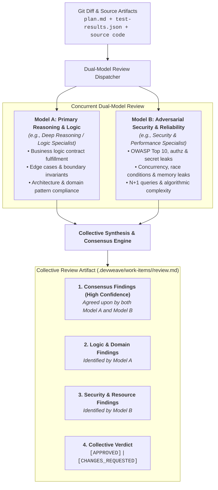

# DevWeave Dual-Model Consensus Code Review Specification

DevWeave mandates a **Dual-Model Collective Review** architecture for Phase 6 (`PR`) and Fix Lane remediation. Instead of relying on a single AI model's blind spots, code changes are evaluated concurrently by **two distinct model perspectives** and synthesized into a collective consensus report.

---

## 1. Dual-Model Review Architecture



---

## 2. Review Model Responsibilities

### Model A: Primary Reasoning & Architecture Specialist
- **Focus**: Semantic correctness, contract fulfillment, business logic integrity, error boundary handling, and compliance with domain rules in `.devweave/domains/`.
- **Capability Tier**: `independent-review` / `deep-reasoning` (e.g. `pro` / `reasoning`).

### Model B: Adversarial Security & Reliability Specialist
- **Focus**: Vulnerability discovery, secret scanning, SQL/command injection, authentication/authorization validation, thread safety, memory consumption, and algorithmic complexity.
- **Capability Tier**: `independent-review` / `independent-reasoning` (e.g. `pro` / `security-reviewer`).

---

## 3. Collective Review Output Structure (`review.md`)

The collective output is recorded in `.devweave/work-items/<ID>/review.md` following this schema:

```markdown
# Collective Code Review: <WorkItem-ID>

## 1. Executive Summary & Verdict
- **Model A Reviewer**: Completed (Logic, Edge Cases, Architecture)
- **Model B Reviewer**: Completed (Security, Vulnerabilities, Performance)
- **Collective Verdict**: APPROVED | CHANGES_REQUESTED
- **Blocking Issues (P0/P1)**: 0
- **Advisory Improvements (P2/P3)**: 2

---

## 2. Consensus Findings (Agreed by Both Models)
*Issues identified independently by both Model A and Model B (Highest Priority).*

---

## 3. Logic & Contract Review (Model A)
- Detailed findings on business logic, boundary conditions, and test coverage.

---

## 4. Security & Performance Audit (Model B)
- Detailed findings on OWASP compliance, zero secrets, memory footprint, and query efficiency.

---

## 5. Remediation Action Plan
- Specific, line-referenced modifications required before PR authorization.
```

---

## 4. Enforcement & Gating Invariants

1. **Zero Single-Model PR Pass**: PR packages cannot be generated without collective sign-off from both review perspectives.
2. **Blocking Finding Remediation**: Any P0/P1 finding flagged by either model triggers the isolated `FIX` $\to$ `RETEST` loop before human gate presentation.
3. **Permanent Audit Trail**: The full collective synthesis is archived in `.devweave/work-items/<ID>/review.md` and referenced in `pr-description.md`.
