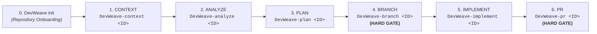

# DevWeave AI-DLC Lifecycle Specification

The AI-Driven Development Lifecycle (AI-DLC) defines the canonical progression of engineering work items from inception to completion.

---

## 1. Canonical User-Facing Lifecycle (6 Phases)

DevWeave unifies the user-facing command and skill interaction model into **6 canonical phases**, preceded by repository-level initialization:

---

## 2. Phase Contracts & Responsibilities

### Repository Inception: `DevWeave init`
- **Purpose**: Autonomous 5-layer technology stack discovery and repository intelligence establishment.
- **Input**: Workspace root inspection (project files, manifests, lockfiles, build scripts).
- **Artifacts**: `.devweave/repository/*` (`profile.md`, `technologies.md`, `frameworks.md`, `dependencies.md`, `build.md`, `testing.md`, `architecture.md`, `practices.md`).
- **Human Checkpoint**: Summary confirmation.
- **Next Phase**: Suggests `DevWeave-context <ID>`.

---

### Phase 1: `CONTEXT` (`DevWeave-context <WorkItem-ID>`)
- **Purpose**: Retrieve and ingest the work item, scope relevant repository knowledge, and construct a focused context budget.
- **Prerequisites**: Repository initialized (`.devweave/` exists).
- **Execution**:
  1. Retrieve ticket via configured Project Management MCP (Jira, ADO, GitHub, Linear) or prompt for manual paste input.
  2. Load relevant domain and architectural knowledge from `.devweave/knowledge/`.
  3. Detect affected codebase zones and establish blast radius.
  4. Preserve immutable source provenance.
- **Artifact**: `.devweave/work-items/<ID>/context.md`.
- **Human Checkpoint**: Confirm context accuracy, provide missing inputs, or request changes.
- **Next Phase**: Suggests `DevWeave-analyze <ID>`. Command terminates (zero automatic chaining).

---

### Phase 2: `ANALYZE` (`DevWeave-analyze <WorkItem-ID>`)
- **Purpose**: Deep codebase investigation, root-cause diagnosis (bugs) or architectural approach evaluation (features), and version-aware practice binding.
- **Prerequisites**: `CONTEXT` completed and approved.
- **Execution**:
  1. For **Bugs**: Map symptom $\to$ evidence $\to$ competing hypotheses $\to$ root cause $\to$ fix approach.
  2. For **Features**: Map requirements $\to$ affected components $\to$ reuse/extend/new $\to$ architecture impact $\to$ solution design.
  3. Evaluate constraints, backward compatibility, and database/API impacts.
  4. If target technology has changed, flag affected knowledge as `NEEDS_REVALIDATION`.
- **Artifact**: `.devweave/work-items/<ID>/analysis.md` (and `solution.md`).
- **Human Checkpoint**: Confirm technical analysis and selected approach.
- **Next Phase**: Suggests `DevWeave-plan <ID>`. Command terminates.

---

### Phase 3: `PLAN` (`DevWeave-plan <WorkItem-ID>`)
- **Purpose**: Decompose the approved analysis into a concrete, file-anchored implementation contract.
- **Prerequisites**: `ANALYZE` completed and approved.
- **Execution**:
  1. Identify exact target files, symbols, line anchors, and modifications.
  2. Define unit/integration test specifications and acceptance criteria checks.
  3. Specify database schema migrations, API contract changes, and rollback strategies.
- **Artifact**: `.devweave/work-items/<ID>/plan.md`.
- **Human Checkpoint**: Explicit plan approval (`APPROVE`, `REQUEST_CHANGES`, `STOP`).
- **Next Phase**: Suggests `DevWeave-branch <ID>`. Command terminates.

---

### Phase 4: `BRANCH` (`DevWeave-branch <WorkItem-ID>`) — **[HARD GOVERNANCE GATE]**
- **Purpose**: Enforce isolated workspace branching prior to executing code modifications.
- **Prerequisites**: `PLAN` completed and explicitly approved.
- **Execution**:
  1. Verify clean repository working tree.
  2. Compute canonical branch name (e.g., `feature/<ID>`, `fix/<ID>`, `modernize/<ID>`).
  3. Create and switch to the target branch.
- **Artifact**: Branch creation record in `.devweave/work-items/<ID>/state.md`.
- **Human Checkpoint**: **Hard Gate** — Requires explicit human authorization before branch creation.
- **Next Phase**: Suggests `DevWeave-implement <ID>`. Command terminates.

---

### Phase 5: `IMPLEMENT` (`DevWeave-implement <WorkItem-ID>`)
- **Purpose**: Execute code modifications strictly bound to the approved implementation plan.
- **Prerequisites**: `BRANCH` created and state is `BRANCH_READY`.
- **Execution**:
  1. Load approved `plan.md` and surgical context.
  2. Apply localized file edits (no ad-hoc scope drift).
  3. Execute automated test runners discovered in `.devweave/repository/testing.md`.
  4. If material plan invalidation is detected, halt execution and recommend returning to `ANALYZE`/`PLAN`.
- **Artifacts**: Modified source files, `.devweave/work-items/<ID>/test-results.json`.
- **Human Checkpoint**: Confirm implementation results and test passing status.
- **Next Phase**: Suggests `DevWeave-pr <ID>`. Command terminates.

---

### Phase 6: `PR` (`DevWeave-pr <WorkItem-ID>`) — **[HARD GOVERNANCE GATE]**
- **Purpose**: Comprehensive deterministic verification, multi-perspective code review, and pull request assembly.
- **Prerequisites**: `IMPLEMENT` completed with 100% test pass.
- **Execution**:
  1. **Deterministic Verification**: Verify clean build (exit code 0), zero schema errors, zero unintended file diffs.
  2. **Multi-Perspective Review**: Critique code across Correctness, Security, Performance, and Maintainability.
  3. **Fix / Retest Loop**: If review findings or test failures exist, stage remediation before PR finalization.
  4. **Assemble PR Package**: Generate PR title, summary, acceptance evidence, and traceability matrix.
- **Artifacts**: `.devweave/work-items/<ID>/verification.md`, `review.md`, `pr-description.md`.
- **Human Checkpoint**: **Hard Gate** — Human approves final PR creation.

---

## 3. Dedicated Workflow Lanes

DevWeave supports three specialized lanes sharing the same underlying state machine and conventions:

1. **General / Feature Lane**: Standard 6-phase flow (`Context` $\to$ `Analyze` $\to$ `Plan` $\to$ `Branch` $\to$ `Implement` $\to$ `PR`).
2. **Fix Lane**: Streamlined 3-phase defect resolution (`DevWeave-fix-triage` $\to$ `DevWeave-fix-diagnose` $\to$ `DevWeave-fix-land`).
3. **Modernization Lane**: Parity-preserving framework/runtime upgrades (`DevWeave-modernize-*` generating `migration_manifest.md` with 100% parity tracking).

---

## 4. Cross-Phase Operational Commands

- `DevWeave-status <ID>`: Inspect real-time phase progression, open gates, and durable state without altering execution.
- `DevWeave-handoff <ID>`: Generate a structured `handoff.md` package summarizing completed phases, architectural decisions, and remaining work for teammates.
- `DevWeave-archive <ID>`: Archive workspace artifacts to `.devweave/archive/<ID>/` post-merge while preserving audit history.
