# DevWeave AI-DLC Lifecycle Specification

The AI-Driven Development Lifecycle (AI-DLC) defines the canonical progression of engineering work items across **Normal Development** and **Modernization** workflows running on unified core infrastructure.

---

## 1. Product Lifecycle Models

### 1.1 Normal Development Lifecycle

```mermaid
flowchart LR
    INIT["<b>Phase 0: Init</b><br><code>devweave-init</code>"] --> P1["<b>Phase 1: Context</b><br><code>devweave-context &lt;ID&gt;</code>"]
    P1 --> P2["<b>Phase 2: Analyze</b><br><code>devweave-analyze &lt;ID&gt;</code>"]
    P2 --> P3["<b>Phase 3: Plan</b><br><code>devweave-plan &lt;ID&gt;</code>"]
    P3 --> P4["<b>Phase 4: Branch</b><br><code>devweave-branch &lt;ID&gt;</code><br><b>[HARD GATE]</b>"]
    P4 --> P5["<b>Phase 5: Implement</b><br><code>devweave-implement &lt;ID&gt;</code>"]
    P5 --> P6["<b>Phase 6: PR Review</b><br><code>devweave-pr-review &lt;ID&gt;</code><br><b>[HARD GATE]</b>"]
    P6 --> P7["<b>Phase 7: PR</b><br><code>devweave-pr &lt;ID&gt;</code><br><b>[HARD GATE]</b>"]
```

### 1.2 Modernization Lifecycle

```mermaid
flowchart LR
    BINIT["<b>Base Init (Prerequisite)</b><br><code>devweave-init</code>"] --> MINIT["<b>Phase 0: Mod Init</b><br><code>devweave-modernization-init</code>"]
    MINIT --> M1["<b>Phase 1: Context</b><br><code>devweave-modernization-context &lt;ID&gt;</code>"]
    M1 --> M2["<b>Phase 2: Analyze</b><br><code>devweave-modernization-analyze &lt;ID&gt;</code><br><b>[Hard Gate #1]</b>"]
    M2 --> M3["<b>Phase 3: Plan</b><br><code>devweave-modernization-plan &lt;ID&gt;</code><br><b>[Hard Gate #2]</b>"]
    M3 --> M4["<b>Phase 4: Branch</b><br><code>devweave-modernization-branch &lt;ID&gt;</code>"]
    M4 --> M5["<b>Phase 5: Implement</b><br><code>devweave-modernization-implement &lt;ID&gt;</code>"]
    M5 --> M6["<b>Phase 6: Verify</b><br><code>devweave-modernization-verify &lt;ID&gt;</code><br><b>[Hard Gate #3]</b>"]
    M6 --> M7["<b>Phase 7: PR</b><br><code>devweave-modernization-pr &lt;ID&gt;</code>"]
```

---

## 2. Normal Development Phase Contracts

### Phase 0: Repository Inception (`devweave-init`)
- **Purpose**: Autonomous 5-layer technology stack discovery and repository intelligence establishment.
- **Prerequisite Gate**: No work-item phase may proceed before `devweave-init` is completed. If uninitialized, commands halt with:
  *"DevWeave has not been initialized for this repository. Run: devweave-init before continuing."*
- **Artifacts**: `.devweave/repository/*`, `.devweave/graph/knowledge-graph.json`.

### Phase 1: Context (`devweave-context <ID>`)
- **Purpose**: Ingest work item via generic `WorkItemProvider` (Azure DevOps, Jira, GitHub, Custom), apply privacy gate, extract attachment text & OCR, model candidate claims (`evidence.json`), and build bounded context (`context.md`).
- **Human Checkpoint**: Confirmation of ingested context. Suggests `devweave-analyze <ID>`.

### Phase 2: Analyze (`devweave-analyze <ID>`)
- **Purpose**: Comprehensive 11-dimension impact analysis (Repository, Code, API, UI, Data, Messaging, Tests, Config, Security, Operations, Deployment) and edge case evaluation.
- **Resume Validation**: Verifies active Git branch against associated branch; prompts before switching.
- **Artifact**: `.devweave/work-items/<ID>/analysis.md`.

### Phase 3: Plan (`devweave-plan <ID>`)
- **Purpose**: Concrete implementation blueprint with bidirectional traceability (`PLAN-001 -> ANALYSIS-007 -> REQUIREMENT-003`), database migration scripts, test specs, and rollback strategies.
- **Staleness Guard**: Marks plan `STALE` if predecessor context or analysis changed.
- **Artifact**: `.devweave/work-items/<ID>/plan.md`.

### Phase 4: Branch (`devweave-branch <ID>`) — **[HARD GATE]**
- **Purpose**: Creates isolated Git branch with interactive target branch (`--name`) and base branch (`--base`) confirmation.

### Phase 5: Implement (`devweave-implement <ID>`)
- **Purpose**: Plan-bound coding and atomic test updates.
- **Pattern vs Practice Decision**: Prompts developer if existing repository convention conflicts with target technology best practice.
- **Plan Deviation Guard**: Halts and prompts if un-scoped requirements are discovered.
- **Artifacts**: Source edits, `test-results.json`, `graph-delta.json`.

### Phase 6: PR Review (`devweave-pr-review <ID>`) — **[HARD GATE]**
- **Purpose**: Dual-model independent code review:
  - **Reviewer A**: Principal Technical Architect (design, SOLID, API contracts, resilience).
  - **Reviewer B**: Senior DBA & Security Architect (SQL, table locks, indexes, migrations, data exposure).
- **Consolidation**: Emits `.devweave/work-items/<ID>/review.md`. Requires `CRITICAL = 0` and blocking `ERROR = 0` for approval.

### Phase 7: PR (`devweave-pr <ID>`) — **[HARD GATE]**
- **Purpose**: Compiles final PR package from verified artifacts without rediscovery, merges graph delta into master knowledge graph, and records release.

---

## 3. Modernization Lifecycle Phase Contracts

1. **Phase 0: Modernization Init (`devweave-modernization-init`)**: Verifies base `devweave-init`, captures architecture intent, inspects target repo, establishes `source-memory.json` (READ_ONLY).
2. **Phase 1: Modernization Context (`devweave-modernization-context <ID>`)**: Ingests story, extracts attachment text & OCR, models claims, extracts bounded migration slice (`migration-slice.json` < 12k tokens).
3. **Phase 2: Modernization Analyze (`devweave-modernization-analyze <ID>`)**: Deeply understands legacy business rules and behavior (**Hard Gate #1**).
4. **Phase 3: Modernization Plan (`devweave-modernization-plan <ID>`)**: Maps source-to-target relationships (`MIGRATED_TO`, `REPLACED_BY`, etc.) and DB migrations (**Hard Gate #2**).
5. **Phase 4: Modernization Branch (`devweave-modernization-branch <ID>`)**: Isolates modernization branch.
6. **Phase 5: Modernization Implement (`devweave-modernization-implement <ID>`)**: Preserves legacy behavior while implementing modern target architecture.
7. **Phase 6: Modernization Verify (`devweave-modernization-verify <ID>`)**: Validates functional parity, data integrity, tests, and migration mapping completeness (**Hard Gate #3**).
8. **Phase 7: Modernization PR (`devweave-modernization-pr <ID>`)**: PR package assembly and graph delta promotion.

---

## 4. Shared Core Architecture

Both workflows strictly share the same underlying core services:
- **State Machine**: Unified state transitions and resume validation.
- **Git Branching**: Clean tree validation and interactive branching.
- **Knowledge Graph**: Single `knowledge-graph.json` with incremental deltas.
- **Provider Infrastructure**: Generic `WorkItemProvider` and `devweave-setup`.
- **Policy Engine**: Privacy gates, human-in-the-loop checkpoints, user-only `audit.md`.
