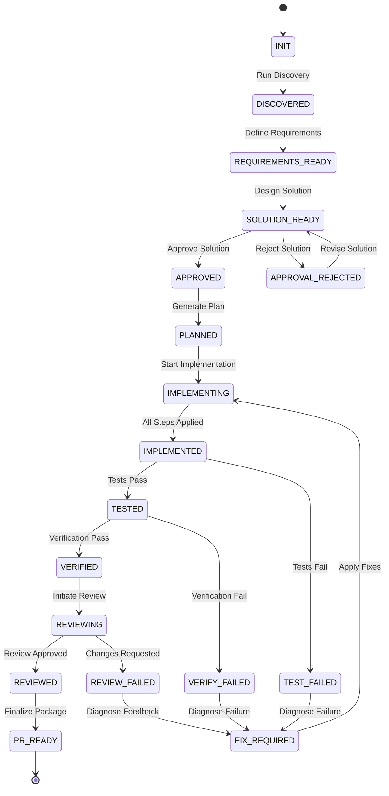

# DevWeave AI-DLC State Machine Specification

This document formally defines the state model, valid transitions, guard conditions, and recovery paths for DevWeave work items.

---

## 1. State Enumeration

### 1.1 Progression States
| State | Description | Preceding State |
| :--- | :--- | :--- |
| `INIT` | Initialized state upon work item creation. | None |
| `DISCOVERED` | Repository context and relevant dependencies discovered. | `INIT` |
| `REQUIREMENTS_READY` | Functional and non-functional requirements drafted and signed off. | `DISCOVERED` |
| `SOLUTION_READY` | Technical architecture and solution strategy formulated. | `REQUIREMENTS_READY` |
| `APPROVED` | Solution and approach approved by human or policy gate. | `SOLUTION_READY` |
| `PLANNED` | Implementation plan decomposed into atomic, ordered steps. | `APPROVED` |
| `IMPLEMENTING` | Implementation actively in progress across planned steps. | `PLANNED` / `FIX_REQUIRED` |
| `IMPLEMENTED` | All planned code changes applied. | `IMPLEMENTING` |
| `TESTED` | Unit and integration test suites executed and passing. | `IMPLEMENTED` |
| `VERIFIED` | Deterministic verification (build, lint, type-check, policy) passed. | `TESTED` |
| `REVIEWING` | Code review and multi-agent critique actively in progress. | `VERIFIED` |
| `REVIEWED` | Code review completed with positive consensus. | `REVIEWING` |
| `PR_READY` | Pull request summary and artifacts compiled; ready for merge. | `REVIEWED` |

### 1.2 Failure & Recovery States
| State | Description | Trigger | Recovery Target |
| :--- | :--- | :--- | :--- |
| `APPROVAL_REJECTED` | Solution rejected during approval gate. | Reviewer rejection | `REQUIREMENTS_READY` or `SOLUTION_READY` |
| `TEST_FAILED` | Automated test suite encountered failures. | Test exit code != 0 | `FIX_REQUIRED` |
| `VERIFY_FAILED` | Lint, type-check, or build verification failed. | Verification error | `FIX_REQUIRED` |
| `REVIEW_FAILED` | Code review identified critical issues. | Review rejection | `FIX_REQUIRED` |
| `FIX_REQUIRED` | Work item staged for remediation and fix application. | Any test/verify/review failure | `IMPLEMENTING` |

---

## 2. Transition Matrix

---

## 3. Transition Guards and Policies

1. **No Skip Rule**: Progression cannot bypass prerequisite states unless explicitly permitted by the assigned `WorkflowProfile` (e.g., `EXPRESS` profiles may combine Discovery and Requirements).
2. **Artifact Preservation Guard**: State cannot advance from `SOLUTION_READY` to `APPROVED` without a valid `solution.md` artifact.
3. **Deterministic Verification Guard**: Transition to `REVIEWING` strictly requires all automated verification checks in `VERIFIED` to report zero errors.
4. **Fix Convergence Guard**: If a work item enters `FIX_REQUIRED` more than 3 consecutive cycles for the same failure, execution must halt and request human operator intervention.
