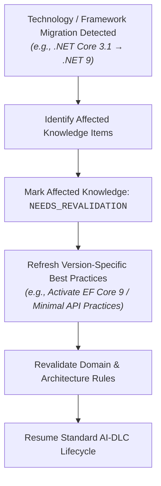

# DevWeave Technology Revalidation & Dynamic Knowledge Evolution

This document specifies how DevWeave handles runtime framework migrations, dependency upgrades, and technology stack evolution without invalidating core AI-DLC skills.

---

## 1. Core Architectural Principle

> **"Skills are stable and permanent. Knowledge and practices are dynamic and refreshable."**

When a project upgrades or migrates its underlying technology (e.g. from `.NET Core 3.1` to `.NET 9`, or `Angular 8` to `Angular 19/20`):
- DevWeave **never** deletes or rewrites Antigravity skills.
- DevWeave **dynamically revalidates** repository knowledge items and swaps out version-specific practices.

---

## 2. Knowledge Item Lifecycle Statuses

Every knowledge artifact in `.devweave/knowledge/` tracks its validity status:

| Status | Description |
| :--- | :--- |
| `OBSERVED` | Directly extracted from repository code, manifests, or lockfiles with high confidence. |
| `INFERRED` | Deduced from architecture patterns or conventions. |
| `RECOMMENDED` | Framework or engineering practice proposed for active tasks. |
| `APPROVED` | Explicitly signed off by a human developer. |
| `NEEDS_REVALIDATION` | Target runtime or major dependency version changed; requires updated evidence. |
| `DEPRECATED` | Obsolete convention or practice flagged for phased removal. |

---

## 3. Revalidation Flow in `CONTEXT` and `ANALYZE`

During the `CONTEXT` and `ANALYZE` phases of a work item:
1. Compare current repository evidence (e.g. `TargetFramework`, `package.json` versions) against stored `.devweave/repository/technologies.md`.
2. If a mismatch is detected:
   - Mark affected items as `NEEDS_REVALIDATION`.
   - Update `.devweave/repository/practices.md` to load the new version's idiomatic patterns.
   - Record revalidation audit events.
   - Report revalidation findings in the phase summary.
